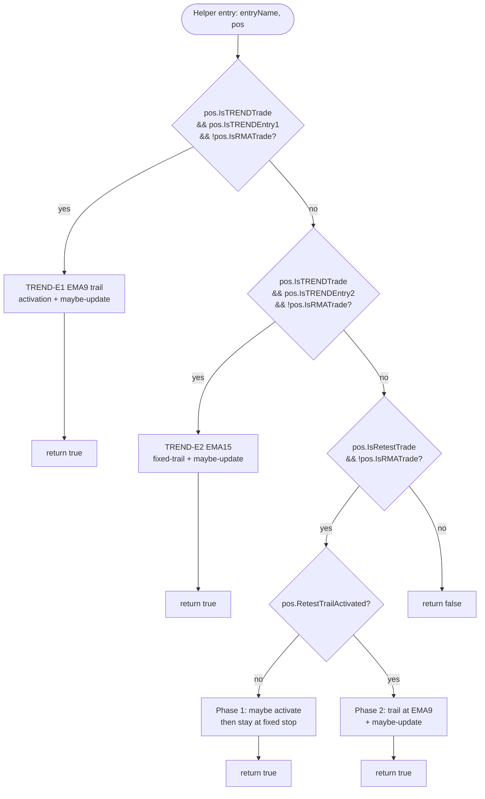

I have created the following plan after thorough exploration and analysis of the codebase. Follow the below plan verbatim. Trust the files and references. Do not re-verify what's written in the plan. Explore only when absolutely necessary. First implement all the proposed file changes and then I'll review all the changes together at the end.

## Observations

- file:src/V12_002.Trailing.cs currently still contains the three target branches verbatim at lines 102–142 (TREND-E1), 144–165 (TREND-E2), and 167–208 (RETEST), each closed by a `continue;` that the helper must convert to `return true;`. The pre-checks at lines 84–100 and the `profitPoints` calc starting at line 210 are explicitly out-of-scope and stay in the parent.
- `PositionInfo` is a `private class` (reference type) in file:src/V12_002.PositionInfo.cs, so mutations to `pos.Entry1TrailActivated` and `pos.RetestTrailActivated` propagate back to the caller automatically — **no `ref` parameter is required**.
- The RETEST branch contains two `continue;` paths (Phase 1 fall-through at line 188 and Phase 2 tail at line 207); both must become `return true;` because both indicate the branch handled the iteration.
- The commented-out TREND-E1 TRAIL `// Print(...)` at lines 137–138 and the leading `?` in any preserved string are part of the byte-identical contract.

## Approach

Add one new `private bool` helper, `ManageTrail_RunPerTradeBranches(string entryName, PositionInfo pos)`, as a member of the existing `public partial class V12_002 : Strategy` in the SAME file:src/V12_002.Trailing.cs. The helper houses the three mutually-exclusive trade-type branches in their original order; each branch ends with `return true;`, and the helper falls through to `return false;` if none of the three predicates match. Parent's `foreach` body collapses lines 102–208 into a single guarded `if (...) continue;`. All five Print strings, the commented-out Print, the predicates, and the calls to `UpdateStopOrder` move byte-identical with zero new heap allocations, zero LINQ, zero captured-locals lambdas, and zero `lock(...)`.

## Implementation Instructions

### 1. Parent edit — replace the inline branches with a single dispatch line

In file:src/V12_002.Trailing.cs, inside `ManageTrailingStops`, after the existing per-position pre-checks block (current lines 84–100 — snapshot `ContainsKey`, `EntryFilled && BracketSubmitted`, `IsFollower && SymmetryGuardIsAnchorPending`, `pos.TicksSinceEntry++`, `ExtremePriceSinceEntry` update), and immediately BEFORE the `profitPoints` calculation (current line 210), the parent foreach body must read exactly:

```
if (ManageTrail_RunPerTradeBranches(entryName, pos)) continue;
```

Delete the inline three-branch block at current lines 102–208 in its entirety (including its blank-line separators and inline comments such as `// V8.2: TREND Entry 1 ...`, `// V8.2: TREND Entry 2 ...`, `// V8.4: RETEST trade ...` — these comments move into the helper to retain provenance, see step 2). The closing `}` of the `foreach` at line 383 stays put; everything from line 210 onward (`profitPoints` calc through the end of the foreach) is untouched in this phase (T1.C/T1.D scope).

### 2. New helper — `ManageTrail_RunPerTradeBranches`

Add the helper as a `private` member of `public partial class V12_002 : Strategy` immediately AFTER the parent `ManageTrailingStops` method's closing `}` (after T1.A's `ManageTrail_AdaptiveThrottleTick` if/when it is co-located there) and BEFORE the legacy doc-comment at current lines 453–454, all within the existing `#region Trailing Stops`. Do NOT create a new file. Do NOT introduce a partial-class split.

Helper signature (exact):

```
private bool ManageTrail_RunPerTradeBranches(string entryName, PositionInfo pos)
```

Helper body composition (in order):

| Step | Source LOC (current file) | Action |
|------|---------------------------|--------|
| 2.1 | 102–142 | Move the **TREND-E1 EMA9 trail activation** block verbatim. Predicate stays `pos.IsTRENDTrade && pos.IsTRENDEntry1 && !pos.IsRMATrade`. The trailing `continue;` at line 141 becomes `return true;`. The commented-out `// Print(string.Format("TREND E1 TRAIL: Stop moved to ..."))` at lines 137–138 stays commented out byte-identical. |
| 2.2 | 144–165 | Move the **TREND-E2 EMA15 fixed-trail** block verbatim. Predicate stays `pos.IsTRENDTrade && pos.IsTRENDEntry2 && !pos.IsRMATrade`. The `continue;` at line 164 becomes `return true;`. The active `Print(string.Format("TREND E2 TRAIL: Stop moved to {0:F2} (EMA15={1:F2} - {2}xATR)", ...))` moves byte-identical. |
| 2.3 | 167–208 | Move the **RETEST EMA9 phase-1 + phase-2 trail** block verbatim. Predicate stays `pos.IsRetestTrade && !pos.IsRMATrade`. **Both** `continue;` statements (the Phase-1 fall-through at line 188 AND the Phase-2 tail at line 207) become `return true;`. The two active Prints (`RETEST: Switching to EMA9 trail (Price={0:F2} crossed EMA9={1:F2})` and `RETEST TRAIL: Stop moved to {0:F2} (EMA9={1:F2} - {2}xATR)`) move byte-identical. |
| 2.4 | (new) | Final fall-through statement: `return false;` |

Local variables (`tickPrice`, `ema9Live`, `currentPrice`, `priceInFavor`, `trendStop`, `shouldUpdate`, `ema15Live`, `retestStop`) move WITH their owning branch — they are scoped inside each `if { }` block exactly as they are today.

### 3. Identifiers consumed by the helper (must compile against existing `partial class` members)

The helper relies entirely on already-existing `V12_002` members. Verify availability before extraction (no new declarations needed):

- **Reads (instance state / indexed series)**: `lastKnownPrice`, `Close[0]`, `ema9[0]`, `ema15[0]`, `currentATR`, `TRENDEntry1ATRMultiplier`, `TRENDEntry2ATRMultiplier`, `RetestATRMultiplier`.
- **Reads (off `pos`)**: `pos.IsTRENDTrade`, `pos.IsTRENDEntry1`, `pos.IsTRENDEntry2`, `pos.IsRetestTrade`, `pos.IsRMATrade`, `pos.Direction`, `pos.CurrentStopPrice`, `pos.CurrentTrailLevel`, `pos.Entry1TrailActivated`, `pos.RetestTrailActivated`.
- **Mutates (off `pos`, propagates via shared reference)**: `pos.Entry1TrailActivated`, `pos.RetestTrailActivated`.
- **Calls**: `Print(...)` (NinjaScript inherited), `UpdateStopOrder(entryName, pos, <newStop>, pos.CurrentTrailLevel)` (existing private member of the partial class).

### 4. Verbatim Print fidelity (gate C6 / Hotspot H1, H11)

Each of the four active Prints in the moved block must remain BYTE-IDENTICAL — same format string, same arg order, same `string.Format(...)` wrapper:

1. `TREND E1: Switching to EMA9 trail (Price={0:F2} crossed EMA9={1:F2})` (was line 119–120)
2. `TREND E2 TRAIL: Stop moved to {0:F2} (EMA15={1:F2} - {2}xATR)` (was line 161–162)
3. `RETEST: Switching to EMA9 trail (Price={0:F2} crossed EMA9={1:F2})` (was line 184–185)
4. `RETEST TRAIL: Stop moved to {0:F2} (EMA9={1:F2} - {2}xATR)` (was line 204–205)

The commented-out `// Print(string.Format("TREND E1 TRAIL: Stop moved to {0:F2} (EMA9={1:F2} - {2}xATR)", trendStop, ema9Live, TRENDEntry2ATRMultiplier));` block (was lines 137–138) stays commented out, exact same text — do NOT delete it, do NOT uncomment it, do NOT reformat it.

### 5. Hard guardrail enforcement checklist

- **Branch order**: TREND-E1 → TREND-E2 → RETEST. Do NOT reorder. Each predicate is mutually exclusive in practice but the `if/if/if` cascade (NOT `if/else if/else if`) preserves the original parent's flow exactly — keep three independent `if` blocks that each `return true;` so behavior matches the original `continue;` semantics.
- **Predicates**: Copy-paste predicate expressions verbatim — no DeMorgan refactoring, no extracted boolean locals.
- **Zero new heap allocations**: The pre-existing `string.Format(...)` calls inside the Prints are moved, not added; that is acceptable. Do NOT introduce any `new`, `List<>`, `ToArray()`, LINQ chains, lambdas with captures, or `string` concatenations beyond what already exists.
- **Zero `lock(...)`**: None added; none present in the source range.
- **ASCII-only**: All five strings are already ASCII; preserve the leading `?` characters and other punctuation byte-for-byte if any are encountered (none in this LOC range, but the rule applies).
- **No `ref` / `out` plumbing**: `PositionInfo` is a class; mutations to its fields propagate via the reference. Do NOT add `ref PositionInfo pos`.

### 6. Acceptance gates (run after the edit)

Run from the repo root and confirm:

| Gate | Expected | Reference |
|------|----------|-----------|
| `python scripts/csharp_hotspots.py` | Helper `ManageTrail_RunPerTradeBranches` < 20 CYC and ≤ 110 LOC; parent `ManageTrailingStops` CYC drops by ~30 | scripts/csharp_hotspots.py |
| `grep -cn "TREND E1: Switching to EMA9 trail" src/V12_002.Trailing.cs` | `1` | gate C6 |
| `grep -cn "TREND E2 TRAIL: Stop moved to" src/V12_002.Trailing.cs` | `1` | gate C6 |
| `grep -cn "RETEST: Switching to EMA9 trail" src/V12_002.Trailing.cs` | `1` | gate C6 |
| `grep -cn "RETEST TRAIL: Stop moved to" src/V12_002.Trailing.cs` | `1` | gate C6 |
| `dotnet build .\Linting.csproj` | Zero new warnings/errors | build pillar |
| `powershell -File .\deploy-sync.ps1` | EXIT 0 | hard-link integrity |
| `git diff src/V12_002.Trailing.cs` | Zero string-literal mutation; unified diff < 150 KB | strict diff limit |

### 7. PR

- **PR title**: `phase-6-t1b-per-trade-branches`
- **Files touched**: file:src/V12_002.Trailing.cs only.
- **Diff target**: < 150 KB (well within budget — net change is ~115 lines moved + ~3 helper signature lines + ~1 call-site line + closing brace).
- **PR description should note**: T1.A pre-condition coupling (helper sits adjacent to `ManageTrail_AdaptiveThrottleTick` per the established "post-parent, in-region" pattern), and that mutation propagation through `pos` (a class reference) eliminates any need for `ref` plumbing.

### Branch decision flow inside the helper

