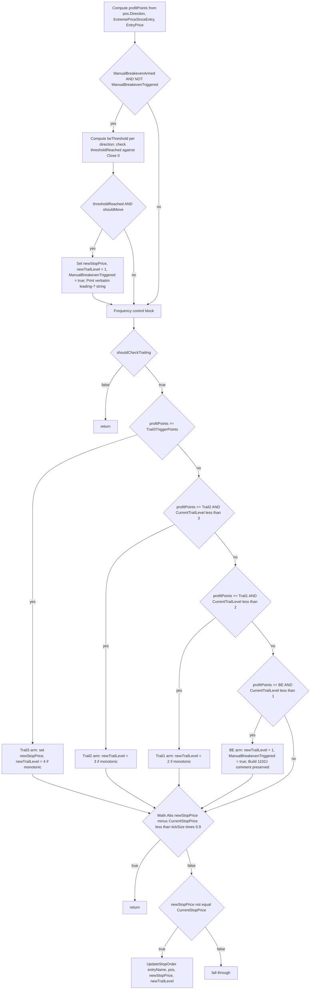

I have created the following plan after thorough exploration and analysis of the codebase. Follow the below plan verbatim. Trust the files and references. Do not re-verify what's written in the plan. Explore only when absolutely necessary. First implement all the proposed file changes and then I'll review all the changes together at the end.

### Observations

The file `file:src/V12_002.Trailing.cs` contains `ManageTrailingStops` whose RMA point-based trailing block (the post per-trade-branches portion of the foreach body) covers `profitPoints` calc, manual BE arm-and-trigger, frequency control, the Trail3/Trail2/Trail1/BE `else if` cascade, the micro-update suppression `continue`, and the final `UpdateStopOrder` call. The block uses two locals (`newStopPrice`, `newTrailLevel`) currently initialized BEFORE the `isTrendOrRetestTrade` gate; after T1.C they move AFTER the gate (only declared when the helper is actually called). The Build 1102J comment appears verbatim above BOTH BE-arm sites (LONG and SHORT) and `pos.ManualBreakevenTriggered = true` fires in three places (manual-BE block + both BE cascade arms).

### Approach

Add a single new `private void ManageTrail_RunPointBasedTrailing(string entryName, PositionInfo pos, ref double newStopPrice, ref int newTrailLevel)` member to the existing `public partial class V12_002 : Strategy` inside `file:src/V12_002.Trailing.cs` (no new file). Move the entire RMA point-based trailing block verbatim into the helper, converting the two `continue;` statements (frequency-skip and micro-update suppression) to `return;`. Keep the `isTrendOrRetestTrade` / `allowPointBasedTrailing` gate in the parent and re-position the two locals to be declared AFTER the gate — only when the helper will actually be called. Use `ref` parameters to avoid any new struct/tuple allocation (Approach §1.3).

### Implementation Instructions

#### 1. Add the helper `ManageTrail_RunPointBasedTrailing` to `file:src/V12_002.Trailing.cs`

Place the new private method as a sibling of `ManageTrailingStops`, inside the same `#region Trailing Stops`, keeping the existing partial-class declaration (no new file, no co-location).

Signature: `private void ManageTrail_RunPointBasedTrailing(string entryName, PositionInfo pos, ref double newStopPrice, ref int newTrailLevel)`.

Body — move the original lines 210-382 verbatim, in this exact order, with the noted micro-edits:

1. **`profitPoints` computation** (original lines 210-212) — first statement of the helper. Reads `pos.Direction`, `pos.ExtremePriceSinceEntry`, `pos.EntryPrice`. No allocation.
2. **DELETE the original lines 214-215** (`double newStopPrice = …;` / `int newTrailLevel = …;`) — these are now `ref` parameters fed by the parent. The parameter names match the existing local names exactly so the rest of the body is byte-identical.
3. **Manual breakeven block** (original lines 223-261) — moves verbatim. Preserve:
   - The `pos.ManualBreakevenArmed && !pos.ManualBreakevenTriggered` outer gate.
   - The directional `beThreshold` recomputation for SHORT inside the `else` arm (the LONG branch sets `beThreshold` once before the `if`; the SHORT branch reassigns it — preserve this minor asymmetry exactly).
   - The `pos.ManualBreakevenTriggered = true` assignment inside the `if (shouldMove)` arm.
   - The verbatim Print at original lines 257-258: `? MANUAL BREAKEVEN TRIGGERED: {0} -> Stop moved to {1:F2} (Entry + {2} tick)` — preserve the leading "?" character byte-for-byte (gate C6 / acceptance grep).
4. **Frequency control block** (original lines 263-293) — moves verbatim. Preserve the four-arm `if/else if/else if/else` cascade on `profitPoints` vs `Trail3TriggerPoints` / `Trail2TriggerPoints` / `Trail1TriggerPoints`, with the `pos.T1Filled && pos.T2Filled` and `pos.T1Filled` guards intact, and the `pos.TicksSinceEntry % 2 == 0` parity check on T1/T2.
   - **Edit**: change the original line 293 `if (!shouldCheckTrailing) continue;` → `if (!shouldCheckTrailing) return;` (helper is no longer inside a foreach).
5. **Trail3 / Trail2 / Trail1 / BreakEven cascade** (original lines 295-371) — moves verbatim as a mutually exclusive `if … else if … else if … else if` chain. Preserve:
   - **Cascade order**: Trail3 first → Trail2 (with `pos.CurrentTrailLevel < 3`) → Trail1 (with `< 2`) → BreakEven (with `< 1`).
   - Trail3 has NO `CurrentTrailLevel` guard (per current code) but does require `pos.T1Filled && pos.T2Filled` via the surrounding semantics — note the existing `if (profitPoints >= Trail3TriggerPoints)` predicate is independent of the `T1Filled/T2Filled` (that gate was already applied in the frequency block) — keep verbatim.
   - LONG vs SHORT direction-specific monotonic guards (`trail3Stop > pos.CurrentStopPrice` for Long, `<` for Short, etc.) intact.
   - The two `// [Build 1102J] Prevent the ManualBreakevenArmed path from re-firing redundantly.` comments above BOTH the Long and Short BE-arm `pos.ManualBreakevenTriggered = true` assignments inside the `BreakEven` branch — preserve verbatim (acceptance gate `grep -cn "Build 1102J" ≥ 1`; note: there are TWO occurrences in this block plus zero elsewhere, so the count post-extraction is 2).
6. **Micro-update suppression** (original lines 373-376) — moves verbatim.
   - **Edit**: change `if (Math.Abs(newStopPrice - pos.CurrentStopPrice) < tickSize * 0.9) continue;` → `if (Math.Abs(newStopPrice - pos.CurrentStopPrice) < tickSize * 0.9) return;`.
7. **Final UpdateStopOrder call** (original lines 378-382) — moves verbatim: `if (newStopPrice != pos.CurrentStopPrice) { UpdateStopOrder(entryName, pos, newStopPrice, newTrailLevel); }`.

The helper writes ONLY through the `ref` parameters and `pos.*` mutations (`pos.ManualBreakevenTriggered`); it does NOT mutate any other strategy-level state, allocates no objects, takes no `lock`, and uses no LINQ/captured-locals lambdas.

#### 2. Rewire the parent `ManageTrailingStops` foreach body in `file:src/V12_002.Trailing.cs`

After the T1.B `if (ManageTrail_RunPerTradeBranches(entryName, pos)) continue;` line (which replaced the three trade-type branches), the foreach body now consists of ONLY:

1. **DELETE original lines 210-215** (the `profitPoints` calc and the two local initializers) — they move into the helper or get re-declared post-gate.
2. **KEEP original lines 217-221 verbatim**: the `bool isTrendOrRetestTrade = pos.IsTRENDTrade || pos.IsRetestTrade;` / `bool allowPointBasedTrailing = !isTrendOrRetestTrade || pos.IsRMATrade;` / `if (!allowPointBasedTrailing) continue;` gate.
3. **INSERT the new call site** (matching ticket spec exactly):
   - `double _newStopPrice = pos.CurrentStopPrice;`
   - `int _newTrailLevel = pos.CurrentTrailLevel;`
   - `ManageTrail_RunPointBasedTrailing(entryName, pos, ref _newStopPrice, ref _newTrailLevel);`
4. The `}` immediately after closes the foreach. The post-foreach `if (EnableSIMA) { … }` block (original lines 389-447) and the trailing `ShadowEngineCheck();` call remain UNTOUCHED in this phase (T1.D scope).

The parent does NOT consume `_newStopPrice` / `_newTrailLevel` after the call returns; they exist purely as ref-binding sites so the helper can read-modify-write `pos.CurrentStopPrice` / `pos.CurrentTrailLevel` snapshots without owning the locals itself. Their `_` underscore prefix matches the ticket's specified names exactly.

#### 3. Hard guardrail enforcement (review checklist before commit)

| Guardrail | How to verify |
|---|---|
| Cascade order Trail3 → Trail2 → Trail1 → BE preserved | Visual diff of the `else if` chain |
| `pos.T1Filled && pos.T2Filled` guard on Trail3 frequency arm preserved | Visual diff of frequency block |
| `< 3` / `< 2` / `< 1` `CurrentTrailLevel` guards on cascade preserved | Visual diff |
| Manual-BE block precedes the cascade and uses `pos.ManualBreakevenArmed && !pos.ManualBreakevenTriggered` | Visual diff |
| `pos.ManualBreakevenTriggered = true` in 3 sites (manual-BE arm + BE-cascade Long arm + BE-cascade Short arm) | `grep -cn "ManualBreakevenTriggered = true" src/V12_002.Trailing.cs` == 3 |
| Micro-update suppression `continue` → `return` inside helper, BEFORE final `UpdateStopOrder` | Visual diff |
| Verbatim leading-"?" Print preserved | `grep -cn "MANUAL BREAKEVEN TRIGGERED" src/V12_002.Trailing.cs` == 1 |
| Build 1102J comment preserved on BOTH BE-arm sites | `grep -cn "Build 1102J" src/V12_002.Trailing.cs` == 2 (≥ 1 satisfied) |
| `ref` parameters used, no new types/tuples/structs | Signature inspection |
| ZERO new `new` of reference types | `git diff` review |
| ZERO new `lock(` | `grep -n "lock(" src/V12_002.Trailing.cs` shows no new occurrences |
| ASCII-only literals | `python check_ascii.py src/V12_002.Trailing.cs` PASS |

#### 4. Acceptance gates (run after edit)

- `python scripts/csharp_hotspots.py | findstr ManageTrail` — `ManageTrail_RunPointBasedTrailing` < 20 CYC and ≤ 130 LOC; parent CYC drops by ~50.
- `grep -cn "MANUAL BREAKEVEN TRIGGERED" src/V12_002.Trailing.cs` == 1.
- `grep -cn "Build 1102J" src/V12_002.Trailing.cs` ≥ 1.
- `dotnet build .\Linting.csproj` — zero new warnings/errors.
- `powershell -File .\deploy-sync.ps1` — EXIT 0 (re-syncs NinjaTrader hard links per AGENTS.md §2).
- PR title: `phase-6-t1c-point-based-trailing`. Diff < 150 KB (no whitespace mutations on adjacent lines).

### Helper Internal Flow

