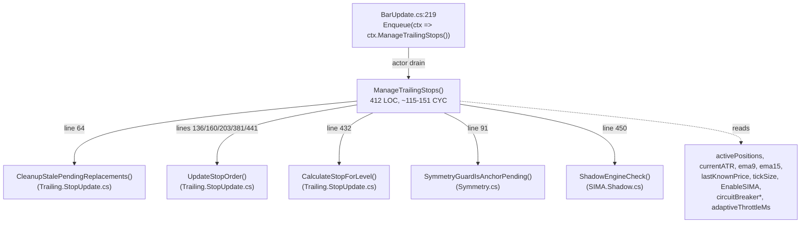
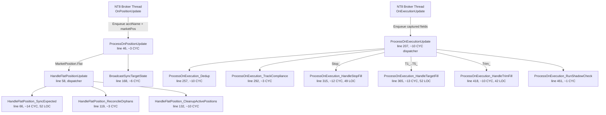

# Refactoring Analysis: Phase 6 Targets

# Refactoring Analysis — Phase 6 Hot Path Hardening

<user_quoted_section>Purpose: Ground the refactoring in the current state of the code. No implementation proposals here — those go in the Approach document after this Analysis is validated.</user_quoted_section>

## 1. Dependency Map

### 1.1 `ManageTrailingStops` (T1) — file:src/V12_002.Trailing.cs



**Reads**: `activePositions` (snapshot via `ToArray()`), `ema9[0]`, `ema15[0]`, `Close[0]`, `lastKnownPrice`, `currentATR`, `tickSize`, all `Trail*Trigger/DistancePoints` properties, `BreakEvenOffsetTicks`, `EnableSIMA`, `_circuitBreaker*` fields, `tickCountInLastSecond`, `lastTickCountReset`, `adaptiveThrottleMs`, `lastStopManagementTime`.

**Mutates**: `pos.TicksSinceEntry`, `pos.ExtremePriceSinceEntry`, `pos.Entry1TrailActivated`, `pos.RetestTrailActivated`, `pos.ManualBreakevenTriggered`, `pos.CurrentStopPrice` (indirectly via `UpdateStopOrder`), `pos.CurrentTrailLevel` (indirectly), `circuitBreakerActive`, `adaptiveThrottleMs`, `lastStopManagementTime`, `tickCountInLastSecond`, `lastTickCountReset`.

**Threading**: Strategy thread only (entered via `Enqueue` actor drain).

### 1.2 `ProcessOnExecutionUpdate` cluster (T2) -- file:src/V12_002.Orders.Callbacks.Execution.cs

<user_quoted_section>A1 RE-SCOPE NOTE: T2 was originally drafted around ProcessOnOrderUpdate in Orders.Callbacks.cs. Per A1 alignment, T2 now targets the ProcessOnExecutionUpdate cluster in Orders.Callbacks.Execution.cs, which is the file the architecture doc flagged as carrying 120 file-level CYC.</user_quoted_section>



**Already extracted** (this file is heavily decomposed):

- Position cluster: `HandleFlatPosition_SyncExpected`, `HandleFlatPosition_ReconcileOrphans`, `HandleFlatPosition_CleanupActivePositions`, `BroadcastSyncTargetState`.
- Execution cluster: `ProcessOnExecution_Dedup`, `_TrackCompliance`, `_HandleStopFill`, `_HandleTargetFill`, `_HandleTrimFill`, `_ExtractEntryName`, `_RunShadowCheck`.

**Remaining concentrated complexity** (Phase 6 targets):

- `HandleFlatPosition_SyncExpected` (~14 CYC) -- two sequential `foreach` scans (entryOrders + activePositions) with predicate logic; extract two named predicates.
- `ProcessOnExecution_HandleTargetFill` (~13 CYC) and `ProcessOnExecution_HandleTrimFill` (~10 CYC) share an identical "fully-closed via partial exit" cleanup pattern (`RequestStopCancelLifecycleSafe` + `PendingCleanup=true` or `SymmetryGuardForgetEntry`); extract a shared helper.
- `ProcessOnExecution_HandleStopFill` (~12 CYC) keeps its immediate-teardown semantics distinct (it does NOT use the new shared helper -- Stop fill tears down `stopOrders` / `pendingStopReplacements` / `activePositions` / `entryOrders` immediately, while Target/Trim defer via PendingCleanup until broker stop terminal confirmation).

**Threading**: Strategy thread only (entered via actor drain). The thin shells `OnPositionUpdate` and `OnExecutionUpdate` run on NT8 broker callback thread but only capture primitives + Enqueue.

### 1.3 `ExecuteSmartDispatchEntry` (T3) — file:src/V12_002.SIMA.Dispatch.cs

**Caller fan-in** (11 call sites):

| Caller | File | Line |
| --- | --- | --- |
| TREND auto entry | file:src/V12_002.Entries.Trend.cs | ~376 |
| TREND_MNL manual | file:src/V12_002.Entries.Trend.cs | ~680 |
| TREND_RMA | file:src/V12_002.Entries.RMA.cs | ~163 |
| RETEST auto | file:src/V12_002.Entries.Retest.cs | ~209 |
| RETEST_MNL | file:src/V12_002.Entries.Retest.cs | ~338 |
| OR | file:src/V12_002.Entries.OR.cs | ~245 |
| MOMO | file:src/V12_002.Entries.MOMO.cs | ~176 |
| FFMA auto | file:src/V12_002.Entries.FFMA.cs | ~208 |
| FFMA_MNL Limit | file:src/V12_002.Entries.FFMA.cs | ~338 |
| FFMA_MNL_MKT | file:src/V12_002.Entries.FFMA.cs | ~482 |
| Self-defer | file:src/V12_002.SIMA.Dispatch.cs (semaphore-contended TriggerCustomEvent) |  |

**Internal structure** (linear scan through the 599 LOC body):

| Block | Lines | Approx CYC | Purpose |
| --- | --- | --- | --- |
| Semaphore non-blocking guard + defer | 47-66 | 5 | `_simaToggleSem.Wait(0)` + `TriggerCustomEvent` self-defer |
| Setup (latency T0, EnableSIMA, isFlattenRunning, MetadataGuard, fleet snapshot, dispatchTargetCount snapshot, SymmetryGuardBeginDispatch) | 68-147 | 12 | Per-call setup |
| **Fleet loop** (per-account) | 149-606 | ~70 | Outer `for i in fleet.Count` |
| Loop body — common setup (account skip, useRmaForFollower, ATR stop dist, target prices ×5, qty parity, target distribution, FSM register, OcoGroupId) | 151-254 | 12 |  |
| Loop body — **Market entry branch** (lines 257-465) | 209 LOC | ~30 | Entry+Stop+Targets bundling, FSM PendingSubmit, expectedDelta reserve, Photon ring publish + ConcurrentQueue fallback |
| Loop body — **Limit entry branch** (lines 466-573) | 108 LOC | ~22 | Entry-only bundling, FSM PendingSubmit, deferred bracket submission, Photon ring publish + ConcurrentQueue fallback |
| Loop body — catch handler (rollback expectedDelta + tracking dict cleanup + FSM remove) | 577-605 | 8 | Per-account failure recovery |
| Pump prime (TriggerCustomEvent) | 609-610 | 2 |  |
| Forensic Pulse Report builder | 612-632 | 3 | Latency telemetry print |
| Outer catch + finally release semaphore | 634-642 | 2 |  |

**Already extracted** to file:src/V12_002.SIMA.Fleet.cs:

- `ShouldSkipFleetAccount()` — inactive/H-13/consistency-lock guard
- `ProcessFleetSlot()` — broker submit (called from `PumpFleetDispatch` consumer side)
- `PumpFleetDispatch()` — Photon ring + legacy queue consumer

**Threading**: Strategy thread only (entered via the Entries.* call sites which themselves run on strategy thread). Self-defer goes through `TriggerCustomEvent` which marshals back to strategy thread.

**Concurrency primitives in use**:

- `_simaToggleSem` (`SemaphoreSlim`) — non-blocking guard
- `_photonDispatchRing` (custom MMIO SPSC ring)
- `_photonPool` (zero-alloc Order[] pool with per-slot sideband)
- `_pendingFleetDispatches` (`ConcurrentQueue<FleetDispatchRequest>` fallback)
- `activePositions`, `entryOrders`, `stopOrders`, `target1Orders..target5Orders` (`ConcurrentDictionary`)
- `_followerBrackets` (`ConcurrentDictionary<string, FollowerBracketFSM>`)
- `_dispatchSyncPendingExpKeys` (`ConcurrentDictionary` for Mark/Clear pending)
- `Interlocked.Increment(ref _pendingFleetDispatchCount)`
- `Thread.MemoryBarrier()` between sideband write and ring publish

## 2. Risk Hotspots

| # | Hotspot | Why it needs careful handling |
| --- | --- | --- |
| H1 | **`ManageTrailingStops`**** foreach body — 6 mutually-exclusive trade-type branches** (TREND-E1 / TREND-E2 / RETEST / point-based BE / T1 / T2 / T3) | Each branch has its own `continue;` and its own `Print(...)` strings (verbatim-fidelity gate C6). Re-ordering branches changes which `Print` fires when multiple flags are co-active (e.g., a TREND trade that flips IsRMATrade mid-flight). |
| H2 | **`ManageTrailingStops`**** post-loop fleet symmetry sync** (lines 389-447) | Iterates `positionSnapshot` twice — first to find leader trail levels by direction, then to sync laggers. Pre-snapshot must remain identical (zero-alloc bias C1). The `Print($"[SIMA] Fleet Sync: ...")` line at 408 is a verbatim-fidelity dependency. |
| H3 | **Build 1105 Shadow callback** at line 450 | `ShadowEngineCheck()` is called at the END of `ManageTrailingStops`, after fleet sync. Extraction must preserve this ordering — Shadow depends on the trail level updates from the loop having flushed first. |
| H4 | **`ProcessOnExecutionUpdate`**** and **`ProcessOnOrderUpdate`** race** | `Orders.Callbacks.Execution.cs:264` comment says: "Phase7 [C-01]: Prevent double-decrement if OnOrderUpdate + OnExecutionUpdate both fire." Both callbacks fire from NT8 on the same fill event — the dedup ring (`_executionIdRing`) is the single point of truth. Any extracted handler that mutates `pos.RemainingContracts` must not bypass dedup. |
| H5 | **`ProcessOnExecution_HandleStopFill`**** 5-target cancel scan** (lines 329-340) | Inside the stop-fill path, the `for tNum=1..5` cancels every Working/Accepted target order via `CancelOrderSafe`. If this loop is moved into a sub-handler, the `cancelledTargets` counter must remain in scope so the gated Print at line 344 (`OCO: Cancelled X target orders for Y`) fires only when count > 0. Verbatim-fidelity dependency. |
| H6 | **`HandleStopFill`**** vs ****`HandleTargetFill`**** vs ****`HandleTrimFill`**** cleanup divergence** | All three handle "RemainingContracts -> 0" but with DIFFERENT semantics: `HandleStopFill` performs immediate-teardown (TryRemove on stopOrders/pendingStopReplacements/activePositions/entryOrders); `HandleTargetFill` and `HandleTrimFill` defer via `RequestStopCancelLifecycleSafe` + `PendingCleanup=true` (or `SymmetryGuardForgetEntry` if the position metadata is already gone). Any extracted shared helper MUST cover only Target+Trim. Folding StopFill in would change broker order lifetime semantics and produce ghost orders. |
| H7 | **`ExecuteSmartDispatchEntry`**** Market vs Limit branch divergence** | The two branches (lines 257-465 vs 466-573) duplicate ~70% of the FSM-init / expectedDelta-reserve / Photon-ring publish logic but with subtle differences (Market includes Stop + non-runner targets; Limit defers brackets). DRY-ifying the wrong slice = ghost orders if Limit fills before brackets attach. |
| H8 | **Photon ring publish ordering** (lines 401-407, 519-523) | Sideband write -> `Thread.MemoryBarrier()` -> `_photonDispatchRing.TryEnqueue` is a load-bearing memory-ordering invariant. Extraction MUST keep this 3-step sequence atomic within the same method context. |
| H9 | **Catch-handler rollback paths** (lines 577-605 in T3, lines 199-202 in T2) | Each `catch` undoes partial state (`syncPending`, `reservedDelta`, tracking dict registration, FSM presence). Extracted helpers must propagate the `try/catch` around the broker call, not just the data prep. |
| H10 | **Adaptive throttle + circuit breaker state** (lines 41-78 of T1) | `tickCountInLastSecond`, `lastTickCountReset`, `adaptiveThrottleMs`, `lastStopManagementTime`, `circuitBreakerActive`, `circuitBreakerActivatedTime` are read-modify-write per tick. They are NOT in `ConcurrentDictionary` — they are plain fields touched only on the strategy thread, but extraction across files must NOT change the touch order or threading model. |
| H11 | **`Print`**** string verbatim fidelity** | First-300-line scan of T1 alone shows 8 `Print(...)` strings with format placeholders. Phase 5 F-06 closed only after Arena Red Team caught 3 dropped TREND lines. This is the #1 historical extraction-failure mode. |
| H12 | **`docs/architecture.md`**** placement bug** for `OnOrderUpdate` | The doc places it in `Orders.Callbacks.Execution.cs` (where it does NOT live). Any plan or ticket that references the doc will misroute. The doc itself is a deliverable to update in this Phase. |

## 3. Test Coverage

### What exists

file:tests/LogicTests.cs is the only test file. It covers **pure-logic helpers extracted into ****`V12_PureLogic`**:

- `GetTargetDistribution_ValidInputs_ReturnsExpectedBuckets` — 5 parameterized cases for target distribution.
- `CalculatePositionSize_*` — 3 tests for position sizing math (basic, cushion, min/max clamp).
- `CalculateATRStopDistance_ValidATR_ReturnsCeilingStop` — 1 test for ATR ceiling.
- `StickyState_RoundTrip_PreservesState` — 1 round-trip test for state persistence.

### What is NOT covered

**None of the three Phase 6 targets are unit-testable** in their current form because they are instance methods on `V12_002 : Strategy` (a NinjaTrader runtime class) that depend on:

- Live NT8 framework state (`Account`, `Order`, `Position`, `Instrument`, `State`)
- Indicator instances (`ema9`, `ema15`, `currentATR`)
- Bar series accessors (`Close[0]`)
- Broker callbacks (`OnOrderUpdate`, `OnExecutionUpdate`)
- The custom Photon ring / pool / MMIO mirror

### Existing safety nets (non-test)

| Net | What it covers | Where |
| --- | --- | --- |
| **Forensic pulse report** | Per-dispatch latency telemetry (T0 -> setup -> fleet loop -> total) printed by `ExecuteSmartDispatchEntry` | `SIMA.Dispatch.cs:619-632` |
| **REAPER audit** | Detects Expected != Actual position desync within audit cycle (subsecond cadence) | `REAPER.Audit.cs` |
| **Shadow callback** (Build 1105) | Catches steady-state trail gaps within 100-500ms of leader fill | `SIMA.Shadow.cs::ShadowEngineCheck()` |
| **Symmetry Guard FSM** | Blocks follower trail until anchor pending; prevents desync mid-dispatch | `Symmetry.BracketFSM.cs` |
| **MetadataGuard** | Rejects duplicate dispatch signals (10s window) | `MetadataGuard.cs` |
| **Sticky State persistence + replay harness** | Position metadata round-trips across restart; SOVEREIGN replay validates 4 sessions of OR logic against captured ticks | `StickyState.cs` + `scripts/amal_harness.py` |
| **Live NT8 4-session replay** | Apr 29 - May 5 verified post-Build-984 | Manual via Director |
| **Risk Audit Cases 1-7** | Per-config behavioral fingerprint | `scripts/test_stress.ps1` |

### Gap for safe refactoring

- No characterization tests for `ManageTrailingStops` per-trade-type branch outputs.
- No characterization tests for `ProcessOnOrderUpdate` state transitions across OrderState.{Filled, Rejected, Cancelled, Working, Accepted}.
- No characterization tests for `ExecuteSmartDispatchEntry` Market vs Limit fleet bundling.
- The `Print` string fidelity gate (C6) is currently **manual diff** only — there is no automated string-literal capture comparing pre/post extraction.

## 4. Change Surface Area

```
src/V12_002.Trailing.cs                              ~412 LOC at risk      [T1 primary]
src/V12_002.Trailing.Breakeven.cs                    co-locate landing     [T1 secondary]
src/V12_002.Trailing.StopUpdate.cs                   READ ONLY (helpers)
src/V12_002.Orders.Callbacks.Execution.cs            ~480 LOC at risk      [T2 primary, A1 re-scope]
src/V12_002.Orders.Callbacks.cs                      READ ONLY (cousin file, OnOrderUpdate cluster)
src/V12_002.Orders.Callbacks.AccountOrders.cs        READ ONLY
src/V12_002.Orders.Callbacks.Propagation.cs          READ ONLY
src/V12_002.SIMA.Dispatch.cs                         ~599 LOC at risk      [T3 primary]
src/V12_002.SIMA.Fleet.cs                            READ ONLY (consumer side)
src/V12_002.SIMA.Execution.cs                        READ ONLY (mirrors patterns)
src/V12_002.SIMA.Shadow.cs                           READ ONLY (T1 callee)
src/V12_002.Symmetry.BracketFSM.cs                   READ ONLY (FSM)
src/V12_002.BarUpdate.cs                             READ ONLY (T1 caller)
src/V12_002.Entries.{OR,MOMO,FFMA,RMA,Trend,Retest}.cs   READ ONLY (T3 callers, 11 sites)
docs/architecture.md                                 UPDATE (heatmap reflow + T2 placement bug)
docs/brain/master_roadmap.md                         UPDATE (Phase 6 row)
docs/brain/implementation_plan.md                    OVERWRITE (Phase 6 plan)
docs/brain/task.md                                   UPDATE (active-task pointer)
```

**Total at-risk LOC** (write surface): ~1,491 across 3 src files + 4 doc files.

**Validation summary (A1-A5 locked)**: A1=C (T2 -> ProcessOnExecutionUpdate cluster). A2=A (no new tests; rely on existing safety nets). A3=A,D,E (T1 boundaries OK; T2 redrawn per A1; T3 boundaries OK). A4=A,C (no DRY between Market/Limit publish helpers; MemoryBarrier stays inside the helper). A5=C (pre-merge roadmap row only; architecture doc + symbol-name fix in final ticket).

**Total read-only context** (must not modify but must understand): ~3,500 LOC across 11 src files.

**File count delta**: 0 to +3 new partial files (depends on Approach decision on co-locate vs new-file).