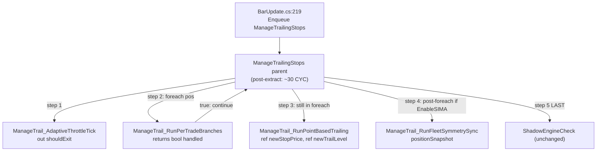
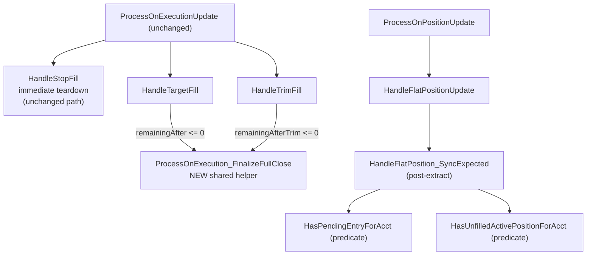
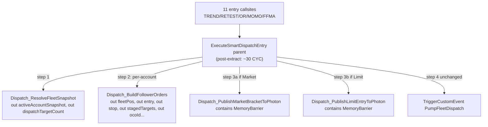

# Refactoring Approach: Phase 6 Hot Path Hardening

# Refactoring Approach — Phase 6 Hot Path Hardening

<user_quoted_section>Builds on:  (Epic Brief) and  (Refactoring Analysis).Locks in: A1=C (T2 → ProcessOnExecutionUpdate cluster), A2=A (no new tests), A3=A,D,E (T1+T3 boundaries OK; T2 redrawn), A4=A,C (no DRY of Photon publish; barrier inside helper), A5=C (pre-merge roadmap row only).</user_quoted_section>

## 1. Key Decisions

### 1.1 Structure

| Decision | Choice | Rationale | Trade-offs |
| --- | --- | --- | --- |
| Decomposition principle | **By execution phase** within each god-function (throttle/branch/sync for T1; cluster-shared-helper for T2; guard/build/publish for T3) | Mirrors the time-ordered control flow already present in code; each new helper takes a contiguous LOC range from the parent. | Slightly more helpers than a domain-cut would produce, but each is independently grep-able and CYC-verifiable. |
| Granularity | **11 tickets total** = 1 pre-merge doc + 4 T1 + 1 T2 + 4 T3 + 1 final-acceptance-with-docs | Stays within the user-approved "3-4 per target" envelope (Q4 alignment) and the AGENTS.md "minimum code that solves the problem" rule. T2 collapses to 1 ticket because Phase 5 already extracted most of the cluster. | If a sub-handler busts the 150 KB diff cap mid-flight, we sub-split that single ticket without re-planning the whole epic. |
| Placement | **Same-file extraction for all three targets** | Minimizes diff (no whole-method moves across files), preserves grep locality for operations, matches Phase 4 dispatcher precedent (`ProcessOnStateChange` -> 5 handlers in same `Lifecycle.cs`). | No new partial files. Co-location into existing siblings (`Trailing.Breakeven.cs` etc.) is permitted but NOT required. |
| New file count delta | **0** | Per above. | None. |

### 1.2 Transition

| Decision | Choice | Rationale |
| --- | --- | --- |
| Strategy | **Incremental per-cluster** | Each ticket leaves the file in a working state with parent CYC strictly lower than before. |
| Sequencing | T0 → T1.A → T1.B → T1.C → T1.D → T2.A → T3.A → T3.B → T3.C → T3.D → T4 | T0 (roadmap row) lands FIRST per A5=C. T1/T2/T3 within each target are extracted in execution-order so the parent stays compilable at each step. T4 (verification + final docs) lands LAST. |
| Coexistence | Not needed | All new helpers `private`; no external callers; no parallel old/new code paths. |
| Rollback | **`git revert`**** per ticket** | Each ticket = independent PR < 150 KB diff. Single-commit revert restores prior state with no migration cleanup. |

### 1.3 Mapping & Gaps

| Concern | Decision |
| --- | --- |
| API/behavior mapping | **1:1 line-for-line by execution order**. Each extracted helper takes the EXACT contiguous block from the parent and gets a `private` signature with the locals it needs as parameters. |
| Translation gap (T1) | `ManageTrailingStops` accumulates `newStopPrice` and `newTrailLevel` across the per-trade-type and point-based sections. Pass these as `ref double newStopPrice, ref int newTrailLevel` to the extracted helpers. **NO new struct types** (would add new types to the codebase contrary to "Simplicity First"). |
| Translation gap (T2) | `HandleStopFill` performs immediate teardown; `HandleTargetFill`/`HandleTrimFill` defer via `PendingCleanup`. The shared "fully-closed via partial exit" helper extracted in T2 covers ONLY Target+Trim — NEVER StopFill (per H6). |
| Translation gap (T3) | `ExecuteSmartDispatchEntry` Market vs Limit branches duplicate ~70% of Photon publish logic. Per A4=A: **DO NOT DRY**. Extract two separate publish helpers; the 40 lines of duplication are an explicit cost to preserve byte-identical broker behavior. |
| Canonical version | The original pre-extraction code IS the canonical reference. Per T4 (verbatim Print fidelity), the diff must show ONLY structural moves and parameter-passing — no string-literal mutation, no logic reordering. |
| Generalization | None. NO new abstractions, NO interfaces, NO base classes. All helpers are private partial-class methods. |

### 1.4 Design

| Concern | Decision |
| --- | --- |
| Interface shape | All new helpers `private void` or `private bool` (return `bool` only when caller needs an early-exit signal, e.g., `ManageTrail_RunPerTradeBranches` returns `true` if the trade-type branch already executed and caller should `continue;`). |
| Naming convention | `<ParentName>_<Verb><Object>` — e.g., `ManageTrail_AdaptiveThrottleTick`, `Dispatch_ResolveFleetSnapshot`, `ProcessOnExecution_FinalizeFullClose`. Mirrors Phase 4 dispatcher and Phase 5 TREND extraction conventions. |
| Abstraction level | NO new interfaces, NO new classes, NO new abstractions. Same partial-class scope as parent. |
| Dependency direction | Helpers stay inside `V12_002 : Strategy` partial class, can read all instance fields just like the parent. NO dependency injection. |

### 1.5 New Concerns

| Concern | Mitigation |
| --- | --- |
| Concurrency | **No change**. Extraction does NOT alter the threading model. All helpers continue to run on the strategy thread inside the actor drain. NO new `Enqueue` paths, NO new `TriggerCustomEvent` calls. |
| New failure modes | NONE intended. T4 (verbatim Print + CYC gate) catches behavioral drift before merge. |
| Performance | Zero-allocation bias preserved. NO new `List<>`, `Dictionary<>`, `string.Concat`, lambda-captured locals, or LINQ `.Where`/`.Select` chains inside `ManageTrailingStops` foreach body or `ExecuteSmartDispatchEntry` fleet loop body. |
| Complexity introduced | Parent dispatchers become thinner; sub-handlers measurable in isolation. Net file-level complexity unchanged or slightly reduced. |

### 1.6 Risk Mitigation Decisions (mapped to Analysis hotspots H1-H12)

| Hotspot | Mitigation in this Approach |
| --- | --- |
| H1 (T1 6-branch trade-type fan-out) | T4 verbatim Print gate + T1.B preserves branch order. |
| H2 (T1 fleet symmetry sync) | T1.D extracts as a single contiguous helper; pre-snapshot identical (zero-alloc per P1). |
| H3 (Shadow callback ordering) | T1.D MUST keep `ShadowEngineCheck()` as the LAST call in `ManageTrailingStops` parent. |
| H4 (Dedup ring single source of truth) | T2.A acceptance criteria preserves `Dedup → Compliance → branch → ShadowCheck` ordering; CANNOT reorder. |
| H5 (5-target cancel scan + cancelledTargets Print gating) | T2.A: if extracting `_HandleStopFill_CancelTargets`, return `out int cancelledTargets` so the parent's gated `Print` at line 344 fires identically. |
| H6 (StopFill vs Target/Trim cleanup divergence) | T2.A acceptance criteria explicitly EXCLUDES StopFill from the shared cleanup helper. |
| H7 (T3 Market vs Limit divergence) | A4=A applied: T3.C and T3.D are SEPARATE tickets producing SEPARATE helpers. |
| H8 (sideband-write -> MemoryBarrier -> ring publish ordering) | A4=C applied: `Thread.MemoryBarrier()` stays inside the publish helper boundary. T3.C and T3.D acceptance criteria forbid splitting the 3-step sequence across method boundaries. |
| H9 (catch-handler rollback paths) | Cluster boundaries in T3.B/C/D align with try/catch boundaries; acceptance criteria forbid splitting data prep from broker submit across try boundary. |
| H10 (T1 adaptive throttle field touch order) | T1.A preserves the read-modify-write sequence on `tickCountInLastSecond / lastTickCountReset / adaptiveThrottleMs / lastStopManagementTime` inside the new `ManageTrail_AdaptiveThrottleTick` helper. |
| H11 (verbatim Print fidelity) | T4 gate: `git diff` of touched files MUST show zero string-literal changes. |
| H12 (architecture.md placement bug) | T4 fixes as part of final code PR (per A5=C). |

## 2. Target State

After all 11 tickets land:

| Symbol | Pre-Phase-6 | Post-Phase-6 |
| --- | --- | --- |
| `ManageTrailingStops` (parent) | 412 LOC, ~115-151 CYC | ≤ 70 LOC, ≤ 30 CYC |
| `ManageTrail_*` sub-handlers (4 new) | n/a | each ≤ 60 LOC, < 20 CYC |
| `ProcessOnExecutionUpdate` (parent) | 49 LOC, ~10 CYC | unchanged (already lean) |
| `HandleFlatPosition_SyncExpected` | 52 LOC, ~14 CYC | ≤ 30 LOC, < 10 CYC (after predicate extraction) |
| `ProcessOnExecution_FinalizeFullClose` (new shared helper) | n/a | ≤ 25 LOC, < 8 CYC |
| `ExecuteSmartDispatchEntry` (parent) | 599 LOC, ~100 CYC | ≤ 80 LOC, ≤ 30 CYC |
| `Dispatch_*` sub-handlers (4 new) | n/a | each ≤ 120 LOC, < 20 CYC |
| `lock(...)` count in `src/` | 0 | 0 (gate C2) |
| Non-ASCII string literals | 0 | 0 (gate C3) |
| `Print(...)` strings byte-identical | n/a | 100% (gate C6) |
| `csharp_hotspots.py` top-50 sub-handlers ≥ 20 CYC | 5 (T1, T2 file-level, T3, OnAccountOrderUpdate, HydrateWorkingOrdersFromBroker) | 2 (OnAccountOrderUpdate + Hydrate, both OUT of Phase 6 scope) |
| `master_roadmap.md` | M3 done, M5/M7 planned | + Phase 6 row registered (T0) and marked complete (T4) |
| `architecture.md` heatmap | T2 placement bug | corrected; CYC numbers refreshed (T4) |
| `implementation_plan.md` | Phase 5 plan stale | overwritten with Phase 6 plan (T4) |

## 3. Component Architecture

<user_quoted_section>All "components" here are private partial-class methods on V12_002 : Strategy. NO new types, NO new files. Signatures are illustrative — exact parameter lists locked at implementation time.</user_quoted_section>

### 3.1 T1 — Trailing.cs Extractions

**T1.A ****`ManageTrail_AdaptiveThrottleTick(out bool shouldExit)`**

- Owns lines 41-78 of current parent.
- Reads/writes: `tickCountInLastSecond`, `lastTickCountReset`, `adaptiveThrottleMs`, `lastStopManagementTime`, `circuitBreakerActive`, `circuitBreakerActivatedTime`.
- Sets `shouldExit = true` if throttle deadline not met OR circuit breaker active and not yet expired.
- Calls `CleanupStalePendingReplacements()` in the same place as today.
- Owns the "V8.30: Circuit breaker RESET" Print verbatim.

**T1.B ****`ManageTrail_RunPerTradeBranches(string entryName, PositionInfo pos)`** returns `bool handled`

- Owns lines 102-208 of current parent (TREND-E1 / TREND-E2 / RETEST branches).
- Returns `true` if any branch executed (parent then `continue;`).
- Reads `lastKnownPrice`, `Close[0]`, `ema9`, `ema15`, `currentATR`, `TRENDEntry1ATRMultiplier`, `TRENDEntry2ATRMultiplier`, `RetestATRMultiplier`.
- Mutates `pos.Entry1TrailActivated`, `pos.RetestTrailActivated`.
- Calls `UpdateStopOrder(...)` for each branch's eligible move.
- Owns 5 Print strings verbatim.

**T1.C ****`ManageTrail_RunPointBasedTrailing(string entryName, PositionInfo pos, ref double newStopPrice, ref int newTrailLevel)`**

- Owns lines 210-382 of current parent (RMA point-based trailing).
- Manual BE arm-and-trigger + frequency control + Trail3/Trail2/Trail1/BE.
- Calls `UpdateStopOrder(...)` once at the end if the move is meaningful (≥ 0.9 tick).
- Owns the "MANUAL BREAKEVEN TRIGGERED" Print verbatim.

**T1.D ****`ManageTrail_RunFleetSymmetrySync(KeyValuePair<string, PositionInfo>[] positionSnapshot)`**

- Owns lines 389-447 of current parent.
- Two-phase: leader-level scan by direction, then follower sync up.
- Owns "FLEET SYNC" + "[SIMA] Fleet Sync: Leader trail levels" Prints verbatim.
- Called only if `EnableSIMA == true`.

### 3.2 T2 — Orders.Callbacks.Execution.cs Extractions

**T2.A — Single ticket, multiple surgical extractions**:

- Extract two named predicate helpers from `HandleFlatPosition_SyncExpected` (lines 75-102): `HasPendingEntryForAcct(string acctName)` and `HasUnfilledActivePositionForAcct(string acctName)`. Brings parent from ~14 CYC to < 10 CYC.
- Extract `ProcessOnExecution_FinalizeFullClose(string entryName)` from the duplicated full-close cleanup pattern in `_HandleTargetFill` (lines 401-407) and `_HandleTrimFill` (lines 444-457): `RequestStopCancelLifecycleSafe + pendingStopReplacements TryRemove + PendingCleanup flag set + SymmetryGuardForgetEntry fallback`. EXPLICITLY EXCLUDES `_HandleStopFill` per H6.
- Verify dispatcher and `_Dedup`/`_TrackCompliance`/`_HandleStopFill` (with its 5-target loop preserved in-place per H5)/`_RunShadowCheck` all measure < 20 CYC at the gate.
- Opportunistic adjacent fixes on touched lines only: any `DateTime.Now` -> `DateTime.UtcNow + InvariantCulture` (mirrors Phase 5 T2 / F-01b precedent); brace standardization on Codacy-flagged single-line control statements.

### 3.3 T3 — SIMA.Dispatch.cs Extractions

**T3.A ****`Dispatch_ResolveFleetSnapshot(out HashSet<string> activeAccountSnapshot, out int dispatchTargetCount)`**

- Owns lines 99-141 (fleet enumeration, active-account snapshot, `activeTargetCount` snapshot, SymmetryGuardBeginDispatch + master entry registration).
- Lives ABOVE the fleet `for` loop.

**T3.B ****`Dispatch_BuildFollowerOrders(...)`**

- Owns lines 159-254 (per-account: `useRmaForFollower`, ATR stop dist, 5 target prices, qty parity with checked overflow, `GetTargetDistribution`, `ocoId`, `fleetEntryName`, `expectedKey`, FSM register, `OcoGroupId`).
- Returns via `out` parameters: `fleetPos`, `entry` (the entry Order), `stop` (null for Limit), `stagedTargets` (empty for Limit), `ocoId`, `fleetEntryName`, `expectedKey`, `reservedDelta`.
- Throws on broker `CreateOrder` failure (caller's existing `try/catch` rollback handles it).

**T3.C ****`Dispatch_PublishMarketBracketToPhoton(...)`**

- Owns lines 257-465 (Market entry branch).
- Bundles entry+stop+staged targets into pool slot, writes sideband, `Thread.MemoryBarrier()`, `_photonDispatchRing.TryEnqueue` with ConcurrentQueue fallback, `_pendingFleetDispatchCount` increment, `dispatchLog` append.
- **MUST contain the full sideband-write -> MemoryBarrier -> TryEnqueue sequence inside this method** (gate H8/D3).
- Owns 2 Print/AppendLine strings: "[PHOTON] Pool exhausted", "[PHOTON] Ring full".

**T3.D ****`Dispatch_PublishLimitEntryToPhoton(...)`**

- Owns lines 466-573 (Limit entry branch).
- Same shape as T3.C but entry-only (no stop, no staged targets). DO NOT DRY with T3.C (per A4=A).
- **MUST contain the full sideband-write -> MemoryBarrier -> TryEnqueue sequence inside this method** (gate H8/D3).

### 3.4 Data Structures

NONE new. Existing `PositionInfo`, `FleetDispatchSlot`, `FleetDispatchSideband`, `FollowerBracketFSM`, `StagedTarget`, `PendingStopReplacement`, `TargetSnapshot`, `FleetDispatchRequest` all reused as-is.

### 3.5 Interaction Patterns

Parent dispatcher → routes to sub-handler via direct call → sub-handler returns control via `out`/`ref` params or `bool` early-exit signal → parent continues to next sub-handler in the time-ordered flow. NO callbacks, NO event subscriptions, NO new threading, NO new `Enqueue`/`TriggerCustomEvent`.

## 4. Invariants

### 4.1 Behavioral Invariants (must NOT change)

- **B1**: For every `(orderState, orderName)` tuple `ProcessOnExecutionUpdate` accepts, the same external observable sequence (broker submits, FSM transitions, dict mutations, Print order) MUST occur.
- **B2**: For every `PositionInfo` state tuple `ManageTrailingStops` foreach observes, the same `UpdateStopOrder` calls (with same args, in same order) MUST occur.
- **B3**: For every `(action, OrderType, fleet membership)` tuple `ExecuteSmartDispatchEntry` dispatches, the same per-account broker calls (with same `OcoGroupId`, same target distribution, same FSM state) MUST occur.
- **B4**: `ShadowEngineCheck()` runs as the FINAL action of `ManageTrailingStops` AND as the FINAL action of `ProcessOnExecutionUpdate`'s try-block (both already in place per Build 1105).
- **B5**: All string literals in `Print(...)` calls are byte-identical pre/post extraction (gate C6).
- **B6**: `Dedup → TrackCompliance → branch dispatch → RunShadowCheck` ordering inside `ProcessOnExecutionUpdate` MUST be preserved (gate H4).

### 4.2 Contract Invariants (public API / threading)

- **C-API1**: NO new `public`/`protected` methods. All new helpers `private`.
- **C-API2**: Existing public surface unchanged: `OnOrderUpdate`, `OnExecutionUpdate`, `OnPositionUpdate`, `OnAccountOrderUpdate`, `OnBarUpdate`, `OnStateChange` overrides preserved with same signatures.
- **C-API3**: NO field shape changes to `PositionInfo`, `FleetDispatchSlot`, `FleetDispatchSideband`, `FollowerBracketFSM`, `PendingStopReplacement`, `StagedTarget`, `TargetSnapshot`.
- **C-Thread1**: All extracted helpers run only on the strategy thread (inside actor drain or via `TriggerCustomEvent` marshaled callback).
- **C-Thread2**: NO `lock(...)` introductions. All concurrency continues via `ConcurrentDictionary`, `Interlocked`, `Volatile`, `MemoryBarrier`, `Enqueue`.

### 4.3 Performance Invariants (must NOT regress)

- **P1**: ZERO new heap allocations on the hot path. NO new `List<>`, `Dictionary<>`, `string.Concat`, lambda-captured locals, or LINQ chains inside `ManageTrailingStops` foreach body or `ExecuteSmartDispatchEntry` fleet loop body.
- **P2**: `_photonPool.Claim()` and `_photonDispatchRing.TryEnqueue` call frequency unchanged.
- **P3**: `lastStopManagementTime` adaptive throttle behavior preserved exactly (no new `DateTime.Now` clock reads beyond what the parent already does).

### 4.4 Data Invariants (state correctness)

- **D1**: `pos.RemainingContracts` write and downstream stop-quantity adjustment MUST stay in the same helper (H6 — V10.3.1 STOP INTEGRITY: leaving the stop at pre-trim quantity would, on a stop trigger, sell more contracts than held and OPEN a reverse position).
- **D2**: `_executionIdRing.ContainsOrAdd` MUST run before any handler mutates `pos.RemainingContracts` (H4 — Phase 7 [C-01] double-decrement guard).
- **D3**: Sideband-write -> `Thread.MemoryBarrier()` -> `_photonDispatchRing.TryEnqueue` MUST stay contiguous within ONE helper (H8).
- **D4**: `expectedPositions` delta reservations MUST be paired with their rollback in the same `try/catch` scope.
- **D5**: `ProcessOnExecution_HandleStopFill` performs IMMEDIATE teardown (all 4 dicts TryRemove); `_HandleTargetFill`/`_HandleTrimFill` defer via `PendingCleanup`. The shared `_FinalizeFullClose` helper extracted in T2 covers ONLY the latter two — never `_HandleStopFill` (H6).

## 5. Test Strategy

Per A2=A: NO new automated tests. Existing safety nets continue:

| Net | Coverage | Location |
| --- | --- | --- |
| `tests/LogicTests.cs` | Pure-logic helpers (`V12_PureLogic.*`) — unchanged scope | file:tests/LogicTests.cs |
| REAPER audit | Detects Expected != Actual position desync within audit cycle (subsecond cadence) | file:src/V12_002.REAPER.Audit.cs |
| Shadow callback (Build 1105) | Catches steady-state trail gaps within 100-500 ms | file:src/V12_002.SIMA.Shadow.cs::ShadowEngineCheck |
| Symmetry Guard FSM | Blocks follower trail until anchor pending | file:src/V12_002.Symmetry.BracketFSM.cs |
| MetadataGuard (10 s window) | Rejects duplicate dispatch signals | file:src/V12_002.MetadataGuard.cs |
| Sticky State persistence + replay harness | Position metadata round-trips across restart | file:src/V12_002.StickyState.cs + file:scripts/amal_harness.py |
| Risk Audit Cases 1-7 | Per-config behavioral fingerprint | file:scripts/test_stress.ps1 |
| Forensic pulse report | Per-dispatch latency telemetry | file:src/V12_002.SIMA.Dispatch.cs |
| 4-session live NT8 replay | Manual via Director before final merge | Apr 29 - May 5 reference |

### Cross-cutting verification gates (T4)

- **Verbatim Print + ASCII gate**: manual `git diff` review for string-literal changes; `python check_ascii.py` PASS on all touched files; `grep -cn` checks per Print listed in T4.
- **CYC verification gate**: `python scripts/csharp_hotspots.py` — assert each new sub-handler < 20 CYC, each parent < 30 CYC.

### Per-ticket verification (every T1.x / T2.A / T3.x)

- `dotnet build .\Linting.csproj` — zero new errors/warnings.
- `dotnet test .\Testing.csproj` — all `LogicTests` green.
- `powershell -File .\deploy-sync.ps1` — EXIT 0 (hard-link sync).
- `powershell -File .\scripts\lint.ps1` — Codacy/DeepSource regression delta = 0.
- `grep -rn "(?

Now the 12 tickets, sequenced T0 → T1.A-D → T2.A → T3.A-D → T4. Each ticket's "References" point back to the Analysis spec sections and the Approach spec sections above.