# System Architecture: V12 Photon Kernel & Morpheus Substrate

The **V12 Universal OR Strategy** is a dual-plane execution engine. The upper plane (**Photon Kernel**) manages legacy high-fidelity execution within NinjaTrader 8, while the lower plane (**Morpheus Substrate**) provides a modular, cross-process substrate for the future of autonomous trading.

## 🏗️ High-Fidelity Logic Map (Dual-Plane)

```mermaid
flowchart TD
    %% V12 PHOTON KERNEL PLANE
    subgraph V12_KERNEL ["V12 PHOTON KERNEL (Upper Plane - NinjaTrader 8)"]

        subgraph S3_UI_IO ["S3: IPC Server & UI Event Broker (Command Router)"]
            UI_Call["V12_002.UI.Callbacks.cs <br/>(< 20 CYC)"]
            UI_Comp["V12_002.UI.Compliance.cs <br/>(< 20 CYC)"]
            UI_IPC_Core["V12_002.UI.IPC.cs <br/>(< 20 CYC)"]
            UI_IPC_Cfg["V12_002.UI.IPC.Commands.Config.cs <br/>(< 20 CYC)"]
            UI_IPC_Fleet["V12_002.UI.IPC.Commands.Fleet.cs <br/>(< 20 CYC)"]
            UI_IPC_Misc["V12_002.UI.IPC.Commands.Misc.cs <br/>(< 20 CYC)"]
            UI_IPC_Mode["V12_002.UI.IPC.Commands.Mode.cs <br/>(< 15 CYC)"]
            UI_IPC_Serv["V12_002.UI.IPC.Server.cs <br/>(< 15 CYC)"]
            UI_Panel_Const["V12_002.UI.Panel.Construction.cs <br/>(< 20 CYC)"]
            UI_Panel_Hand["V12_002.UI.Panel.Handlers.cs <br/>(20 CYC)"]
            UI_Panel_Help["V12_002.UI.Panel.Helpers.cs <br/>(20 CYC)"]
            UI_Panel_LC["V12_002.UI.Panel.Lifecycle.cs <br/>(< 15 CYC)"]
            UI_Panel_Sync["V12_002.UI.Panel.StateSync.cs <br/>(< 20 CYC)"]
            UI_Sizing["V12_002.UI.Sizing.cs <br/>(< 20 CYC)"]
            UI_Snap["V12_002.UI.Snapshot.cs <br/>(< 15 CYC)"]
            UI_Brushes["V12_002.UI.Panel.Brushes.cs <br/>(< 15 CYC)"]

            UI_Call ~~~ UI_Panel_Const
            UI_Comp ~~~ UI_Panel_Hand
            UI_IPC_Core ~~~ UI_Panel_Help
            UI_IPC_Cfg ~~~ UI_Panel_LC
            UI_IPC_Fleet ~~~ UI_Panel_Sync
            UI_IPC_Misc ~~~ UI_Sizing
            UI_IPC_Mode ~~~ UI_Snap
            UI_IPC_Serv ~~~ UI_Brushes
        end

        subgraph S1_SIMA ["S1: SIMA Orchestration Core (State & Dispatch Routing)"]
            SIMA_Main["V12_002.SIMA.cs <br/>(< 15 CYC)"]
            SIMA_LC["V12_002.SIMA.Lifecycle.cs <br/>(< 20 CYC)"]
            SIMA_Disp["V12_002.SIMA.Dispatch.cs <br/>(20 CYC)"]
            SIMA_Fleet["V12_002.SIMA.Fleet.cs <br/>(28 CYC)"]
            SIMA_Exec["V12_002.SIMA.Execution.cs <br/>(< 15 CYC)"]
            SIMA_Flat["V12_002.SIMA.Flatten.cs <br/>(< 20 CYC)"]
            SIMA_Shad["V12_002.SIMA.Shadow.cs <br/>(20 CYC)"]
            SIMA_Init["V12_002.SIMA.Init.cs <br/>(< 15 CYC)"]
            SIMA_Const["V12_002.SIMA.Constants.cs <br/>(0 CYC)"]

            SIMA_Main ~~~ SIMA_LC
            SIMA_Disp ~~~ SIMA_Fleet
            SIMA_Exec ~~~ SIMA_Flat
            SIMA_Shad ~~~ SIMA_Init
            SIMA_Const
        end

        subgraph S2_EXECUTION ["S2: Order Execution Engine (Callbacks, Symmetry & Trailing FSM)"]
            Exec_Logic["V12_002.Orders.Callbacks.Execution.cs <br/>(< 20 CYC)"]
            Exec_Account["V12_002.Orders.Callbacks.AccountOrders.cs <br/>(< 20 CYC)"]
            Exec_Prop["V12_002.Orders.Callbacks.Propagation.cs <br/>(< 20 CYC)"]
            Trailing_Main["V12_002.Trailing.cs <br/>(< 15 CYC)"]
            Trailing_BE["V12_002.Trailing.Breakeven.cs <br/>(< 15 CYC)"]
            Trailing_Stop["V12_002.Trailing.StopUpdate.cs <br/>(< 15 CYC)"]
            Sym_Main["V12_002.Symmetry.cs <br/>(< 15 CYC)"]
            Sym_FSM["V12_002.Symmetry.BracketFSM.cs <br/>(< 15 CYC)"]
            Sym_Follow["V12_002.Symmetry.Follower.cs <br/>(< 15 CYC)"]
            Sym_Rep["V12_002.Symmetry.Replace.cs <br/>(< 20 CYC)"]
            Order_Meta["V12_002.Orders.Metadata.cs <br/>(< 15 CYC)"]
            Order_Utils["V12_002.Orders.Utils.cs <br/>(< 15 CYC)"]
            Order_Base["V12_002.Orders.Callbacks.cs <br/>(< 20 CYC)"]
            Order_Cancel["V12_002.Orders.CancelGateway.cs <br/>(< 15 CYC)"]
            Orders_Mgmt["V12_002.Orders.Management.cs <br/>(< 15 CYC)"]
            Orders_Cleanup["V12_002.Orders.Management.Cleanup.cs <br/>(< 20 CYC)"]
            Orders_Flat["V12_002.Orders.Management.Flatten.cs <br/>(< 20 CYC)"]
            Orders_StopSync["V12_002.Orders.Management.StopSync.cs <br/>(< 20 CYC)"]

            Exec_Logic ~~~ Exec_Account
            Exec_Prop ~~~ Trailing_Main
            Trailing_BE ~~~ Trailing_Stop
            Sym_Main ~~~ Sym_FSM
            Sym_Follow ~~~ Sym_Rep
            Order_Meta ~~~ Order_Utils
            Order_Base ~~~ Order_Cancel
            Orders_Mgmt ~~~ Orders_Cleanup
            Orders_Flat ~~~ Orders_StopSync
        end

        subgraph S7_INFRA ["S7: Kernel Infrastructure Base (Drawing, Account & Bar Utilities)"]
            V12_Main["V12_002.cs <br/>(< 15 CYC)"]
            Kernel_Const["V12_002.Constants.cs <br/>(0 CYC)"]
            Logic_Audit["V12_002.LogicAudit.cs <br/>(< 15 CYC)"]
            Drawing_Help["V12_002.DrawingHelpers.cs <br/>(< 15 CYC)"]
            Account_Upd["V12_002.AccountUpdate.cs <br/>(< 15 CYC)"]
            Bar_Upd["V12_002.BarUpdate.cs <br/>(< 15 CYC)"]
            Atm_Mgr["V12_002.Atm.cs <br/>(< 15 CYC)"]
            Pure_Logic["V12_002.PureLogic.cs <br/>(< 15 CYC)"]
            V12_Data["V12_002.Data.cs <br/>(< 15 CYC)"]
            Position_Info["V12_002.PositionInfo.cs <br/>(< 15 CYC)"]
            Entries_Base["V12_002.Entries.cs <br/>(< 15 CYC)"]
            Sig_Broadcast["SignalBroadcaster.cs <br/>(< 15 CYC)"]

            V12_Main ~~~ Kernel_Const
            Logic_Audit ~~~ Drawing_Help
            Account_Upd ~~~ Bar_Upd
            Atm_Mgr ~~~ Pure_Logic
            V12_Data ~~~ Position_Info
            Entries_Base ~~~ Sig_Broadcast
        end

        subgraph S8_PHOTON_IO ["S8: Photon L1 Substrate (Ring Buffer & MMIO Mirror)"]
            Ring_Buffer["V12_002.Photon.Ring.cs <br/>(< 15 CYC)"]
            Mem_Pool["V12_002.Photon.Pool.cs <br/>(< 15 CYC)"]
            Mmio_Mirror["V12_002.Photon.MmioMirror.cs <br/>(< 15 CYC)"]
            Metadata_Guard["V12_002.MetadataGuard.cs <br/>(< 15 CYC)"]

            Ring_Buffer ~~~ Mem_Pool
            Mmio_Mirror ~~~ Metadata_Guard
        end

        subgraph S4_REAPER ["S4: REAPER Defensive Shields (Watchdog & Recovery Audit)"]
            REAPER_Audit["V12_002.REAPER.Audit.cs <br/>(< 20 CYC)"]
            REAPER_Repair["V12_002.REAPER.Repair.cs <br/>(< 15 CYC)"]
            REAPER_Main["V12_002.REAPER.cs <br/>(< 15 CYC)"]
            REAPER_Naked["V12_002.REAPER.NakedStop.cs <br/>(< 15 CYC)"]
            Safety_WD["V12_002.Safety.Watchdog.cs <br/>(< 15 CYC)"]
            Safety_Auth["V12_002.Safety.Auth.cs <br/>(< 15 CYC)"]
            Safety_Limits["V12_002.Safety.Limits.cs <br/>(< 15 CYC)"]

            REAPER_Audit ~~~ REAPER_Repair
            REAPER_Main ~~~ REAPER_Naked
            Safety_WD ~~~ Safety_Auth
            Safety_Limits
        end

        subgraph S5_KERNEL ["S5: Kernel Memory State (Properties, Fields & Lifecycles)"]
            StickyState["V12_002.StickyState.cs <br/>(< 20 CYC)"]
            Base_LC["V12_002.Lifecycle.cs <br/>(< 15 CYC)"]
            Telemetry["V12_002.Telemetry.cs <br/>(< 15 CYC)"]
            StructuredLog["V12_002.StructuredLog.cs <br/>(< 15 CYC)"]
            Base_Properties["V12_002.Properties.cs <br/>(0 CYC)"]
            Base_Fields["V12_002.Fields.cs <br/>(0 CYC)"]
            Base_Methods["V12_002.Methods.cs <br/>(< 15 CYC)"]
            Base_Vars["V12_002.Variables.cs <br/>(0 CYC)"]

            StickyState ~~~ Base_LC
            Telemetry ~~~ StructuredLog
            Base_Properties ~~~ Base_Fields
            Base_Methods ~~~ Base_Vars
        end

        subgraph S6_SIGNALS ["S6: Entry Signals & Indicators (Trend, OR, RMA & FSM)"]
            Trend_Main["V12_002.Entries.Trend.cs <br/>(< 15 CYC)"]
            OR_Main["V12_002.Entries.OR.cs <br/>(< 15 CYC)"]
            RMA_Core["V12_002.Entries.RMA.cs <br/>(< 20 CYC)"]
            FFMA_Core["V12_002.Entries.FFMA.cs <br/>(< 20 CYC)"]
            OR_Retest["V12_002.Entries.Retest.cs <br/>(< 15 CYC)"]
            OR_MOMO["V12_002.Entries.MOMO.cs <br/>(< 15 CYC)"]
            Sig_Indicators["V12_002.Signals.Indicators.cs <br/>(< 15 CYC)"]
            Sig_FSM["V12_002.Signals.LogicFSM.cs <br/>(< 15 CYC)"]
            Sig_Utils["V12_002.Signals.Utils.cs <br/>(< 15 CYC)"]

            Trend_Main ~~~ OR_MOMO
            OR_Main ~~~ Sig_Indicators
            RMA_Core ~~~ Sig_FSM
            FFMA_Core ~~~ Sig_Utils
        end
    end

    %% MORPHEUS SUBSTRATE PLANE
    subgraph MORPHEUS ["MORPHEUS SUBSTRATE (Lower Plane - Cross-Process)"]
        direction LR
        subgraph M_CONTROL ["Control Plane"]
            OS_Shell["Electron OS Shell"]
            Svelte_Dashboard["Telemetry Dashboard"]
        end
        subgraph M_BRIDGE ["L1 Bridge"]
            Broker_Adapter["Schwab TOS Adapter"]
            MMIO_Consumer["MMIO Ring Consumer"]
        end
        subgraph M_SUBSTRATE ["Morpheus Kernel"]
            MPMC_Pipeline["MPMC XOR Pipeline"]
            N_Producers["Strategy Engine"]
        end
    end

    %% INTER-PLANE COUPLING
    S3_UI_IO -->|COMMANDS| S1_SIMA
    S6_SIGNALS -->|ENTRIES| S1_SIMA
    S5_KERNEL -->|STATE| S1_SIMA
    S1_SIMA -->|DISPATCHES| S2_EXECUTION
    S4_REAPER -->|AUDITS| S2_EXECUTION
    S1_SIMA -->|SYNC| S7_INFRA
    S8_PHOTON_IO -->|MMIO| S3_UI_IO
    
    S2_EXECUTION -->|"COLD PATH"| MORPHEUS
    MORPHEUS -->|"HOT PATH"| S8_PHOTON_IO

    %% HEATMAP STYLING
    classDef default font-size:18px,font-weight:bold;
    classDef highComplexity fill:#4c1d95,stroke:#818cf8,stroke-width:2px,color:#fff,font-weight:bold;
    classDef ultraComplexity fill:#7f1d1d,stroke:#f87171,stroke-width:4px,color:#fff,font-weight:bold;
    classDef stable fill:#064e3b,stroke:#34d399,stroke-width:1px,color:#fff,font-weight:bold;

    %% V12 THEME STYLING
    classDef stateData fill:#111827,stroke:#3b82f6,stroke-width:2px,color:#fff,font-weight:bold;
    classDef coreActive fill:#064e3b,stroke:#10b981,stroke-width:2px,color:#fff,font-weight:bold;
    classDef ioUI fill:#1e1b4b,stroke:#818cf8,stroke-width:2px,color:#fff,font-weight:bold;
    classDef security fill:#450a0a,stroke:#ef4444,stroke-width:2px,color:#fff,font-weight:bold;

    class S5_KERNEL,S7_INFRA,S8_PHOTON_IO stateData
    class S1_SIMA,S2_EXECUTION,S6_SIGNALS coreActive
    class S3_UI_IO ioUI
    class S4_REAPER security

    class UI_Call,UI_IPC_Core,UI_Comp,Trailing_Main,Orders_Mgmt,Sym_FSM,SIMA_LC,SIMA_Flat stable
    class SIMA_Disp,SIMA_Shad,UI_Panel_Hand,UI_Panel_Help highComplexity
    class SIMA_Fleet ultraComplexity
    class Trend_Main,REAPER_Repair,Telemetry,StructuredLog,V12_Main,Ring_Buffer stable

    %% SUBGRAPH STYLE OVERRIDES (STABLE BORDERS, NO FILL)
    style S1_SIMA stroke:#10b981,stroke-width:3px,fill:none,color:#fff,font-size:22px
    style S2_EXECUTION stroke:#10b981,stroke-width:3px,fill:none,color:#fff,font-size:22px
    style S3_UI_IO stroke:#818cf8,stroke-width:3px,fill:none,color:#fff,font-size:22px
    style S4_REAPER stroke:#ef4444,stroke-width:3px,fill:none,color:#fff,font-size:22px
    style S5_KERNEL stroke:#3b82f6,stroke-width:3px,fill:none,color:#fff,font-size:22px
    style S6_SIGNALS stroke:#10b981,stroke-width:3px,fill:none,color:#fff,font-size:22px
    style S7_INFRA stroke:#3b82f6,stroke-width:3px,fill:none,color:#fff,font-size:22px
    style S8_PHOTON_IO stroke:#3b82f6,stroke-width:3px,fill:none,color:#fff,font-size:22px
    style V12_KERNEL stroke:#64748b,stroke-width:4px,fill:none,color:#fff,font-size:24px
    style MORPHEUS stroke:#64748b,stroke-width:4px,fill:none,color:#fff,font-size:24px
```

### 📂 V12 Photon Kernel: Interactive File Registry

| Domain | Source File (Click to Open) | Description |
| :--- | :--- | :--- |
| **S1: SIMA Core** | [`V12_002.SIMA.cs`](../src/V12_002.SIMA.cs) | Central Orchestrator |
| | [`V12_002.SIMA.Lifecycle.cs`](../src/V12_002.SIMA.Lifecycle.cs) | State Initialization |
| | [`V12_002.SIMA.Dispatch.cs`](../src/V12_002.SIMA.Dispatch.cs) | Order Routing |
| | [`V12_002.SIMA.Fleet.cs`](../src/V12_002.SIMA.Fleet.cs) | Multi-Account Logic |
| **S2: Execution** | [`V12_002.Orders.Callbacks.Execution.cs`](../src/V12_002.Orders.Callbacks.Execution.cs) | Fill Callbacks |
| | [`V12_002.Symmetry.BracketFSM.cs`](../src/V12_002.Symmetry.BracketFSM.cs) | Bracket Protection |
| | [`V12_002.Trailing.cs`](../src/V12_002.Trailing.cs) | Dynamic Stops |
| **S3: IPC & UI** | [`V12_002.UI.IPC.cs`](../src/V12_002.UI.IPC.cs) | Command Router |
| | [`V12_002.UI.Panel.Construction.cs`](../src/V12_002.UI.Panel.Construction.cs) | Dashboard WPF |
| **S4: REAPER** | [`V12_002.REAPER.Audit.cs`](../src/V12_002.REAPER.Audit.cs) | Defensive Watchdog |
| | [`V12_002.Safety.Watchdog.cs`](../src/V12_002.Safety.Watchdog.cs) | Risk Circuit Breaker |
| **S5: Kernel** | [`V12_002.StickyState.cs`](../src/V12_002.StickyState.cs) | Persistent Memory |
| | [`V12_002.Lifecycle.cs`](../src/V12_002.Lifecycle.cs) | NT8 Event Hooks |
| **S6: Signals** | [`V12_002.Entries.Trend.cs`](../src/V12_002.Entries.Trend.cs) | Trend Logic |
| | [`V12_002.Entries.OR.cs`](../src/V12_002.Entries.OR.cs) | Opening Range Logic |
| **S7: Infra** | [`V12_002.cs`](../src/V12_002.cs) | Strategy Entry Point |
| | [`V12_002.LogicAudit.cs`](../src/V12_002.LogicAudit.cs) | Telemetry Audit |
| **S8: Photon IO** | [`V12_002.Photon.Ring.cs`](../src/V12_002.Photon.Ring.cs) | L1 Substrate Bus |

---

## 📊 Technical Debt & Complexity Heatmap (Phase 7 COMPLETE)

**PLATINUM STANDARD ACHIEVED**: 819 out of 820 methods are < 20 CYC. The single remaining method is `ShouldSkipFleet_RunHealthCheck` (CYC=28), which is permanently disqualified from extraction due to false-positive branch counting on atomic FSM guards within a 31 LOC mandatory try/catch block.

| Rank | Symbol | File | Complexity (CYC) | Status |
| :--- | :--- | :--- | :---: | :--- |
| -- | `ManageTrailingStops` | `V12_002.Trailing.cs` | **< 30** | 🟢 **OPTIMIZED** (Phase 6) |
| -- | `ExecuteSmartDispatchEntry` | `V12_002.SIMA.Dispatch.cs` | **< 30** | 🟢 **OPTIMIZED** (Phase 6) |
| -- | `ProcessOnExecutionUpdate` | `V12_002.Orders.Callbacks.Execution.cs` | **< 20** | 🟢 **OPTIMIZED** (Phase 6) |
| -- | `ExecuteTRENDEntry` | `V12_002.Entries.Trend.cs` | **10** | 🟢 **OPTIMIZED** (Phase 5) |
| -- | `ValidateStopPrice` | `V12_002.Orders.Management.StopSync.cs` | **33→19** | 🟢 **OPTIMIZED** (Phase 7) |
| -- | `ShouldSkipFleetAccount` | `V12_002.SIMA.Fleet.cs` | **25→10** | 🟢 **OPTIMIZED** (Phase 7) |
| -- | `ShouldSkipFleet_RunHealthCheck` | `V12_002.SIMA.Fleet.cs` | **28** | ⚠️ **DISQUALIFIED** (False Positive) |
| -- | `TryFindOrderInPosition` | `V12_002.Orders.Callbacks.AccountOrders.cs` | **25→8** | 🟢 **OPTIMIZED** (Phase 7) |
| -- | `HydrateWorkingOrdersFromBroker` | `V12_002.SIMA.Lifecycle.cs` | **96→3** | 🟢 **OPTIMIZED** (Phase 7) |
| -- | `ProcessIpcCommand` | `V12_002.UI.IPC.cs` | **~30→6** | 🟢 **OPTIMIZED** (Phase 7) |
| -- | `HydrateFSM_LinkBracketOrders` | `V12_002.Symmetry.BracketFSM.cs` | **47 LOC→18 LOC** | 🟢 **OPTIMIZED** (Phase 7) |
| -- | `OnKeyDown` | `V12_002.UI.Callbacks.cs` | **48→17** | 🟢 **OPTIMIZED** (UI Epic) |
| -- | `AttachPanelHandlers` | `V12_002.UI.Panel.Handlers.cs` | **39→12** | 🟢 **OPTIMIZED** (UI Epic) |
| -- | `ProcessIpc_MatchSymbol` | `V12_002.UI.IPC.cs` | **38→7** | 🟢 **OPTIMIZED** (UI Epic) |
| -- | `UpdateContextualUI` | `V12_002.UI.Panel.Handlers.cs` | **32→7** | 🟢 **OPTIMIZED** (UI Epic) |

---

## 🧪 Phase 7 Testing Epic: 273-Test Integration Suite

**BUILD_TAG**: `1111.007-phase7-tQ1_S7_ORCHESTRATION_TESTS_COMPLETE`
**Status**: COMPLETE (2026-05-17)
**Coverage**: 7 clusters spanning all V12 Photon Kernel subgraphs

### Test Distribution & Architecture

The Phase 7 Testing Epic delivers comprehensive integration test coverage across the entire V12 Photon Kernel, organized into 7 strategic clusters aligned with the system's architectural subgraphs:

| Cluster | Test File | Tests | Coverage Domain |
| :--- | :--- | :---: | :--- |
| **S1** | [`SIMAIntegrationTests.cs`](../tests/SIMAIntegrationTests.cs) | 30 | SIMA orchestration, lifecycle, dispatch, fleet management, execution routing |
| **S2** | [`ExecutionEngineIntegrationTests.cs`](../tests/ExecutionEngineIntegrationTests.cs) | 30 | Order callbacks, symmetry FSM, trailing stops, order management, bracket protection |
| **S3** | [`UIPhotonIOIntegrationTests.cs`](../tests/UIPhotonIOIntegrationTests.cs) | 30 | IPC server, UI callbacks, panel construction, state synchronization, command routing |
| **S4** | [`REAPERDefenseIntegrationTests.cs`](../tests/REAPERDefenseIntegrationTests.cs) | 30 | REAPER audit, repair logic, watchdog systems, safety circuit breakers |
| **S5** | [`ConfigurationIntegrationTests.cs`](../tests/ConfigurationIntegrationTests.cs) | 30 | Kernel state, lifecycle hooks, telemetry, structured logging, configuration management |
| **S6** | [`MetricsIntegrationTests.cs`](../tests/MetricsIntegrationTests.cs) | 22 | Entry signals, indicators, trend logic, RMA/FFMA, signal FSM |
| **S7** | [`OrchestrationIntegrationTests.cs`](../tests/OrchestrationIntegrationTests.cs) | 28 | Infrastructure base, drawing helpers, account updates, ATM management, bar updates |
| | **TOTAL** | **200** | **Core integration coverage** |
| | **Edge Cases** | **73** | **Boundary conditions & error paths** |
| | **GRAND TOTAL** | **273** | **Complete V12 DNA verification** |

### V12 DNA Compliance Verification

Every test in the suite enforces the **Platinum Standard** architectural mandates:

#### 1. Lock-Free Actor Pattern
- **Zero `lock()` statements** across all test scenarios
- All state mutations use FSM/Actor `Enqueue` model or atomic primitives
- Concurrent access patterns verified through mock infrastructure

#### 2. ASCII-Only Compliance
- **Zero Unicode, emoji, or curly quotes** in test strings
- All test data uses pure ASCII for compiler safety
- String literal validation in mock responses

#### 3. Atomic State Patterns
- State transitions verified as atomic operations
- No intermediate states exposed to concurrent observers
- FSM state machine integrity validated

#### 4. Correctness by Construction
- Mock infrastructure designed to make illegal states unrepresentable
- Type-safe enums and data models prevent invalid test scenarios
- Compile-time guarantees for test fixture integrity

### Mock Infrastructure Architecture

The test suite employs a comprehensive mock infrastructure that mirrors the NinjaTrader 8 API surface while enforcing V12 DNA constraints:

#### Core Mock Components
- **`MockAccount`**: Account state simulation with position tracking
- **`MockOrder`**: Order lifecycle management with FSM state transitions
- **`MockExecution`**: Fill event generation with realistic timing
- **`MockPosition`**: Position state tracking with P&L calculation
- **`MockInstrument`**: Symbol metadata and tick size management
- **`MockBarsArray`**: Historical bar data with OHLCV simulation

#### Mock Behavioral Patterns
1. **State Consistency**: All mocks maintain internally consistent state across method calls
2. **Event Ordering**: Callbacks fire in deterministic order matching NT8 behavior
3. **Error Injection**: Controlled failure modes for defensive logic testing
4. **Timing Simulation**: Realistic latency patterns for async operations

### Test Execution & Verification

Each cluster follows a standardized verification workflow:

1. **Setup Phase**: Initialize mocks with known-good state
2. **Execution Phase**: Invoke V12 methods under test conditions
3. **Assertion Phase**: Verify state transitions, side effects, and invariants
4. **Teardown Phase**: Validate cleanup and resource disposal

**Verification Criteria**:
- ✅ All 273 tests PASS with zero failures
- ✅ Zero lock violations detected
- ✅ ASCII compliance verified across all string operations
- ✅ Atomic state patterns confirmed in concurrent scenarios
- ✅ Mock infrastructure integrity maintained

### Documentation & Traceability

Each cluster is fully documented with a 4-stage artifact chain:

1. **Forensic Report**: Root cause analysis and technical evidence (where applicable)
2. **Implementation Plan**: Test design, mock architecture, and coverage strategy
3. **Adjudicator Audit**: Adversarial review of test quality and DNA compliance (where applicable)
4. **Verification Report**: Test execution results and acceptance criteria

**Documentation Registry**: See [`Living_Document_Registry.md`](brain/Living_Document_Registry.md) for complete artifact index.

### Strategic Impact

The Phase 7 Testing Epic establishes:
- **Regression Safety**: 273 tests guard against future breakage
- **Refactoring Confidence**: Comprehensive coverage enables fearless optimization
- **DNA Enforcement**: Automated verification of architectural mandates
- **Onboarding Velocity**: Test suite serves as executable documentation

---

## 🛡️ Sovereign Hardening Status

- **Lock Audit**: `(?<!\w)lock\s*\(` Case-sensitive check: **PASS** (Zero hits). F5 false positives verified.
- **ASCII Integrity**: Zero non-ASCII string literals in strategy source: **PASS**.
- **Deployment**: `deploy-sync.ps1` hard-link synchronization: **ACTIVE**.
- **Diff Guard**: character limit enforcement (< 150k): **ACTIVE**.
- **Zero-Allocation Dispatch**: LINQ closures replaced with stack-allocated structs in `ShouldSkipFleet_RunHealthCheck`.

> [!NOTE]
> `ExecuteTRENDEntry` was successfully extracted from a 120+ complexity God-function into a lean 10-complexity entry point during Phase 5.

---

## 🛡️ Reliability & Hardening (Build 984)

- **Zero-Lock Compliance**: All internal `lock()` blocks removed in favor of the FSM/Actor `Enqueue` model.
- **ASCII Integrity**: Pure ASCII maintained across all C# string literals for compiler safety.
- **Timezone Safety**: Standardized to `DateTime.UtcNow` across all entry and audit paths.
- **Symmetric Deduplication**: Hardened concurrency guards prevent redundant task dispatch in REAPER and SIMA.
- **IPC Validation**: Hardened multiplier validation across all configuration paths.

---
*Generated for the V12 Universal OR Strategy | Photon Kernel Architecture*
