# System Architecture: V12 Photon Kernel & Morpheus Substrate

The **V12 Universal OR Strategy** is a dual-plane execution engine. The upper plane (**Photon Kernel**) manages legacy high-fidelity execution within NinjaTrader 8, while the lower plane (**Morpheus Substrate**) provides a modular, cross-process substrate for the future of autonomous trading.

## 🏗️ High-Fidelity Logic Map (Dual-Plane)

```mermaid
flowchart TD
    %% V12 PHOTON KERNEL PLANE
    subgraph V12_KERNEL ["V12 PHOTON KERNEL (Upper Plane - NinjaTrader 8)"]
        direction TB

        %% ROW 1: EXECUTION FOCUS
        subgraph ROW1 ["ROW 1: Core Execution"]
            direction LR
            
            subgraph S1_SIMA ["S1: SIMA Core (~669 CYC)"]
                SIMA_Main["V12_002.SIMA.cs <br/>(1342 LOC, 45 CYC)"]
                SIMA_LC["V12_002.SIMA.Lifecycle.cs <br/>(883 LOC, 96 CYC)"]
                SIMA_Disp["V12_002.SIMA.Dispatch.cs <br/>(648 LOC, 100 CYC)"]
                SIMA_Fleet["V12_002.SIMA.Fleet.cs <br/>(389 LOC, 48 CYC)"]
                SIMA_Exec["V12_002.SIMA.Execution.cs <br/>(570 LOC, 42 CYC)"]
                SIMA_Flat["V12_002.SIMA.Flatten.cs <br/>(351 LOC, 35 CYC)"]
                SIMA_Shad["V12_002.SIMA.Shadow.cs <br/>(182 LOC, 15 CYC)"]
                SIMA_Init["V12_002.SIMA.Init.cs <br/>(245 LOC, 12 CYC)"]
                SIMA_Const["V12_002.SIMA.Constants.cs <br/>(120 LOC, 0 CYC)"]

                %% Vertical Stack
                SIMA_Main --> SIMA_LC --> SIMA_Disp --> SIMA_Fleet --> SIMA_Exec --> SIMA_Flat --> SIMA_Shad --> SIMA_Init --> SIMA_Const
            end

            subgraph S2_EXECUTION ["S2: Execution Engine (~1627 CYC)"]
                Exec_Logic["V12_002.Orders.Callbacks.Execution.cs <br/>(479 LOC, 120 CYC)"]
                Exec_Account["V12_002.Orders.Callbacks.AccountOrders.cs <br/>(710 LOC, 85 CYC)"]
                Exec_Prop["V12_002.Orders.Callbacks.Propagation.cs <br/>(627 LOC, 75 CYC)"]
                Trailing_Main["V12_002.Trailing.cs <br/>(457 LOC, 151 CYC)"]
                Trailing_BE["V12_002.Trailing.Breakeven.cs <br/>(385 LOC, 25 CYC)"]
                Trailing_Stop["V12_002.Trailing.StopUpdate.cs <br/>(353 LOC, 28 CYC)"]
                Sym_Main["V12_002.Symmetry.cs <br/>(265 LOC, 30 CYC)"]
                Sym_FSM["V12_002.Symmetry.BracketFSM.cs <br/>(306 LOC, 40 CYC)"]
                Sym_Follow["V12_002.Symmetry.Follower.cs <br/>(340 LOC, 35 CYC)"]
                Sym_Rep["V12_002.Symmetry.Replace.cs <br/>(299 LOC, 32 CYC)"]
                Order_Meta["V12_002.Orders.Metadata.cs <br/>(320 LOC, 10 CYC)"]
                Order_Utils["V12_002.Orders.Utils.cs <br/>(210 LOC, 15 CYC)"]

                %% Vertical Stack
                Exec_Logic --> Exec_Account --> Exec_Prop --> Trailing_Main --> Trailing_BE --> Trailing_Stop --> Sym_Main --> Sym_FSM --> Sym_Follow --> Sym_Rep --> Order_Meta --> Order_Utils
            end
        end

        %% ROW 2: INTERFACE & DEFENSE
        subgraph ROW2 ["ROW 2: Interface & Defense"]
            direction LR

            subgraph S3_UI_IO ["S3: UI & Photon IO (~1646 CYC)"]
                UI_Call["V12_002.UI.Callbacks.cs <br/>(920 LOC, 110 CYC)"]
                UI_Comp["V12_002.UI.Compliance.cs <br/>(610 LOC, 87 CYC)"]
                UI_IPC_Core["V12_002.UI.IPC.cs <br/>(411 LOC, 49 CYC)"]
                UI_IPC_Cfg["V12_002.UI.IPC.Commands.Config.cs <br/>(419 LOC, 15 CYC)"]
                UI_IPC_Fleet["V12_002.UI.IPC.Commands.Fleet.cs <br/>(569 LOC, 22 CYC)"]
                UI_IPC_Misc["V12_002.UI.IPC.Commands.Misc.cs <br/>(452 LOC, 18 CYC)"]
                UI_IPC_Mode["V12_002.UI.IPC.Commands.Mode.cs <br/>(370 LOC, 15 CYC)"]
                UI_IPC_Serv["V12_002.UI.IPC.Server.cs <br/>(391 LOC, 40 CYC)"]
                UI_Panel_Const["V12_002.UI.Panel.Construction.cs <br/>(1190 LOC, 25 CYC)"]
                UI_Panel_Hand["V12_002.UI.Panel.Handlers.cs <br/>(604 LOC, 30 CYC)"]
                UI_Panel_Help["V12_002.UI.Panel.Helpers.cs <br/>(651 LOC, 20 CYC)"]
                UI_Panel_LC["V12_002.UI.Panel.Lifecycle.cs <br/>(129 LOC, 10 CYC)"]
                UI_Panel_Sync["V12_002.UI.Panel.StateSync.cs <br/>(430 LOC, 15 CYC)"]
                UI_Sizing["V12_002.UI.Sizing.cs <br/>(232 LOC, 12 CYC)"]
                UI_Snap["V12_002.UI.Snapshot.cs <br/>(212 LOC, 8 CYC)"]
                UI_Brushes["V12_002.UI.Panel.Brushes.cs <br/>(64 LOC, 2 CYC)"]

                %% Vertical Stack
                UI_Call --> UI_Comp --> UI_IPC_Core --> UI_IPC_Cfg --> UI_IPC_Fleet --> UI_IPC_Misc --> UI_IPC_Mode --> UI_IPC_Serv --> UI_Panel_Const --> UI_Panel_Hand --> UI_Panel_Help --> UI_Panel_LC --> UI_Panel_Sync --> UI_Sizing --> UI_Snap --> UI_Brushes
            end

            subgraph S4_REAPER ["S4: REAPER Defense (~437 CYC)"]
                REAPER_Audit["V12_002.REAPER.Audit.cs <br/>(512 LOC, 45 CYC)"]
                REAPER_Repair["V12_002.REAPER.Repair.cs <br/>(265 LOC, 20 CYC)"]
                REAPER_Main["V12_002.REAPER.cs <br/>(430 LOC, 18 CYC)"]
                REAPER_Naked["V12_002.REAPER.NakedStop.cs <br/>(310 LOC, 25 CYC)"]
                Safety_WD["V12_002.Safety.Watchdog.cs <br/>(115 LOC, 15 CYC)"]
                Safety_Auth["V12_002.Safety.Auth.cs <br/>(180 LOC, 10 CYC)"]
                Safety_Limits["V12_002.Safety.Limits.cs <br/>(240 LOC, 22 CYC)"]

                %% Vertical Stack
                REAPER_Audit --> REAPER_Repair --> REAPER_Main --> REAPER_Naked --> Safety_WD --> Safety_Auth --> Safety_Limits
            end
        end

        %% ROW 3: KERNEL & SIGNALS
        subgraph ROW3 ["ROW 3: Foundation & Signals"]
            direction LR

            subgraph S5_KERNEL ["S5: Kernel State (~315 CYC)"]
                StickyState["V12_002.StickyState.cs <br/>(680 LOC, 35 CYC)"]
                Base_LC["V12_002.Lifecycle.cs <br/>(842 LOC, 30 CYC)"]
                Telemetry["V12_002.Telemetry.cs <br/>(174 LOC, 15 CYC)"]
                StructuredLog["V12_002.StructuredLog.cs <br/>(115 LOC, 5 CYC)"]
                Base_Properties["V12_002.Properties.cs <br/>(1540 LOC, 0 CYC)"]
                Base_Fields["V12_002.Fields.cs <br/>(890 LOC, 0 CYC)"]
                Base_Methods["V12_002.Methods.cs <br/>(450 LOC, 50 CYC)"]
                Base_Vars["V12_002.Variables.cs <br/>(320 LOC, 0 CYC)"]

                %% Vertical Stack
                StickyState --> Base_LC --> Telemetry --> StructuredLog --> Base_Properties --> Base_Fields --> Base_Methods --> Base_Vars
            end

            subgraph S6_SIGNALS ["S6: Signals & Entries (~244 CYC)"]
                Trend_Main["V12_002.Entries.Trend.cs <br/>(692 LOC, 10 CYC)"]
                OR_Main["V12_002.Entries.OR.cs <br/>(512 LOC, 42 CYC)"]
                RMA_Core["V12_002.Entries.RMA.cs <br/>(455 LOC, 31 CYC)"]
                FFMA_Core["V12_002.Entries.FFMA.cs <br/>(410 LOC, 25 CYC)"]
                OR_Retest["V12_002.Entries.Retest.cs <br/>(320 LOC, 28 CYC)"]
                OR_MOMO["V12_002.Entries.MOMO.cs <br/>(280 LOC, 15 CYC)"]
                Sig_Indicators["V12_002.Signals.Indicators.cs <br/>(640 LOC, 15 CYC)"]
                Sig_FSM["V12_002.Signals.LogicFSM.cs <br/>(380 LOC, 45 CYC)"]
                Sig_Utils["V12_002.Signals.Utils.cs <br/>(210 LOC, 10 CYC)"]

                %% Vertical Stack
                Trend_Main --> OR_Main --> RMA_Core --> FFMA_Core --> OR_Retest --> OR_MOMO --> Sig_Indicators --> Sig_FSM --> Sig_Utils
            end
        end
    end

    %% MORPHEUS SUBSTRATE PLANE
    subgraph MORPHEUS ["MORPHEUS SUBSTRATE (Lower Plane - Cross-Process)"]
        direction LR
        subgraph M_CONTROL ["Control Plane"]
            OS_Shell["Electron OS Shell"]
            Svelte_Dashboard["Telemetry Dashboard"]
        end
        subgraph M_BRIDGE ["L1 Bridge"]
            Broker_Adapter["Schwab TOS Adapter"]
            MMIO_Consumer["MMIO Ring Consumer"]
        end
        subgraph M_SUBSTRATE ["Morpheus Kernel"]
            MPMC_Pipeline["MPMC XOR Pipeline"]
            N_Producers["Strategy Engine"]
        end
    end

    %% INTER-PLANE COUPLING
    ROW1 ==> ROW2
    ROW2 ==> ROW3
    ROW3 ==> |"Cold Path"| MORPHEUS
    MORPHEUS ==> |"Hot Path"| ROW1

    %% HEATMAP STYLING
    classDef highComplexity fill:#f96,stroke:#333,stroke-width:2px;
    classDef ultraComplexity fill:#f33,stroke:#333,stroke-width:4px,color:#fff;
    classDef stable fill:#9f9,stroke:#333,stroke-width:1px;

    class UI_Call,Exec_Logic,SIMA_LC,SIMA_Disp,Trailing_Main ultraComplexity
    class SIMA_Main,OR_Main,REAPER_Audit,Exec_Account,UI_Comp highComplexity
    class Trend_Main,REAPER_Repair,Telemetry,StructuredLog stable
```

## 📊 Technical Debt & Complexity Heatmap (Phase 6 COMPLETE)

| Rank | Symbol | File | Complexity (CYC) | Status |
| :--- | :--- | :--- | :---: | :--- |
| -- | `ManageTrailingStops` | `V12_002.Trailing.cs` | **< 30** | 🟢 **OPTIMIZED** (Phase 6) |
| -- | `ExecuteSmartDispatchEntry` | `V12_002.SIMA.Dispatch.cs` | **< 30** | 🟢 **OPTIMIZED** (Phase 6) |
| -- | `ProcessOnExecutionUpdate` | `V12_002.Orders.Callbacks.Execution.cs` | **< 20** | 🟢 **OPTIMIZED** (Phase 6) |
| -- | `ExecuteTRENDEntry` | `V12_002.Entries.Trend.cs` | **10** | 🟢 **OPTIMIZED** (Phase 5) |
| 1 | `OnAccountOrderUpdate` | `V12_002.UI.Callbacks.cs` | 110 | 🔴 **CRITICAL** (Phase 7 Target) |
| 2 | `HydrateWorkingOrdersFromBroker` | `V12_002.SIMA.Lifecycle.cs` | 96 | 🔴 **CRITICAL** (Phase 7 Target) |

## 🛡️ Sovereign Hardening Status
- **Lock Audit**: `(?<!\w)lock\s*\(` Case-sensitive check: **PASS** (Zero hits).
- **ASCII Integrity**: Zero non-ASCII string literals in strategy source: **PASS**.
- **Deployment**: `deploy-sync.ps1` hard-link synchronization: **ACTIVE**.
- **Diff Guard**: character limit enforcement (< 150k): **ACTIVE**.

> [!NOTE]
> `ExecuteTRENDEntry` was successfully extracted from a 120+ complexity God-function into a lean 10-complexity entry point during Phase 5.

---

## 🛡️ Reliability & Hardening (Build 984)
- **Zero-Lock Compliance**: All internal `lock()` blocks removed in favor of the FSM/Actor `Enqueue` model.
- **ASCII Integrity**: Pure ASCII maintained across all C# string literals for compiler safety.
- **Timezone Safety**: Standardized to `DateTime.UtcNow` across all entry and audit paths.
- **Symmetric Deduplication**: Hardened concurrency guards prevent redundant task dispatch in REAPER and SIMA.
- **IPC Validation**: Hardened multiplier validation across all configuration paths.

---
*Generated for the V12 Universal OR Strategy | Photon Kernel Architecture*
