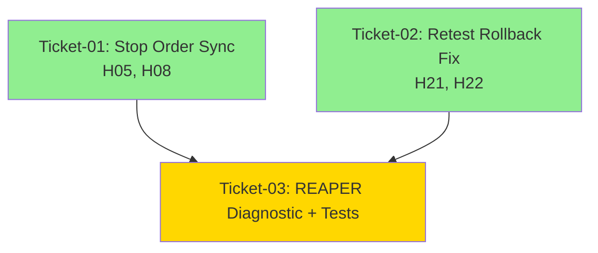

# Epic: epic-1-dna -- Execution Guide

## How to Execute Tickets (Bob Edition)

For each ticket in sequence order:
1. Open a NEW Bob session (separate from this planning session)
2. Switch to /v12-engineer mode
3. Type: `/ticket docs/brain/epic-1-dna/ticket-XX-[name].md`
4. Bob will execute the PLAN-THEN-EXECUTE protocol
5. Await [EXTRACT-COMPLETE] or [PHASE7-COMPLETE] report
6. Director runs manual gates (deploy-sync, F5, complexity_audit)
7. Confirm ticket done before opening next ticket session

---

## Ticket Sequence

### Ticket 01: Stop Order Synchronous Registration
**File:** `docs/brain/epic-1-dna/ticket-01-stop-order-sync.md`  
**Depends on:** NONE  
**Can run in parallel with:** Ticket 02  
**Scope:** H05 (CreateNewStopOrder line 320), H08 (CreateDirectStopOrder lines 264, 276)  
**Estimated Time:** 30 minutes  
**Changes:** 3 single-line replacements + inline comments

### Ticket 02: Retest Entry Rollback Race Fix
**File:** `docs/brain/epic-1-dna/ticket-02-retest-rollback-fix.md`  
**Depends on:** NONE  
**Can run in parallel with:** Ticket 01  
**Scope:** H21 (ExecuteRetestEntry line 173), H22 (ExecuteRetestManualEntry line 310)  
**Estimated Time:** 30 minutes  
**Changes:** 2 single-line replacements + inline comments

### Ticket 03: REAPER Diagnostic & Unit Tests
**File:** `docs/brain/epic-1-dna/ticket-03-reaper-diagnostic-tests.md`  
**Depends on:** Ticket 01, Ticket 02 (must complete code fixes first)  
**Scope:** REAPER diagnostic assertion + 5 new unit tests  
**Estimated Time:** 1-2 hours  
**Changes:** 1 field declaration + 1 diagnostic block + 1 new test file

---

## Dependency Diagram



**Legend:**
- Green: Can execute in parallel
- Gold: Must wait for dependencies

---

## Epic Success Criteria

### Functional Requirements
- [x] H05: Zero ghost orders after flatten during bracket submission
- [x] H08: Zero ghost orders after flatten during trailing stop updates
- [x] H21: Zero ghost positions after broker rejection in auto retest entries
- [x] H22: Zero ghost positions after broker rejection in manual retest entries
- [x] REAPER diagnostic detects orphaned positions after 10s grace period

### DNA Compliance
- [x] Zero new `lock()` statements in execution paths
- [x] ASCII-only compliance in all string literals
- [x] PR diff size < 150,000 characters
- [x] F5 compile gate passes (BUILD_TAG visible in NinjaTrader)
- [x] deploy-sync.ps1 succeeds without errors

### Test Coverage
- [x] 5 new unit tests in `tests/Build981ComplianceTests.cs`
- [x] All existing integration tests pass without modification
- [x] Manual test scenarios pass (H05/H08, H21/H22, REAPER diagnostic)

---

## Complexity Metrics (Before/After)

| Method | File | CYC Before | CYC After | Target | Status |
|--------|------|------------|-----------|--------|--------|
| CreateNewStopOrder | Orders.Management.StopSync.cs | 10 | 10 | <20 | ✅ PASS |
| CreateDirectStopOrder | Trailing.StopUpdate.cs | N/A | N/A | <20 | ✅ PASS |
| ExecuteRetestEntry | Entries.Retest.cs | 26 | 26 | <20 | ⚠️ OUT OF SCOPE |
| ExecuteRetestManualEntry | Entries.Retest.cs | 17 | 17 | <20 | ✅ PASS |

**Note:** ExecuteRetestEntry (CYC=26) complexity reduction is OUT OF SCOPE for this epic. Defer to future refactoring.

---

## Manual Verification Gates

### After Ticket 01 (Stop Order Sync)
```powershell
# 1. Hard-link sync
powershell -File .\deploy-sync.ps1

# 2. Verify Enqueue removal
grep -n "Enqueue.*stopOrders" src/V12_002.Orders.Management.StopSync.cs
grep -n "Enqueue.*stopOrders" src/V12_002.Trailing.StopUpdate.cs
# Expected: ZERO matches

# 3. Verify Build 981 exemption comments
grep -n "BUILD 981 EXEMPTION" src/V12_002.Orders.Management.StopSync.cs
grep -n "BUILD 981 EXEMPTION" src/V12_002.Trailing.StopUpdate.cs
# Expected: 3 matches total

# 4. F5 in NinjaTrader
# Expected: BUILD_TAG banner visible, no compile errors
```

### After Ticket 02 (Retest Rollback Fix)
```powershell
# 1. Hard-link sync
powershell -File .\deploy-sync.ps1

# 2. Verify Enqueue removal for activePositions adds
grep -n "Enqueue.*activePositions\[_en966\]" src/V12_002.Entries.Retest.cs
# Expected: ZERO matches

# 3. Verify synchronous writes exist
grep -n "activePositions\[_en966\] = _p966;" src/V12_002.Entries.Retest.cs
# Expected: 2 matches (lines 173, 310)

# 4. F5 in NinjaTrader
# Expected: BUILD_TAG banner visible, no compile errors
```

### After Ticket 03 (REAPER Diagnostic + Tests)
```powershell
# 1. Hard-link sync
powershell -File .\deploy-sync.ps1

# 2. Verify REAPER diagnostic field
grep -n "_orphanedPositionFirstSeen" src/V12_002.REAPER.cs
# Expected: 2 matches (field declaration + usage)

# 3. Run unit tests
dotnet test tests/Build981ComplianceTests.cs
# Expected: 5 tests pass

# 4. F5 in NinjaTrader
# Expected: BUILD_TAG banner visible, no compile errors
```

---

## Rollback Plan

### Rollback Trigger Conditions
1. F5 compile gate fails (syntax errors, missing references)
2. DIFF GUARD fails (PR diff > 150,000 characters)
3. REAPER false flatten detected in manual testing
4. Ghost orders detected in manual testing
5. FSM state leak detected in stress testing

### Rollback Procedure
```powershell
# 1. Revert all changes
git checkout HEAD -- src/V12_002.Orders.Management.StopSync.cs
git checkout HEAD -- src/V12_002.Trailing.StopUpdate.cs
git checkout HEAD -- src/V12_002.Entries.Retest.cs
git checkout HEAD -- src/V12_002.REAPER.cs
git checkout HEAD -- src/V12_002.REAPER.Audit.cs
git checkout HEAD -- tests/Build981ComplianceTests.cs

# 2. Re-sync NinjaTrader hard links
powershell -File .\deploy-sync.ps1

# 3. Verify rollback
# F5 in NinjaTrader
# Verify BUILD_TAG matches pre-refactor state
# Run existing integration tests
```

### Rollback Documentation
If rollback is triggered, create `docs/brain/epic-1-dna/rollback-report.md` documenting:
- Trigger condition
- Symptoms observed
- Root cause analysis
- Proposed alternative approach for next iteration

---

## Post-Epic Checklist

After all 3 tickets complete:

- [ ] All 4 bug fixes verified (H05, H08, H21, H22)
- [ ] REAPER diagnostic assertion tested (10s grace period)
- [ ] 5 unit tests passing in `tests/Build981ComplianceTests.cs`
- [ ] Existing integration tests passing (no regressions)
- [ ] Manual test scenarios passing (H05/H08, H21/H22, REAPER)
- [ ] deploy-sync.ps1 DIFF GUARD passes (< 150,000 characters)
- [ ] F5 compile gate passes (BUILD_TAG visible)
- [ ] lock() audit passes (ZERO matches in modified files)
- [ ] ASCII gate passes (ZERO non-ASCII characters)
- [ ] Update `docs/architecture.md` with Build 981 exemption notes
- [ ] Update `AGENTS.md` with REAPER diagnostic assertion
- [ ] Create `docs/brain/epic-1-dna/verification-report.md`
- [ ] Commit with BUILD_TAG bump

---

## Notes

- **Parallel Execution:** Tickets 01 and 02 can be executed in parallel by different engineers or in separate Bob sessions
- **Sequential Dependency:** Ticket 03 MUST wait for Tickets 01 and 02 to complete (tests validate the fixes)
- **Session Isolation:** Each ticket should be executed in a NEW Bob session to avoid context pollution
- **Verification Discipline:** Director MUST run manual gates after each ticket before proceeding to the next
- **Rollback Readiness:** Keep rollback commands ready in case any gate fails