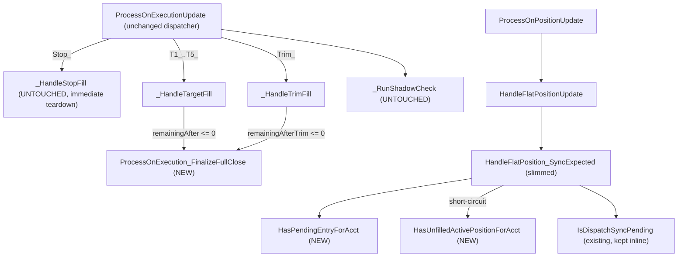

# Implementation Plan: Phase 6 T2.A Surgical Hardening

I have created the following plan after thorough exploration and analysis of the codebase. Follow the below plan verbatim. Trust the files and references. Do not re-verify what's written in the plan. Explore only when absolutely necessary. First implement all the proposed file changes and then I'll review all the changes together at the end.

## Observations

- Target file `file:src/V12_002.Orders.Callbacks.Execution.cs` is already heavily decomposed (Phase 5). Only 3 hot pockets remain: the `HandleFlatPosition_SyncExpected` foreach pair (lines 66-117), the `_HandleTargetFill` cleanup tail (lines 401-407), and the `_HandleTrimFill` cleanup tail (lines 444-457).
- The two cleanup tails are NOT byte-identical: trim has `pendingStopReplacements.TryRemove + Interlocked.Decrement(ref pendingReplacementCount)` while target lacks it. The ticket calls out this parity gap as a deliberate hardening to land in the new helper.
- `_HandleStopFill` (315-363) is explicitly OUT OF SCOPE per H5/H6 — its immediate-teardown semantics differ (4 dict TryRemoves) and its `OCO: Cancelled X target orders for Y` Print at line 344 must remain verbatim.
- No `DateTime.Now` occurrences exist within the touched line ranges, so that opportunistic fix is a no-op for this ticket; the grep gate `does NOT increase` is naturally satisfied.

## Approach

Apply three surgical, same-file private-method extractions on `V12_002` partial class, plus the deliberate cleanup-parity hardening on `_HandleTargetFill`. Place new helpers adjacent to their callers (predicates after `HandleFlatPosition_SyncExpected`; `_FinalizeFullClose` after `_HandleTrimFill` and before `_RunShadowCheck`). Preserve dispatcher branch ordering, all `Print` literals byte-identical, ASCII-only, no `lock(...)`, zero new allocations. Each replacement is a 1:1 contiguous block move with locals passed explicitly; no DRY-ing across `_HandleStopFill` (H6 firewall).

## Post-Extraction Flow

## Implementation Steps

### 1. Add new helper: `ProcessOnExecution_FinalizeFullClose(string entryName)`

- Location: insert immediately AFTER `_HandleTrimFill` (around current line 459) and BEFORE `ProcessOnExecution_RunShadowCheck` in `file:src/V12_002.Orders.Callbacks.Execution.cs`.
- Signature: `private void ProcessOnExecution_FinalizeFullClose(string entryName)`.
- Body owns three contiguous statements (the trim superset semantics):
  1. `RequestStopCancelLifecycleSafe(entryName);`
  2. `pendingStopReplacements.TryRemove(entryName, out _)` guarded `Interlocked.Decrement(ref pendingReplacementCount);` — wrap the decrement in braces.
  3. `activePositions.TryGetValue(entryName, out var localPos)` test → if non-null set `localPos.PendingCleanup = true;` else `SymmetryGuardForgetEntry(entryName);` — both branches braced.
- Add a single-line ASCII XML or `//` comment marking it as Phase 6 T2.A and noting deliberate Target/Trim parity hardening. No emoji, no curly quotes.
- Acceptance: ≤ 25 LOC, < 10 CYC.

### 2. Replace `_HandleTargetFill` cleanup tail (current lines 401-407)

- Within `ProcessOnExecution_HandleTargetFill`, in the `else` branch entered when `remainingAfter <= 0`, replace the existing 6 statements (`RequestStopCancelLifecycleSafe`, `PositionInfo closedPos`, `if/else` setting `PendingCleanup`/`SymmetryGuardForgetEntry`) with a single call: `ProcessOnExecution_FinalizeFullClose(entryName);`.
- Do NOT touch the surrounding logic (`bool terminalFill`, `ApplyTargetFill`, the `[1101E GUARD]` Print, the `TARGET FILLED:` Print, `UpdateStopQuantity` call, the post-block `terminalFill` target-dict cleanup at line 410-414).
- Net behavior change for Target: now also decrements `pendingReplacementCount` on cleanup — call out as deliberate hardening in the PR description.
- Acceptance: parent ≤ 9 CYC.

### 3. Replace `_HandleTrimFill` cleanup tail (current lines 444-457)

- Within `ProcessOnExecution_HandleTrimFill`, in the `else` branch entered when `remainingAfterTrim <= 0`, KEEP the `Print(string.Format("TRIM FLATTEN: Position {0} fully closed. Cancelling stop.", entryName));` line VERBATIM at the top of the else branch.
- After that Print, replace the next 12 statements with: `ProcessOnExecution_FinalizeFullClose(entryName);`.
- Do NOT touch `previousQty`, `remainingAfterTrim`, `TRIM EXECUTION:` Print, `STOP INTEGRITY:` Print, `UpdateStopQuantity` call.
- Acceptance: parent ≤ 9 CYC.

### 4. Add new predicate: `HasPendingEntryForAcct(string flatAcctName)`

- Location: insert immediately AFTER `HandleFlatPosition_SyncExpected` (around current line 117), keeping it spatially adjacent to its only caller.
- Signature: `private bool HasPendingEntryForAcct(string flatAcctName)`.
- Body owns the `foreach (var kvp in entryOrders.ToArray())` scan from current lines 75-87 verbatim: `IsOrderTerminal(ord.OrderState)` negation + `activePositions.TryGetValue` + `pos.ExecutingAccount.Name == flatAcctName` test, returning `true` on first hit, `false` if loop exits.
- Use the same `var ord = kvp.Value;` local style and same null-guards as today (no semantic change).
- Acceptance: ≤ 20 LOC, < 5 CYC.

### 5. Add new predicate: `HasUnfilledActivePositionForAcct(string flatAcctName)`

- Location: insert immediately after the predicate from Step 4.
- Signature: `private bool HasUnfilledActivePositionForAcct(string flatAcctName)`.
- Body owns the `foreach (var kvp in activePositions.ToArray())` scan from current lines 92-101 verbatim: `kvp.Value.ExecutingAccount.Name == flatAcctName && !kvp.Value.EntryFilled` test, returning `true` on first hit, `false` if loop exits.
- Acceptance: ≤ 20 LOC, < 5 CYC.

### 6. Slim `HandleFlatPosition_SyncExpected` (lines 66-117)

- Keep the outer `if (!string.IsNullOrEmpty(flatAcctName))` guard, the `flatExpKey` derivation, and the `bool hasSyncPending = IsDispatchSyncPending(flatExpKey);` call exactly as today.
- Replace the two inline `foreach` scans with: `bool hasPendingEntry = HasPendingEntryForAcct(flatAcctName);` followed by `bool hasActivePositionForAcct = false; if (!hasPendingEntry) { hasActivePositionForAcct = HasUnfilledActivePositionForAcct(flatAcctName); }` — preserves the existing short-circuit (don't pay the 2nd scan if the 1st already produced `true`).
- Keep the decision `if (hasPendingEntry || hasActivePositionForAcct || hasSyncPending)` at the parent.
- Keep BOTH Print strings byte-identical:
  - `[OnPositionUpdate] H-14 SKIP: {flatExpKey} broker=Flat but {skipReason} -- not resetting expectedPositions`
  - `[OnPositionUpdate] expectedPositions cleared for {flatExpKey} (position flat)`
- Keep `SetExpectedPositionLocked(flatExpKey, 0);` ahead of the second Print.
- Acceptance: parent ≤ 8 CYC.

### 7. Adjacent fixes (scope-limited to touched lines)

- Brace standardization: ensure every single-line `if`/`else` body inside the three new helpers is wrapped in `{ ... }` (Codacy/StyleCop alignment with Phase 5 T6 precedent). Apply ONLY inside the new helpers and inside the modified else-branches of `_HandleTargetFill`/`_HandleTrimFill`.
- `DateTime.Now`: none exist in touched lines — no rewrite required; gate is satisfied trivially.
- Do NOT mutate whitespace, line endings, or formatting outside the contiguous touched ranges (AGENTS.md Whitespace ban + 150 KB diff cap).

### 8. Out-of-scope guardrails (explicit do-not-touch list)

| Symbol / Region | File / Lines | Why |
| --- | --- | --- |
| `ProcessOnExecution_HandleStopFill` body | lines 315-363 | H5: `cancelledTargets` counter + gated `OCO: Cancelled` Print; H6: immediate-teardown semantics distinct from Target/Trim |
| `ProcessOnExecutionUpdate` dispatcher branch order | lines 207-255 | H4/B6: `Dedup -> TrackCompliance -> Stop_/T1-5_/Trim_ -> RunShadowCheck` ordering immutable |
| `ProcessOnExecution_Dedup` / `_TrackCompliance` / `_ExtractEntryName` / `_RunShadowCheck` | lines 257-313, 461-464 | already < 20 CYC; verify only |
| `OnPositionUpdate` / `OnExecutionUpdate` thin shells | lines 37-44, 192-205 | NT8 broker thread capture pattern locked |
| `BroadcastSyncTargetState` | lines 168-188 | already < 20 CYC |
| `HandleFlatPosition_ReconcileOrphans` / `HandleFlatPosition_CleanupActivePositions` | lines 119-165 | already lean; not flagged |
| MOVE-SYNC summary doc-comment block | lines 466-475 | unrelated docstring |

### 9. Verification gates (run in order, all must pass)

| Gate | Command | Expected |
| --- | --- | --- |
| File hotspot delta | `python scripts/csharp_hotspots.py | findstr Orders.Callbacks.Execution` | new helpers visible; parent CYCs ≤ targets in ticket |
| Visual diff | `git diff src/V12_002.Orders.Callbacks.Execution.cs` | zero string-literal mutation outside new helpers; no whitespace bleed |
| Build | `dotnet build .\Linting.csproj` | clean (no new warnings/errors) |
| ASCII | `python check_ascii.py` on touched file | PASS |
| Lock scan | `grep -rn "lock(" src/V12_002.Orders.Callbacks.Execution.cs` | zero matches |
| Print fidelity | `grep -cn "OCO: Cancelled" src/V12_002.Orders.Callbacks.Execution.cs` | == 1 |
| Helper presence | `grep -cn "FinalizeFullClose" src/V12_002.Orders.Callbacks.Execution.cs` | == 3 (1 decl + 2 callers) |
| Helper presence | `grep -cn "HasPendingEntryForAcct\|HasUnfilledActivePositionForAcct" src/V12_002.Orders.Callbacks.Execution.cs` | == 4 (2 decls + 2 callers) |
| Clock drift | `grep -cn "DateTime.Now" src/V12_002.Orders.Callbacks.Execution.cs` | does NOT increase from baseline (0) |
| Hard-link sync | `powershell -File .\deploy-sync.ps1` | EXIT 0 |
| Lint regression | `powershell -File .\scripts\lint.ps1` | delta = 0 |

### 10. PR description checklist

- Title: `T2.A — ProcessOnExecutionUpdate cluster: extract FinalizeFullClose + SyncExpected predicates`.
- Call out **deliberate hardening**: `_HandleTargetFill` now also decrements `pendingReplacementCount` (matching `_HandleTrimFill` superset semantics). State this is intentional, sourced from the ticket guardrail.
- Reference: Refactoring Analysis §1.2 + risk hotspots H4, H5, H6, H11; Refactoring Approach §3.2 T2.A + invariants B1, B5, B6 + D1, D2, D5.
- Confirm no changes to `_HandleStopFill`, dispatcher ordering, or any out-of-scope symbol per Step 8.
- Attach `csharp_hotspots.py` before/after delta showing file-level CYC drop of ~10-15.
