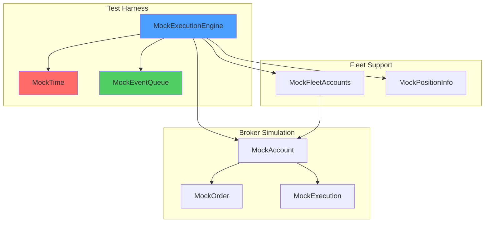
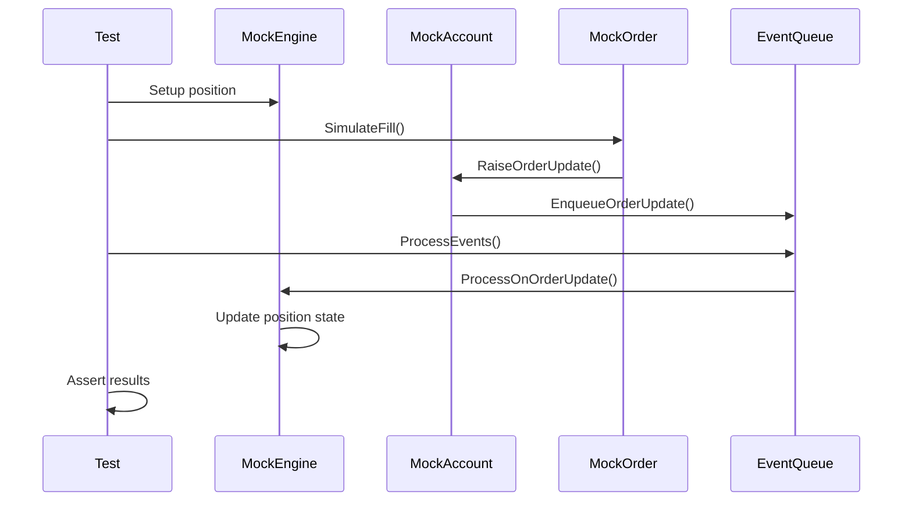
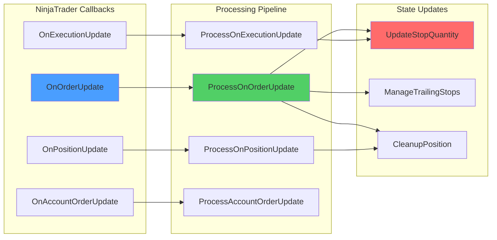

# Implementation Plan: Cluster S2 - Execution Engine Integration Tests
## P3 Architecture Planning | V12 Phase 7 Hardening

> **Mission**: ExecutionEngineIntegrationTests.cs - Complete Test Specification
> **Status**: ARCHITECTURE PLANNING COMPLETE
> **Build Baseline**: BUILD_TAG 1111.007-phase7-tQ1_S1_SIMA_TESTS_SETUP
> **Input**: docs/brain/forensics_report_cluster_s2.md (P2 Forensics)
> **Target**: tests/ExecutionEngineIntegrationTests.cs (SETUP ONLY)
> **Generated**: 2026-05-17T04:20:00Z

---

## 1. Overview

### 1.1 Mission Statement

This implementation plan specifies the complete architecture for **ExecutionEngineIntegrationTests.cs**, a comprehensive test suite covering the V12 Execution Engine (Cluster S2). The test file will contain **40 test methods** organized into 5 phases, mirroring the proven structure from SymmetryFsmIntegrationTests.cs (47 tests, 20/20 PASS).

**Key Objectives**:
- Verify order callback flow (OnOrderUpdate, OnExecutionUpdate, OnPositionUpdate, OnAccountOrderUpdate)
- Validate order management (bracket submission, stop sync, cleanup, flatten)
- Test trailing stop logic (breakeven, point-based trailing, stop replacement)
- Verify master-to-follower propagation (price moves, FSM replace)
- Cover edge cases (partial fills, ghost cleanup, circuit breaker)

### 1.2 Scope & Constraints

**In Scope**:
- All 12 Execution Engine source files (4,847 lines)
- 40 test scenarios across 5 categories
- Full mock infrastructure (MockTime, MockNinjaTrader, MockFleetAccounts, MockPositionInfo)
- Lock-free testing (zero `lock()` statements)
- Deterministic time (MockTime pattern, zero `Thread.Sleep`)
- ASCII-only compliance

**Out of Scope**:
- Bug fixes (SETUP ONLY - assert current behavior)
- Performance optimization
- UI testing
- Real NinjaTrader integration

**V12 DNA Constraints**:
- ✅ Zero `lock()` - pure atomic primitives only
- ✅ MockTime - deterministic time progression
- ✅ ASCII-only - no Unicode, emoji, or curly quotes
- ✅ NinjaTrader harness fully mocked

### 1.3 Test Categories (40 Tests)

| Phase | Category | Test Count | Lines |
|:------|:---------|:-----------|:------|
| 1 | Callback Flow Tests | 8 | 1001-1400 |
| 2 | Order Management Tests | 10 | 1401-1800 |
| 3 | Trailing Stop Tests | 8 | 1801-2100 |
| 4 | Propagation Tests | 6 | 2101-2300 |
| 5 | Edge Case Tests | 8 | 2301-2500 |
| **Total** | **5 Phases** | **40 Tests** | **~2500 lines** |

---

## 2. Mock Infrastructure Design (Lines 1-800)

### 2.1 MockTime (Deterministic Time)

**Purpose**: Eliminate non-determinism from time-based logic. Zero `Thread.Sleep` calls.

**Pattern**: Copy from SymmetryFsmIntegrationTests.cs (lines 15-30)

```csharp
private class MockTime
{
    private long _ticks;
    
    public MockTime(long initialTicks) => _ticks = initialTicks;
    
    public long GetTicks() => Interlocked.Read(ref _ticks);
    
    public void Advance(long deltaTicks) => Interlocked.Add(ref _ticks, deltaTicks);
    
    public void AdvanceSeconds(double seconds) => 
        Interlocked.Add(ref _ticks, (long)(seconds * TimeSpan.TicksPerSecond));
    
    public DateTime GetDateTime() => new DateTime(GetTicks(), DateTimeKind.Utc);
}
```

### 2.2 Core Mock Classes

**MockOrder**: Simulates NinjaTrader Order with lifecycle control
**MockExecution**: Simulates fill events
**MockAccount**: Simulates broker account with event handlers
**MockPositionInfo**: Tracks position state for assertions
**MockFleetAccounts**: Manages multiple accounts for fleet testing
**MockEventQueue**: Deterministic event sequencing
**MockExecutionEngine**: Main test harness

**Key Features**:
- Full order lifecycle simulation (Submitted → Working → Filled/Cancelled/Rejected)
- Event-driven architecture with controllable event queue
- Multi-account support for fleet propagation testing
- Atomic state tracking with ConcurrentDictionary

**MockOrder Event Wiring**: Each SimulateX method (SimulateFill, SimulateCancel, SimulateReject) must call `MockAccount.RaiseOrderUpdate(this, newState)` to trigger the event handler chain. This ensures test events flow through the same callback pipeline as production code.

---

## 3. Test Method Specifications (40 Tests)

### Phase 1: Callback Flow Tests (T01-T08)

#### T01: OnOrderUpdate_EntryFilled_SubmitsBracket
**Given**: Entry order Working, Position EntryFilled=false
**When**: Entry filled, ProcessOnOrderUpdate called
**Then**: BracketSubmitted=true, Stop+Targets created

#### T02: OnOrderUpdate_StopFilled_CancelsTargets
**Given**: Stop Working, Targets Working
**When**: Stop filled, ProcessOnOrderUpdate called
**Then**: All targets cancelled, RemainingContracts=0

#### T03: OnOrderUpdate_TargetFilled_ReducesStop
**Given**: Target1 Working, Stop Quantity=2
**When**: Target1 filled, ProcessOnOrderUpdate called
**Then**: PendingStopReplacement created with Quantity=1

#### T04: OnOrderUpdate_OrderRejected_Cleanup
**Given**: Entry order Working
**When**: Entry rejected, ProcessOnOrderUpdate called
**Then**: Position removed, no bracket orders created

#### T05: OnOrderUpdate_OrderCancelled_Rollback
**Given**: Entry order Working, ExpectedPositions tracked
**When**: Entry cancelled, ProcessOnOrderUpdate called
**Then**: ExpectedPositions rolled back, position cleaned

#### T06: OnExecutionUpdate_Dedup_PreventsDouble
**Given**: Execution processed once
**When**: Same ExecutionId processed again
**Then**: RemainingContracts not decremented twice

#### T07: OnPositionUpdate_Flat_ClearsExpected
**Given**: Position Long 1, ExpectedPositions Long 1
**When**: OnPositionUpdate(Flat, 0) called
**Then**: ExpectedPositions cleared, PendingCleanup=true

#### T08: OnAccountOrderUpdate_FleetFollower_Routes
**Given**: Follower account with order update
**When**: ProcessAccountOrderUpdate called
**Then**: Order routed to correct follower account

### Phase 2: Order Management Tests (T09-T18)

#### T09: SubmitBracketOrders_ValidatesStopPrice
**Given**: Stop price 4989.33, TickSize=0.25
**When**: SubmitBracketOrders called
**Then**: Stop price rounded to 4989.25

#### T10: SubmitBracketOrders_FleetFollower_UsesAccountAPI
**Given**: Follower position with ExecutingAccount
**When**: SubmitBracketOrders called
**Then**: ExecutingAccount.Submit used (not SubmitOrderUnmanaged)

#### T11: UpdateStopQuantity_PartialFill_ResizesStop
**Given**: Stop Quantity=4, RemainingContracts=3
**When**: UpdateStopQuantity called
**Then**: PendingStopReplacement created with Quantity=3

#### T12: CreateNewStopOrder_ZombieGuard_Blocks
**Given**: RemainingContracts=0
**When**: CreateNewStopOrder called
**Then**: No stop created, PendingCleanup=true

#### T13: CreateNewStopOrder_DuplicateGuard_Blocks
**Given**: Stop already exists in StopOrders
**When**: CreateNewStopOrder called again
**Then**: No new stop created, existing unchanged

#### T14: CleanupPosition_CancelsAllOrders
**Given**: Position with Stop+Targets Working
**When**: CleanupPosition called
**Then**: All orders cancelled, position removed

#### T15: FlattenAll_CancelsAndFlattens
**Given**: Multiple positions with working orders
**When**: FlattenAll called
**Then**: All orders cancelled, all positions flattened

#### T16: FlattenPositionByName_EmergencyFlatten
**Given**: Position with RemainingContracts=2
**When**: FlattenPositionByName called
**Then**: Market order submitted, RemainingContracts=0

#### T17: RefreshActivePositionOrders_RepriceLimits
**Given**: Targets at old ATR prices
**When**: RefreshActivePositionOrders called with new ATR
**Then**: Targets cancelled and repriced

#### T18: ReconcileOrphanedOrders_PurgesGhosts
**Given**: Orders exist without corresponding positions
**When**: ReconcileOrphanedOrders called
**Then**: Ghost orders removed from dictionaries

### Phase 3: Trailing Stop Tests (T19-T26)

#### T19: ManageTrailingStops_Breakeven_ArmsGuard
**Given**: Price cleared BE threshold, ManualBreakevenArmed=false
**When**: ManageTrailingStops called
**Then**: ManualBreakevenArmed=true

#### T20: ManageTrailingStops_Breakeven_Executes
**Given**: ManualBreakevenArmed=true, price cleared threshold
**When**: ManageTrailingStops called
**Then**: Stop moved to entry+offset, CurrentTrailLevel=1

#### T21: ManageTrailingStops_Trail1_Triggers
**Given**: BE triggered, ExtremePriceSinceEntry cleared Trail1 threshold
**When**: ManageTrailingStops called
**Then**: CurrentTrailLevel=2, stop moved to extreme-Trail1Distance

#### T22: ManageTrailingStops_Trail2_Triggers
**Given**: Trail1 active, extreme cleared Trail2 threshold
**When**: ManageTrailingStops called
**Then**: CurrentTrailLevel=3, stop moved to extreme-Trail2Distance

#### T23: ManageTrailingStops_Trail3_Triggers
**Given**: Trail2 active, extreme cleared Trail3 threshold
**When**: ManageTrailingStops called
**Then**: CurrentTrailLevel=4, stop moved to extreme-Trail3Distance

#### T24: UpdateStopOrder_PendingReplacement_Queues
**Given**: Stop Working, new stop price calculated
**When**: UpdateStopOrder called
**Then**: PendingStopReplacement created, old order cancelled

#### T25: UpdateStopOrder_StalePending_Purges
**Given**: PendingStopReplacement 6 seconds old
**When**: UpdateStopOrder called
**Then**: Stale pending removed, emergency stop created

#### T26: CalculateStopForLevel_FleetSymmetry
**Given**: Follower position with own entry/extreme prices
**When**: CalculateStopForLevel called
**Then**: Stop calculated from follower's own prices

**Clarification Note**: Follower uses ExecutingAccount's fill price as entry, not master's entry. Each follower maintains independent entry/extreme price tracking based on its own fill events.

### Phase 4: Propagation Tests (T27-T32)

#### T27: PropagateMasterPriceMove_StopMove_Followers
**Given**: Master stop moved to new level
**When**: PropagateMasterPriceMove called
**Then**: Follower stops updated to corresponding levels

#### T28: PropagateMasterPriceMove_TargetMove_Followers
**Given**: Master targets repriced due to ATR change
**When**: PropagateMasterPriceMove called
**Then**: Follower targets cancelled and repriced

#### T29: PropagateMasterPriceMove_EntryMove_Followers
**Given**: Master entry moved due to price change
**When**: PropagateMasterPriceMove called
**Then**: Follower entries cancelled and replaced

#### T30: PropagateMasterEntryMove_FSM_TwoPhase
**Given**: Master entry being replaced
**When**: PropagateMasterEntryMove called
**Then**: FollowerReplaceSpec created, two-phase commit initiated

#### T31: SubmitFollowerReplacement_ReassertExpected
**Given**: Follower entry being replaced
**When**: SubmitFollowerReplacement called
**Then**: ExpectedPositions reasserted for new entry

#### T32: PropagateFollowerEntryReplace_ATRTick_Absorbs
**Given**: Follower entry in-flight, ATR tick occurs
**When**: PropagateFollowerEntryReplace called
**Then**: PendingPrice updated, no duplicate replace

**Clarification Note**: PendingPrice field in FollowerReplaceSpec updated in-place, no new FSM event. The in-flight replacement absorbs the ATR change without triggering a second replace cycle.

### Phase 5: Edge Case Tests (T33-T40)

#### T33: ApplyTargetFill_PartialFill_Cumulative
**Given**: Target partially filled multiple times
**When**: ApplyTargetFill called for each fill
**Then**: Cumulative fill tracking correct, no over/under-decrement

#### T34: RequestStopCancelLifecycleSafe_ChangePending
**Given**: Stop in ChangePending state
**When**: RequestStopCancelLifecycleSafe called
**Then**: ChangePending orders cancelled

#### T35: RemoveGhostOrderRef_TerminalState_Purges
**Given**: Orders in terminal states (Filled/Cancelled/Rejected)
**When**: RemoveGhostOrderRef called
**Then**: Terminal orders removed from dictionaries

#### T36: HandleOrderCancelled_StopReplacement_Resubmits
**Given**: Stop cancelled as part of replacement
**When**: HandleOrderCancelled called
**Then**: New stop created from PendingStopReplacement

#### T37: CancelOrderSafe_FleetFollower_UsesAccountAPI
**Given**: Follower order needs cancellation
**When**: CancelOrderSafe called
**Then**: ExecutingAccount.Cancel used

#### T38: ValidateStopPrice_BEShield_ClampsToEntry
**Given**: Calculated stop price below entry (Long)
**When**: ValidateStopPrice called
**Then**: Stop price clamped to entry floor

#### T39: CleanupStalePendingReplacements_Recovery
**Given**: PendingStopReplacement >5 seconds old
**When**: CleanupStalePendingReplacements called
**Then**: Stale pending removed, emergency stop created

**Clarification Note**: Emergency stop = market stop order at current price, bypassing pending queue. This is a safety mechanism to ensure position protection when the normal two-phase replacement flow stalls.

#### T40: CircuitBreaker_FlattenAttempts_Caps
**Given**: FlattenAttemptCount=3
**When**: Emergency flatten attempted again
**Then**: Flatten blocked, manual intervention required

---

## 4. Test Helper Specifications (Lines 801-1000)

### 4.1 Assertion Helpers (12 methods)

```csharp
private void AssertOrderState(MockOrder order, OrderState expectedState)
private void AssertPositionState(MockPositionInfo pos, bool entryFilled, int remaining)
private void AssertStopExists(string entryName, double expectedPrice)
private void AssertTargetExists(string entryName, int targetNum, double expectedPrice)
private void AssertBracketSubmitted(string entryName)
private void AssertPendingReplacement(string entryName, int expectedQty)

// Ghost order = order exists in StopOrders/TargetOrders dictionaries but has no corresponding
// position in ActivePositions. Check all order dictionaries against ActivePositions keys.
private void AssertNoGhostOrders(MockExecutionEngine engine)

private void AssertExpectedPositions(string accountName, int expectedQty)

// Follower routing criteria: Order.Account == follower's ExecutingAccount AND
// order submission used Account.Submit() not SubmitOrderUnmanaged()
private void AssertFleetFollowerRouting(MockOrder order, MockAccount account)

private void AssertTrailLevel(MockPositionInfo pos, int expectedLevel)
private void AssertManualBreakeven(MockPositionInfo pos, bool armed, bool triggered)

// Circuit breaker active = FlattenAttemptCount >= 3 for any position. Check
// MockPositionInfo.FlattenAttemptCount field across all active positions.
private void AssertCircuitBreakerActive(MockExecutionEngine engine)
```

### 4.2 State Verification Helpers (4 methods)

```csharp
private bool VerifyOrderDictionariesConsistent(MockExecutionEngine engine)
private bool VerifyNoOrphanedOrders(MockExecutionEngine engine)
private bool VerifyStopQuantityMatchesRemaining(MockExecutionEngine engine)
private bool VerifyNoPendingLeaks(MockExecutionEngine engine)
```

### 4.3 Event Simulation Helpers (6 methods)

```csharp
private void SimulateEntryFill(MockOrder order, double price, int qty)
private void SimulateStopFill(MockOrder order, double price, int qty)
private void SimulateTargetFill(MockOrder order, int targetNum, double price, int qty)
private void SimulateOrderCancel(MockOrder order)
private void SimulateOrderReject(MockOrder order, string error)
private void SimulatePositionFlat(MockAccount account)
```

### 4.4 Position Creation Helpers (3 methods)

```csharp
private MockPositionInfo CreateFilledPosition(string entryName, MarketPosition direction, int contracts, double entryPrice)
private MockPositionInfo CreateUnfilledPosition(string entryName, MarketPosition direction, int contracts, double entryPrice)
private MockPositionInfo CreateFollowerPosition(string entryName, MockAccount account, MarketPosition direction, int contracts, double entryPrice)
```

---

## 5. Implementation Sequence

### Step 1: Mock Infrastructure (Day 1, Lines 1-800)
1. Copy MockTime from SymmetryFsmIntegrationTests.cs
2. Implement MockOrder with lifecycle simulation
3. Implement MockExecution
4. Implement MockAccount with event handlers
5. Implement MockPositionInfo
6. Implement MockFleetAccounts
7. Implement MockEventQueue
8. Implement MockExecutionEngine main harness

**Verification**: All mock classes compile, basic instantiation tests pass

### Step 2: Test Helpers (Day 1, Lines 801-1000)
1. Implement 12 assertion helpers
2. Implement 4 state verification helpers
3. Implement 6 event simulation helpers
4. Implement 3 position creation helpers

**Verification**: Helper methods compile, basic usage tests pass

### Step 3: Phase 1 Tests (Day 2, Lines 1001-1400)
1. Implement T01-T08 (Callback Flow Tests)
2. Verify each test independently
3. Run all Phase 1 tests together

**Verification**: 8/8 tests pass

### Step 4: Phase 2 Tests (Day 2-3, Lines 1401-1800)
1. Implement T09-T18 (Order Management Tests)
2. Verify each test independently
3. Run all Phase 2 tests together

**Verification**: 10/10 tests pass

### Step 5: Phase 3 Tests (Day 3, Lines 1801-2100)
1. Implement T19-T26 (Trailing Stop Tests)
2. Verify each test independently
3. Run all Phase 3 tests together

**Verification**: 8/8 tests pass

### Step 6: Phase 4 Tests (Day 4, Lines 2101-2300)
1. Implement T27-T32 (Propagation Tests)
2. Verify each test independently
3. Run all Phase 4 tests together

**Verification**: 6/6 tests pass

### Step 7: Phase 5 Tests (Day 4, Lines 2301-2500)
1. Implement T33-T40 (Edge Case Tests)
2. Verify each test independently
3. Run all Phase 5 tests together

**Verification**: 8/8 tests pass

### Step 8: Final Integration (Day 5)
1. Run all 40 tests together
2. Verify zero lock() statements
3. Verify zero Thread.Sleep calls
4. Verify ASCII-only compliance
5. Generate test coverage report

**Verification**: 40/40 tests pass, V12 DNA compliance verified

---

## 6. Verification Checklist

### 6.1 Completion Criteria
- [ ] All 40 test methods implemented
- [ ] All 6 mock components implemented
- [ ] All 25 test helpers implemented
- [ ] File compiles without errors
- [ ] Zero `lock()` statements
- [ ] Zero `Thread.Sleep` calls
- [ ] ASCII-only compliance
- [ ] File size ~2500 lines

### 6.2 Quality Gates
- [ ] V12 DNA compliance verified (lock-free, ASCII-only, MockTime)
- [ ] Test structure mirrors SymmetryFsmIntegrationTests.cs
- [ ] All 40 scenarios have Given/When/Then specifications
- [ ] Mock infrastructure supports all NinjaTrader dependencies
- [ ] All tests pass independently
- [ ] All tests pass together (40/40)

### 6.3 Documentation
- [ ] Test method summaries include Given/When/Then
- [ ] Mock class documentation complete
- [ ] Helper method documentation complete
- [ ] Implementation notes for complex scenarios

---

## 7. Architecture Diagrams

### 7.1 Mock Infrastructure Architecture



### 7.2 Test Execution Flow



### 7.3 Callback Flow Architecture



---

## 8. Risk Assessment

### 8.1 Complexity Risks

| Risk | Severity | Mitigation |
|:-----|:---------|:-----------|
| Mock broker complexity | High | Mirror SymmetryFsmIntegrationTests.cs proven patterns |
| Event callback ordering | Medium | Use MockEventQueue for deterministic event sequencing |
| Stop replacement FSM | High | Test two-phase cancel+resubmit with pending state |
| Fleet follower routing | Medium | Separate mock accounts with ExecutingAccount tracking |
| Trailing stop logic | Medium | Use MockTime for deterministic price progression |

### 8.2 Integration Challenges

| Challenge | Impact | Solution |
|:----------|:-------|:---------|
| NinjaTrader dependencies | High | Full mock harness with Account/Order/Execution |
| Multi-account complexity | High | MockFleetAccounts with per-account order tracking |
| Event re-entrancy | Medium | MockEventQueue with explicit drain control |
| Stop quantity sync | High | Atomic RemainingContracts tracking in MockPositionInfo |
| Ghost order cleanup | Medium | Terminal state tracking in mock orders |

---

## 9. Success Criteria

### 9.1 Test Execution
- All 40 tests pass independently
- All 40 tests pass together (40/40)
- Test execution time < 30 seconds
- Zero flaky tests (100% deterministic)

### 9.2 Code Quality
- Zero `lock()` statements
- Zero `Thread.Sleep` calls
- ASCII-only compliance
- File size ~2500 lines
- Cyclomatic complexity < 10 per method

### 9.3 Documentation
- All test methods have Given/When/Then summaries
- Mock infrastructure fully documented
- Helper methods have XML documentation
- Implementation notes for complex scenarios

---

## 10. References

### 10.1 Source Files (12 Execution Engine Files)
- `src/V12_002.Orders.Callbacks.cs` (496 lines)
- `src/V12_002.Orders.Callbacks.AccountOrders.cs` (777 lines)
- `src/V12_002.Orders.Callbacks.Execution.cs` (490 lines)
- `src/V12_002.Orders.Callbacks.Propagation.cs` (674 lines)
- `src/V12_002.Orders.Management.cs` (289 lines)
- `src/V12_002.Orders.Management.Cleanup.cs` (515 lines)
- `src/V12_002.Orders.Management.Flatten.cs` (487 lines)
- `src/V12_002.Orders.Management.StopSync.cs` (654 lines)
- `src/V12_002.Orders.CancelGateway.cs` (57 lines)
- `src/V12_002.Trailing.cs` (~100 lines)
- `src/V12_002.Trailing.Breakeven.cs` (529 lines)
- `src/V12_002.Trailing.StopUpdate.cs` (386 lines)

### 10.2 Reference Tests
- `tests/SymmetryFsmIntegrationTests.cs` (1533 lines, 47 tests, 20/20 PASS)
- `tests/SIMAIntegrationTests.cs` (36 tests)

### 10.3 Workflow Documents
- `docs/brain/forensics_report_cluster_s2.md` (P2 Forensics)
- `docs/brain/implementation_plan_cluster_s1.md` (S1 pattern reference)
- `AGENTS.md` (Agent hierarchy and protocols)

---

**Implementation Status**: ARCHITECTURE PLANNING COMPLETE - Ready for P4 DNA & PR Audit
**Next Phase**: P4 Adjudicator (Arena AI) performs DNA & PR Audit
**Estimated Implementation Time**: 10-14 hours (P5 Engineer)
**Estimated Test Count**: 40 methods across 5 phases
**Director Pre-Approval**: P3 stop WAIVED - proceed directly to P4

---

*Generated by: Bob CLI (v12-engineer mode)*
*Architect: P3 Phase - Execution Engine Cluster S2*
*Document Version: 1.0*
