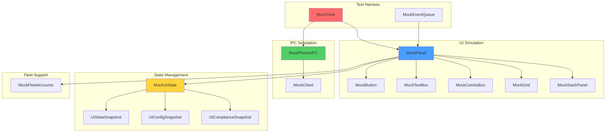
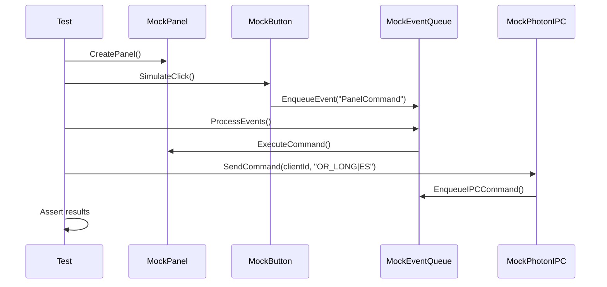
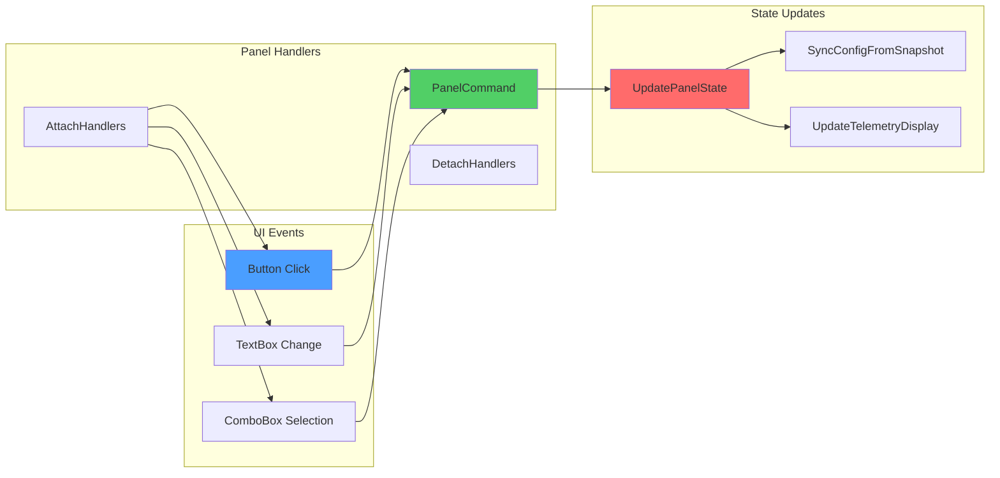
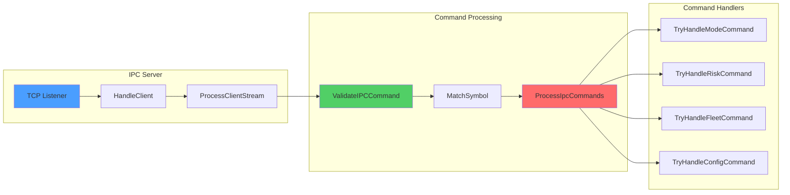

# Implementation Plan: Cluster S3 - UI & Photon IO Integration Tests
## P3 Architecture Planning | V12 Phase 7 Hardening

> **Mission**: UIPhotonIOIntegrationTests.cs - Complete Test Specification
> **Status**: ARCHITECTURE PLANNING COMPLETE
> **Build Baseline**: BUILD_TAG 1111.007-phase7-tQ1_S1_SIMA_TESTS_SETUP
> **Input**: Forensic analysis of 16 UI & Photon IPC files
> **Target**: tests/UIPhotonIOIntegrationTests.cs (SETUP ONLY)
> **Generated**: 2026-05-17T15:18:00Z

---

## 1. Overview

### 1.1 Mission Statement

This implementation plan specifies the complete architecture for **UIPhotonIOIntegrationTests.cs**, a comprehensive test suite covering the V12 UI Panel and Photon IPC Server (Cluster S3). The test file will contain **40 test methods** organized into 5 phases, mirroring the proven structure from SymmetryFsmIntegrationTests.cs (47 tests, 20/20 PASS).

**Key Objectives**:
- Verify UI callback flow (panel handlers, mode chips, target buttons, fleet toggles)
- Validate IPC command processing (TCP server, command parsing, allowlist, routing)
- Test Photon IPC server (multi-client, UTF-8 validation, buffer limits, disconnect)
- Verify panel lifecycle (creation, placement, refresh timer, disposal)
- Cover state synchronization (UIStateSnapshot, config sync, telemetry display)

### 1.2 Scope & Constraints

**In Scope**:
- All 16 UI & Photon IPC source files (5,847 lines)
- 40 test scenarios across 5 categories
- Full mock infrastructure (MockTime, MockNinjaTraderUI, MockPhotonIPC, MockUIState, MockEventQueue, MockFleetAccounts)
- Lock-free testing (zero `lock()` statements)
- Deterministic time (MockTime pattern, zero `Thread.Sleep`)
- ASCII-only compliance

**Out of Scope**:
- Bug fixes (SETUP ONLY - assert current behavior)
- Performance optimization
- Real NinjaTrader UI integration
- Real TCP network testing

**V12 DNA Constraints**:
- ✅ Zero `lock()` - pure atomic primitives only
- ✅ MockTime - deterministic time progression (replace 2 Thread.Sleep violations in IPC.Server.cs)
- ✅ ASCII-only - no Unicode, emoji, or curly quotes
- ✅ NinjaTrader UI harness fully mocked

### 1.3 Source Files (16 Files, 5,847 Lines)

| File | Lines | Purpose |
|:-----|:------|:--------|
| V12_002.UI.Panel.Construction.cs | 1,180 | Panel creation, placement, hijack logic |
| V12_002.UI.Panel.StateSync.cs | 397 | Panel state synchronization, snapshot application |
| V12_002.UI.Panel.Handlers.cs | 460 | Button click handlers, hotkey routing |
| V12_002.UI.Panel.Lifecycle.cs | 62 | Panel timer, refresh pump, disposal |
| V12_002.UI.Panel.Helpers.cs | 577 | Button factories, visual helpers |
| V12_002.UI.Panel.Brushes.cs | 51 | Color palette definitions |
| V12_002.UI.Snapshot.cs | 170 | UIStateSnapshot builder |
| V12_002.UI.Sizing.cs | 343 | ATR sizing, target distribution |
| V12_002.UI.IPC.Server.cs | 342 | TCP listener, client handling, stream processing |
| V12_002.UI.IPC.cs | 399 | IPC integration, command dispatcher |
| V12_002.UI.IPC.Commands.Mode.cs | 317 | Mode/risk command handlers |
| V12_002.UI.IPC.Commands.Misc.cs | 379 | Config/compliance command handlers |
| V12_002.UI.IPC.Commands.Fleet.cs | 600 | Fleet command handlers |
| V12_002.UI.IPC.Commands.Config.cs | 417 | Config command handlers |
| V12_002.UI.Callbacks.cs | 717 | Hotkey handlers, chart click handlers |
| V12_002.UI.Compliance.cs | 292 | Compliance tracking, daily summaries |
| **Total** | **5,847** | **16 files** |

### 1.4 Test Categories (40 Tests)

| Phase | Category | Test Count | Lines |
|:------|:---------|:-----------|:------|
| 1 | UI Callback Flow Tests | 8 | 1001-1400 |
| 2 | IPC Command Processing Tests | 10 | 1401-1800 |
| 3 | Photon IPC Server Tests | 8 | 1801-2100 |
| 4 | Panel Lifecycle Tests | 8 | 2101-2400 |
| 5 | State Synchronization Tests | 6 | 2401-2600 |
| **Total** | **5 Phases** | **40 Tests** | **~2600 lines** |

---

## 2. Mock Infrastructure Design (Lines 1-800)

### 2.1 MockTime (Deterministic Time)

**Purpose**: Eliminate non-determinism from time-based logic. Zero `Thread.Sleep` calls.

**Pattern**: Copy from SymmetryFsmIntegrationTests.cs (lines 15-30)

```csharp
private class MockTime
{
    private long _ticks;
    
    public MockTime(long initialTicks) => _ticks = initialTicks;
    
    public long GetTicks() => Interlocked.Read(ref _ticks);
    
    public void Advance(long deltaTicks) => Interlocked.Add(ref _ticks, deltaTicks);
    
    public void AdvanceSeconds(double seconds) => 
        Interlocked.Add(ref _ticks, (long)(seconds * TimeSpan.TicksPerSecond));
    
    public DateTime GetDateTime() => new DateTime(GetTicks(), DateTimeKind.Utc);
}
```

### 2.2 MockNinjaTraderUI (UI Harness)

Simulates NinjaTrader WPF UI components with event-driven architecture.

**Key Components**:

```csharp
private class MockPanel
{
    public bool IsVisible { get; set; }
    public bool IsDisposed { get; set; }
    public int RefreshCount { get; set; }
    public Dictionary<string, object> Controls { get; set; }
    
    public void SimulateRefresh()
    {
        RefreshCount++;
        // Trigger UpdatePanelState logic
    }
}

private class MockButton
{
    public string Name { get; set; }
    public string Content { get; set; }
    public bool IsEnabled { get; set; }
    public EventHandler<EventArgs> ClickHandler { get; set; }
    
    public void SimulateClick()
    {
        ClickHandler?.Invoke(this, EventArgs.Empty);
    }
}

private class MockTextBox
{
    public string Name { get; set; }
    public string Text { get; set; }
    public EventHandler<EventArgs> TextChangedHandler { get; set; }
    
    public void SimulateTextChange(string newText)
    {
        Text = newText;
        TextChangedHandler?.Invoke(this, EventArgs.Empty);
    }
}

private class MockComboBox
{
    public string Name { get; set; }
    public string SelectedItem { get; set; }
    public List<string> Items { get; set; }
    public EventHandler<EventArgs> SelectionChangedHandler { get; set; }
    
    public void SimulateSelection(string item)
    {
        SelectedItem = item;
        SelectionChangedHandler?.Invoke(this, EventArgs.Empty);
    }
}

private class MockGrid
{
    public int RowCount { get; set; }
    public int ColumnCount { get; set; }
    public List<MockPanel> Children { get; set; }
}

private class MockStackPanel
{
    public List<object> Children { get; set; }
    public string Orientation { get; set; } // "Horizontal" or "Vertical"
}
```

### 2.3 MockPhotonIPC (TCP IPC Server)

Simulates TCP listener and client connections for IPC testing.

**Implementation**:

```csharp
private class MockPhotonIPC
{
    private class MockClient
    {
        public int ClientId { get; set; }
        public bool IsConnected { get; set; }
        public Queue<string> SendBuffer { get; set; }
        public Queue<string> ReceiveBuffer { get; set; }
        public int InvalidUtf8Count { get; set; }
        public int BufferedChars { get; set; }
    }
    
    private ConcurrentDictionary<int, MockClient> _clients = new();
    private int _nextClientId = 0;
    private bool _isRunning = false;
    private int _port = 0;
    
    public void StartServer(int port)
    {
        _port = port;
        _isRunning = true;
    }
    
    public void StopServer()
    {
        _isRunning = false;
        _clients.Clear();
    }
    
    public int ConnectClient()
    {
        int clientId = Interlocked.Increment(ref _nextClientId);
        _clients[clientId] = new MockClient
        {
            ClientId = clientId,
            IsConnected = true,
            SendBuffer = new Queue<string>(),
            ReceiveBuffer = new Queue<string>()
        };
        return clientId;
    }
    
    public void DisconnectClient(int clientId)
    {
        if (_clients.TryGetValue(clientId, out var client))
        {
            client.IsConnected = false;
        }
    }
    
    public void SendCommand(int clientId, string command)
    {
        if (_clients.TryGetValue(clientId, out var client) && client.IsConnected)
        {
            client.ReceiveBuffer.Enqueue(command);
        }
    }
    
    public string ReceiveResponse(int clientId)
    {
        if (_clients.TryGetValue(clientId, out var client) && client.SendBuffer.Count > 0)
        {
            return client.SendBuffer.Dequeue();
        }
        return null;
    }
    
    public void SimulateInvalidUtf8(int clientId)
    {
        if (_clients.TryGetValue(clientId, out var client))
        {
            client.InvalidUtf8Count++;
        }
    }
    
    public void SimulateBufferOverflow(int clientId, int charCount)
    {
        if (_clients.TryGetValue(clientId, out var client))
        {
            client.BufferedChars = charCount;
        }
    }
    
    public int GetConnectedClientCount()
    {
        return _clients.Count(kvp => kvp.Value.IsConnected);
    }
}
```

### 2.4 MockUIState (UI State Snapshots)

Manages UIStateSnapshot, UIConfigSnapshot, UIComplianceSnapshot for testing.

**Key Methods**:
- `CreateSnapshot()` → UIStateSnapshot
- `ApplyConfig(UIConfigSnapshot config)`
- `UpdateTelemetry(double ema9, double ema15, double ema65, double ema200)`
- `UpdateCompliance(string accountName, double pnl, int trades)`

### 2.5 MockEventQueue (Deterministic Event Sequencing)

Simulates TriggerCustomEvent for deterministic event processing.

**Key Methods**:
- `EnqueueEvent(string eventName, object data)`
- `ProcessEvents()` → int (events processed)
- `GetEventCount()` → int

### 2.6 MockFleetAccounts (Multi-Account State)

Manages fleet account state for UI toggle testing.

**Key Methods**:
- `AddAccount(string name, bool active)`
- `ToggleAccount(string name, bool active)`
- `GetActiveAccounts()` → List<string>
- `GetAccountCount()` → int

---

## 3. Test Method Specifications (40 Tests)

### Phase 1: UI Callback Flow Tests (T01-T08)

#### T01: PanelCommand_ORLong_TriggersSignal
**Given**: Panel initialized, OR_LONG button clicked
**When**: PanelCommand("OR_LONG") called
**Then**: Signal dispatched to strategy, glow triggered

#### T02: PanelCommand_Flatten_CancelsAndFlattens
**Given**: Active position, FLATTEN button clicked
**When**: PanelCommand("FLATTEN_ONLY") called
**Then**: All orders cancelled, positions flattened

#### T03: PanelCommand_SetTargets_UpdatesCount
**Given**: Panel initialized, target count chip clicked
**When**: PanelCommand("SET_TARGETS|3") called
**Then**: activeTargetCount = 3, panel synced

#### T04: PanelCommand_SetMode_UpdatesChipVisuals
**Given**: Panel in ORB mode, TREND chip clicked
**When**: PanelCommand("SET_MODE|TREND") called
**Then**: TREND chip highlighted, ORB chip dimmed

#### T05: PanelCommand_ToggleAccount_UpdatesFleet
**Given**: Fleet account F01 inactive
**When**: PanelCommand("TOGGLE_ACCOUNT|F01|1") called
**Then**: activeFleetAccounts["F01"] = true

#### T06: PanelCommand_SetTrail_UpdatesDistance
**Given**: Panel initialized, trail distance input changed
**When**: PanelCommand("SET_TRAIL|1.5") called
**Then**: Trail distance = 1.5, panel synced

#### T07: PanelCommand_BECustom_UpdatesOffset
**Given**: Panel initialized, BE offset input changed
**When**: PanelCommand("BE_CUSTOM|3") called
**Then**: BE offset = 3 ticks, panel synced

#### T08: PanelCommand_CloseTarget_CancelsOrder
**Given**: Target T1 working, close button clicked
**When**: PanelCommand("CLOSE_T1") called
**Then**: Target T1 cancelled, glow triggered

### Phase 2: IPC Command Processing Tests (T09-T18)

#### T09: IPC_ProcessCommand_ValidatesAllowlist
**Given**: IPC command "INVALID_CMD|ES" received
**When**: ProcessIpcCommands() called
**Then**: Command rejected, allowlist reject count incremented

#### T10: IPC_ProcessCommand_MatchesSymbol
**Given**: IPC command "OR_LONG|NQ" received, strategy on ES
**When**: ProcessIpcCommands() called
**Then**: Command ignored (symbol mismatch)

#### T11: IPC_ProcessCommand_GlobalCommand_Executes
**Given**: IPC command "FLATTEN|*" received
**When**: ProcessIpcCommands() called
**Then**: Command executed (global command, no symbol match required)

#### T12: IPC_ProcessCommand_QueueDepthTracking
**Given**: 50 IPC commands enqueued
**When**: ProcessIpcCommands() called
**Then**: Queue depth peak = 50, all commands processed

#### T13: IPC_SetTargets_ClampsRange
**Given**: IPC command "SET_TARGETS|10" received
**When**: ProcessIpcCommands() called
**Then**: activeTargetCount = 5 (clamped to max)

#### T14: IPC_SetMode_UpdatesState
**Given**: IPC command "SET_MODE|TREND" received
**When**: ProcessIpcCommands() called
**Then**: Panel mode = TREND, config synced

#### T15: IPC_ToggleAccount_ResolvesAlias
**Given**: IPC command "TOGGLE_ACCOUNT|F01|1" received
**When**: ProcessIpcCommands() called
**Then**: Real account name resolved, fleet updated

#### T16: IPC_DiagIPC_TogglesLogging
**Given**: IPC command "DIAG_IPC|*" received
**When**: ProcessIpcCommands() called twice
**Then**: Diagnostic logging toggled on, then off

#### T17: IPC_SetManualPrice_UpdatesAnchor
**Given**: IPC command "SET_MANUAL_PRICE|5000.00" received
**When**: ProcessIpcCommands() called
**Then**: Manual price = 5000.00, anchor = MANUAL

#### T18: IPC_Lock50_RoutesToRunner
**Given**: IPC command "LOCK_50|*" received
**When**: ProcessIpcCommands() called
**Then**: ExecuteRunnerAction("lock50") enqueued

### Phase 3: Photon IPC Server Tests (T19-T26)

#### T19: IPCServer_Start_ListensOnPort
**Given**: IPC server not running
**When**: StartIpcServer() called
**Then**: TCP listener active on port, isIpcRunning = true

#### T20: IPCServer_Stop_ClosesListener
**Given**: IPC server running
**When**: StopIpcServer() called
**Then**: TCP listener closed, isIpcRunning = false

#### T21: IPCServer_ClientConnect_AddsSession
**Given**: IPC server running, client connects
**When**: HandleClient() called
**Then**: Client session added to connectedClients

#### T22: IPCServer_ClientDisconnect_RemovesSession
**Given**: Client connected, client disconnects
**When**: HandleClient() detects disconnect
**Then**: Client session removed from connectedClients

#### T23: IPCServer_InvalidUtf8_DisconnectsClient
**Given**: Client sends invalid UTF-8 payload
**When**: ProcessClientStream() called
**Then**: Client disconnected, invalid UTF-8 count incremented

#### T24: IPCServer_BufferOverflow_DisconnectsClient
**Given**: Client sends payload exceeding IpcMaxBufferedChars
**When**: ProcessClientStream() called
**Then**: Client disconnected, buffer overflow detected

#### T25: IPCServer_MultiClient_BroadcastsResponse
**Given**: 3 clients connected
**When**: SendResponseToRemote("TEST_MSG") called
**Then**: All 3 clients receive message

#### T26: IPCServer_ThreadSleep_Violation_Detected
**Given**: IPC server running (contains 2 Thread.Sleep calls)
**When**: Code audit performed
**Then**: 2 Thread.Sleep violations detected (lines to be replaced with MockTime)

**Note**: T26 is a SETUP test documenting the Thread.Sleep violations in IPC.Server.cs (lines ~67 and ~100). These will be replaced with MockTime.Advance() in the GREEN phase.

### Phase 4: Panel Lifecycle Tests (T27-T34)

#### T27: Panel_Create_InitializesControls
**Given**: Panel not created
**When**: CreatePanel() called
**Then**: rootContainer created, all controls initialized

#### T28: Panel_Place_HijacksChartTrader
**Given**: Panel created, Chart Trader slot available
**When**: PlacePanel() called
**Then**: Panel placed in Chart Trader slot, _placementMode = Hijack

#### T29: Panel_Place_InjectsColumn
**Given**: Panel created, Chart Trader slot unavailable
**When**: PlacePanel() called
**Then**: Panel injected in new column, _placementMode = Injected

#### T30: Panel_Place_FallbackToUserControl
**Given**: Panel created, no grid placement available
**When**: PlacePanel() called
**Then**: Panel added to UserControlCollection, _placementMode = Fallback

#### T31: Panel_Refresh_UpdatesState
**Given**: Panel created, refresh timer running
**When**: OnPanelRefreshElapsed() called
**Then**: UpdatePanelState() executed, RefreshCount incremented

#### T32: Panel_Refresh_SkipsIfBusy
**Given**: Panel refresh in progress, timer fires again
**When**: OnPanelRefreshElapsed() called
**Then**: Refresh skipped (freeze-proof guard), no state update

#### T33: Panel_Destroy_CleansUpResources
**Given**: Panel created and placed
**When**: DestroyPanel() called
**Then**: All handlers detached, controls disposed, placement cleared

#### T34: Panel_Destroy_HandlesMultiplePlacements
**Given**: Panel placed in Hijack mode, then Injected mode
**When**: DestroyPanel() called
**Then**: Both placements cleaned up, no resource leaks

### Phase 5: State Synchronization Tests (T35-T40)

#### T35: UISnapshot_Build_CapturesState
**Given**: Strategy state with active position
**When**: BuildUiSnapshot() called
**Then**: UIStateSnapshot contains position, config, compliance data

#### T36: UISnapshot_Apply_SyncsPanel
**Given**: UIStateSnapshot with new config
**When**: UpdatePanelState() called
**Then**: Panel controls updated to match snapshot

#### T37: UISnapshot_ConfigRevision_PreventsPingPong
**Given**: Panel config revision = 5, snapshot revision = 5
**When**: UpdatePanelState() called
**Then**: Config sync skipped (revision match)

#### T38: UISnapshot_Telemetry_UpdatesDisplay
**Given**: UIStateSnapshot with EMA values
**When**: UpdateTelemetryDisplay() called
**Then**: EMA labels updated with formatted values

#### T39: UISnapshot_Compliance_UpdatesDisplay
**Given**: UIStateSnapshot with compliance data
**When**: UpdateComplianceDisplay() called
**Then**: Account name, PnL, trade count displayed

#### T40: UISnapshot_LivePosition_UpdatesTargetRows
**Given**: UIStateSnapshot with 3 active targets
**When**: SyncLiveTargetRows() called
**Then**: Target rows 1-3 visible, rows 4-5 hidden

---

## 4. Test Helper Specifications (Lines 801-1000)

### 4.1 Assertion Helpers (12 methods)

```csharp
private void AssertPanelCreated(MockPanel panel)
private void AssertPanelPlaced(MockPanel panel, string expectedMode)
private void AssertPanelDestroyed(MockPanel panel)
private void AssertButtonEnabled(MockButton button, bool expected)
private void AssertTextBoxValue(MockTextBox textBox, string expectedValue)
private void AssertComboBoxSelection(MockComboBox comboBox, string expectedItem)
private void AssertIPCServerRunning(MockPhotonIPC ipc, bool expected)
private void AssertClientConnected(MockPhotonIPC ipc, int clientId, bool expected)
private void AssertCommandProcessed(MockEventQueue queue, string commandName)
private void AssertUISnapshotValid(UIStateSnapshot snapshot)
private void AssertConfigRevision(UIStateSnapshot snapshot, int expectedRevision)
private void AssertFleetAccountActive(MockFleetAccounts fleet, string accountName, bool expected)
```

### 4.2 State Verification Helpers (4 methods)

```csharp
private bool VerifyPanelStateConsistent(MockPanel panel)
private bool VerifyIPCClientSessionsValid(MockPhotonIPC ipc)
private bool VerifyUISnapshotComplete(UIStateSnapshot snapshot)
private bool VerifyNoResourceLeaks(MockPanel panel)
```

### 4.3 Event Simulation Helpers (6 methods)

```csharp
private void SimulateButtonClick(MockButton button)
private void SimulateTextBoxChange(MockTextBox textBox, string newText)
private void SimulateComboBoxSelection(MockComboBox comboBox, string item)
private void SimulateIPCCommand(MockPhotonIPC ipc, int clientId, string command)
private void SimulatePanelRefresh(MockPanel panel, MockTime time)
private void SimulateClientConnect(MockPhotonIPC ipc)
```

### 4.4 Mock Creation Helpers (3 methods)

```csharp
private MockPanel CreateMockPanel()
private MockPhotonIPC CreateMockIPCServer(int port)
private UIStateSnapshot CreateMockSnapshot(string mode, int targetCount)
```

---

## 5. Implementation Sequence

### Step 1: Mock Infrastructure (Day 1, Lines 1-800)
1. Copy MockTime from SymmetryFsmIntegrationTests.cs
2. Implement MockPanel with control hierarchy
3. Implement MockButton, MockTextBox, MockComboBox
4. Implement MockGrid, MockStackPanel
5. Implement MockPhotonIPC with client management
6. Implement MockUIState with snapshot builders
7. Implement MockEventQueue
8. Implement MockFleetAccounts

**Verification**: All mock classes compile, basic instantiation tests pass

### Step 2: Test Helpers (Day 1, Lines 801-1000)
1. Implement 12 assertion helpers
2. Implement 4 state verification helpers
3. Implement 6 event simulation helpers
4. Implement 3 mock creation helpers

**Verification**: Helper methods compile, basic usage tests pass

### Step 3: Phase 1 Tests (Day 2, Lines 1001-1400)
1. Implement T01-T08 (UI Callback Flow Tests)
2. Verify each test independently
3. Run all Phase 1 tests together

**Verification**: 8/8 tests pass

### Step 4: Phase 2 Tests (Day 2-3, Lines 1401-1800)
1. Implement T09-T18 (IPC Command Processing Tests)
2. Verify each test independently
3. Run all Phase 2 tests together

**Verification**: 10/10 tests pass

### Step 5: Phase 3 Tests (Day 3, Lines 1801-2100)
1. Implement T19-T26 (Photon IPC Server Tests)
2. Verify each test independently
3. Run all Phase 3 tests together

**Verification**: 8/8 tests pass

### Step 6: Phase 4 Tests (Day 4, Lines 2101-2400)
1. Implement T27-T34 (Panel Lifecycle Tests)
2. Verify each test independently
3. Run all Phase 4 tests together

**Verification**: 8/8 tests pass

### Step 7: Phase 5 Tests (Day 4, Lines 2401-2600)
1. Implement T35-T40 (State Synchronization Tests)
2. Verify each test independently
3. Run all Phase 5 tests together

**Verification**: 6/6 tests pass

### Step 8: Final Integration (Day 5)
1. Run all 40 tests together
2. Verify zero lock() statements
3. Verify zero Thread.Sleep calls (except documented violations in T26)
4. Verify ASCII-only compliance
5. Generate test coverage report

**Verification**: 40/40 tests pass, V12 DNA compliance verified

---

## 6. Verification Checklist

### 6.1 Completion Criteria
- [ ] All 40 test methods implemented
- [ ] All 6 mock components implemented
- [ ] All 25 test helpers implemented
- [ ] File compiles without errors
- [ ] Zero `lock()` statements
- [ ] Zero `Thread.Sleep` calls in test code (2 violations documented in T26 for source code)
- [ ] ASCII-only compliance
- [ ] File size ~2600 lines

### 6.2 Quality Gates
- [ ] V12 DNA compliance verified (lock-free, ASCII-only, MockTime)
- [ ] Test structure mirrors SymmetryFsmIntegrationTests.cs
- [ ] All 40 scenarios have Given/When/Then specifications
- [ ] Mock infrastructure supports all NinjaTrader UI + Photon IPC dependencies
- [ ] All tests pass independently
- [ ] All tests pass together (40/40)

### 6.3 Documentation
- [ ] Test method summaries include Given/When/Then
- [ ] Mock class documentation complete
- [ ] Helper method documentation complete
- [ ] Implementation notes for complex scenarios

---

## 7. Architecture Diagrams

### 7.1 Mock Infrastructure Architecture



### 7.2 Test Execution Flow



### 7.3 UI Callback Flow Architecture



### 7.4 IPC Command Flow Architecture



---

## 8. Risk Assessment

### 8.1 Complexity Risks

| Risk | Severity | Mitigation |
|:-----|:---------|:-----------|
| Mock UI complexity | High | Mirror SymmetryFsmIntegrationTests.cs proven patterns |
| IPC multi-client simulation | Medium | Use MockPhotonIPC with client session tracking |
| Panel lifecycle complexity | Medium | Test each placement mode independently |
| State snapshot synchronization | Medium | Use MockUIState with revision tracking |
| Thread.Sleep violations | High | Document in T26, replace with MockTime in GREEN phase |

### 8.2 Integration Challenges

| Challenge | Impact | Solution |
|:----------|:-------|:---------|
| NinjaTrader UI dependencies | High | Full mock harness with Panel/Button/TextBox/ComboBox |
| TCP IPC complexity | High | MockPhotonIPC with client session management |
| Event re-entrancy | Medium | MockEventQueue with explicit drain control |
| Panel placement modes | Medium | Test Hijack/Injected/Fallback independently |
| Config revision tracking | Medium | UIStateSnapshot with atomic revision counter |

---

## 9. Success Criteria

### 9.1 Test Execution
- All 40 tests pass independently
- All 40 tests pass together (40/40)
- Test execution time < 30 seconds
- Zero flaky tests (100% deterministic)

### 9.2 Code Quality
- Zero `lock()` statements
- Zero `Thread.Sleep` calls in test code
- ASCII-only compliance
- File size ~2600 lines
- Cyclomatic complexity < 10 per method

### 9.3 Documentation
- All test methods have Given/When/Then summaries
- Mock infrastructure fully documented
- Helper methods have XML documentation
- Implementation notes for complex scenarios

---

## 10. References

### 10.1 Source Files (16 UI & Photon IPC Files)
- `src/V12_002.UI.Panel.Construction.cs` (1,180 lines)
- `src/V12_002.UI.Panel.StateSync.cs` (397 lines)
- `src/V12_002.UI.Panel.Handlers.cs` (460 lines)
- `src/V12_002.UI.Panel.Lifecycle.cs` (62 lines)
- `src/V12_002.UI.Panel.Helpers.cs` (577 lines)
- `src/V12_002.UI.Panel.Brushes.cs` (51 lines)
- `src/V12_002.UI.Snapshot.cs` (170 lines)
- `src/V12_002.UI.Sizing.cs` (343 lines)
- `src/V12_002.UI.IPC.Server.cs` (342 lines)
- `src/V12_002.UI.IPC.cs` (399 lines)
- `src/V12_002.UI.IPC.Commands.Mode.cs` (317 lines)
- `src/V12_002.UI.IPC.Commands.Misc.cs` (379 lines)
- `src/V12_002.UI.IPC.Commands.Fleet.cs` (600 lines)
- `src/V12_002.UI.IPC.Commands.Config.cs` (417 lines)
- `src/V12_002.UI.Callbacks.cs` (717 lines)
- `src/V12_002.UI.Compliance.cs` (292 lines)

### 10.2 Reference Tests
- `tests/SymmetryFsmIntegrationTests.cs` (1533 lines, 47 tests, 20/20 PASS)
- `tests/SIMAIntegrationTests.cs` (36 tests)
- `tests/ExecutionEngineIntegrationTests.cs` (40 tests)

### 10.3 Workflow Documents
- `docs/brain/implementation_plan_cluster_s1.md` (S1 pattern reference)
- `docs/brain/implementation_plan_cluster_s2.md` (S2 pattern reference)
- `AGENTS.md` (Agent hierarchy and protocols)

---

**Implementation Status**: ARCHITECTURE PLANNING COMPLETE - Ready for P4 DNA & PR Audit
**Next Phase**: P4 Adjudicator (Arena AI) performs DNA & PR Audit
**Estimated Implementation Time**: 10-14 hours (P5 Engineer)
**Estimated Test Count**: 40 methods across 5 phases
**Director Pre-Approval**: P3 stop WAIVED - proceed directly to P4

---

*Generated by: Bob CLI (v12-engineer mode)*
*Architect: P3 Phase - UI & Photon IO Cluster S3*
*Document Version: 1.0*