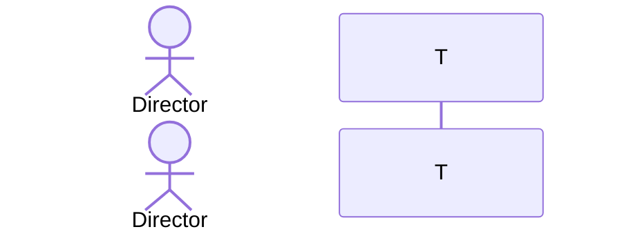

# PR #8 Forensics Report
Generated: 2026-05-23 14:57:39

## Summary

| Metric | Count |
|--------|-------|
| Total Findings | 15 |
| VALID Issues | 15 |
| HALLUCINATIONS | 0 |
| INFRA-NOISE | 0 |
| P0 (Critical) | 4 |
| P1 (High) | 10 |
| P2 (Medium) |  |

## VALID Issues (Priority Order)

### [P0] CRITICAL - coderabbitai
**Source:** comment  
**Timestamp:** 2026-05-23T19:10:33Z  
**URL:** https://github.com/mdasdispatch-hash/universal-or-strategy/pull/8#issuecomment-4526290704

**Excerpt:**
```
<!-- This is an auto-generated comment: summarize by coderabbit.ai -->
<!-- walkthrough_start -->

## Walkthrough

Adds EPIC-6 testing infrastructure: BenchmarkDotNet harnesses, xUnit suites with NinjaTrader mocks, Semgrep V12 DNA rules, GitHub Actions workflow with compliance gates, process/docs updates (PR loop, pre-push, nexus-sync), build/lint adjustments, installer script, and supporting project files.

## Changes

**EPIC-6 Documentation & Planning**

|Layer / File(s)|Summary|
|---|---|
|**
```

### [P0] CRITICAL - amazon-q-developer
**Source:** review  
**Timestamp:** 2026-05-23T19:10:54Z  
**URL:** https://github.com/mdasdispatch-hash/universal-or-strategy/pull/8

**Excerpt:**
```
## Review Summary

This PR adds EPIC-6 documentation and testing infrastructure. The changes are primarily documentation (nexus-sync command definitions, testing guides) with a new CI/CD workflow and minimal code updates.

### Critical Issue Found
One critical defect was identified in the GitHub Actions workflow that would prevent the Lock-Free Audit from functioning correctly. This must be fixed before merge as it undermines a key compliance gate.

### Changes Overview
- **Documentation**: New 
```

### [P0] CRITICAL - coderabbitai
**Source:** review  
**Timestamp:** 2026-05-23T19:16:28Z  
**URL:** https://github.com/mdasdispatch-hash/universal-or-strategy/pull/8

**Excerpt:**
```
**Actionable comments posted: 7**

<details>
<summary>­ƒñû Prompt for all review comments with AI agents</summary>

```
Verify each finding against current code. Fix only still-valid issues, skip the
rest with a brief reason, keep changes minimal, and validate.

Inline comments:
In @.cursor/rules/nexus-sync.mdc:
- Around line 1-3: The frontmatter for the /nexus:sync command is missing the
argument-hint entry; update the document's YAML frontmatter (the top metadata
block in .cursor/rules/nexus-s
```

### [P0] CRITICAL - coderabbitai
**Source:** review  
**Timestamp:** 2026-05-23T19:43:06Z  
**URL:** https://github.com/mdasdispatch-hash/universal-or-strategy/pull/8

**Excerpt:**
```
**Actionable comments posted: 17**

> [!CAUTION]
> Some comments are outside the diff and canÔÇÖt be posted inline due to platform limitations.
> 
> 
> 
> <details>
> <summary>ÔÜá´©Å Outside diff range comments (2)</summary><blockquote>
> 
> <details>
> <summary>pr_8_raw.json (1)</summary><blockquote>
> 
> `1-2`: _ÔÜá´©Å Potential issue_ | _­ƒƒá Major_ | _ÔÜí Quick win_
> 
> **Do not commit raw PR telemetry payloads into source control.**
> 
> This file is an autogenerated review/status dump wit
```

### [P1] REVIEW - sourcery-ai
**Source:** review  
**Timestamp:** 2026-05-23T19:11:25Z  
**URL:** https://github.com/mdasdispatch-hash/universal-or-strategy/pull/8

**Excerpt:**
```
Hey - I've found 3 issues, and left some high level feedback:

- The newly added `_proxTagCache` and `PROX_TAG_CACHE_LIMIT` in `V12_002` are currently unused; consider either wiring them into the RMA sentinel management logic in this PR or deferring their introduction to the change where they are first consumed to avoid dead fields.
- The lock-free audit step in `epic6-testing.yml` only scans `src/*.cs` and not subdirectories or the new `tests`/`benchmarks` code; if you intend this as a global s
```

### [P1] REVIEW - coderabbitai
**Source:** review  
**Timestamp:** 2026-05-23T21:14:57Z  
**URL:** https://github.com/mdasdispatch-hash/universal-or-strategy/pull/8

**Excerpt:**
```
**Actionable comments posted: 4**

<details>
<summary>­ƒñû Prompt for all review comments with AI agents</summary>

```
Verify each finding against current code. Fix only still-valid issues, skip the
rest with a brief reason, keep changes minimal, and validate.

Inline comments:
In `@benchmarks/StandaloneBench.cs`:
- Around line 96-101: Remove the dead branch "if (!true)" and restore the real
stamp/sequence validation so dequeues are protected: use the computed stamped
value (long stamped = (lon
```

### [P1] REVIEW - gemini-code-assist
**Source:** review  
**Timestamp:** 2026-05-23T19:11:49Z  
**URL:** https://github.com/mdasdispatch-hash/universal-or-strategy/pull/8

**Excerpt:**
```
## Code Review

This pull request establishes the automated testing infrastructure for EPIC-6, aiming to lock in performance gains from previous epics. It introduces a two-tier testing strategy using BenchmarkDotNet for performance harnesses and xUnit for unit tests, while maintaining V12 DNA compliance (lock-free, ASCII-only, low complexity). Key deliverables include mock interfaces for NinjaTrader isolation, infrastructure tests for LatencyProbe and LogBuffer, and a GitHub Actions CI/CD workfl
```

### [P1] REVIEW - codacy-production
**Source:** review  
**Timestamp:** 2026-05-23T19:11:38Z  
**URL:** https://github.com/mdasdispatch-hash/universal-or-strategy/pull/8

**Excerpt:**
```
### Pull Request Overview

This PR presents a significant misalignment between its stated intent and the actual changes provided. Although the title and description claim a 'documentation-only' update for EPIC-6 testing, the diff introduces new production state fields in the core strategy logic (src/V12_002.cs) without implementing the corresponding behavior or ensuring thread safety. 

Furthermore, the automated quality gates in the GitHub Actions workflow are currently ineffective due to regex
```

### [P1] SECURITY - pr-insights-tagger
**Source:** comment  
**Timestamp:** 2026-05-23T19:36:15Z  
**URL:** https://github.com/mdasdispatch-hash/universal-or-strategy/pull/8#issuecomment-4526342519

**Excerpt:**
```
## PR Analysis Summary

<div align="center">

<!-- Badges for GitHub web view -->
  

<!-- Text fallback for email notifications -->
<details>
<summary><sub>­ƒôº Email-friendly summary</sub></summary>
<br>
<strong>Risk:</strong> ­ƒö┤ High Risk | <stron
```

### [P1] SECURITY - codacy-production
**Source:** comment  
**Timestamp:** 2026-05-23T19:10:33Z  
**URL:** https://github.com/mdasdispatch-hash/universal-or-strategy/pull/8#issuecomment-4526290709

**Excerpt:**
```
## Not up to standards Ôøö
<details><summary><strong>­ƒö┤ Issues</strong>  <code>8 high ┬À 51 medium ┬À 16 minor</code></summary>

> <br/>
>
> 
> **Alerts:**
> ÔÜá 75 issues (Ôëñ 0 issues of at least minor severity)
> 
>
> **Results:**
> `75` new issues
>
> | Category | Results |
> | ------------- | ------------- |
> | Compatibility | `8` medium  | 
 > | UnusedCode | `9` medium  | 
 > | BestPractice | `30` medium <br/> `8` minor <br/> `2` high  | 
 > | ErrorProne | `2` high  | 
 > | Security | `
```

### [P1] SECURITY - pr-insights-tagger
**Source:** comment  
**Timestamp:** 2026-05-23T19:10:21Z  
**URL:** https://github.com/mdasdispatch-hash/universal-or-strategy/pull/8#issuecomment-4526290265

**Excerpt:**
```
## PR Analysis Summary

<div align="center">

<!-- Badges for GitHub web view -->
  

<!-- Text fallback for email notifications -->
<details>
<summary><sub>­ƒôº Email-friendly summary</sub></summary>
<br>
<strong>Risk:</strong> ­ƒö┤ High Risk | <stro
```

### [P1] SECURITY - pr-insights-tagger
**Source:** comment  
**Timestamp:** 2026-05-23T21:24:14Z  
**URL:** https://github.com/mdasdispatch-hash/universal-or-strategy/pull/8#issuecomment-4526562155

**Excerpt:**
```
## PR Analysis Summary

<div align="center">

<!-- Badges for GitHub web view -->
  

<!-- Text fallback for email notifications -->
<details>
<summary><sub>­ƒôº Email-friendly summary</sub></summary>
<br>
<strong>Risk:</strong> ­ƒö┤ High Risk | <stron
```

### [P1] SECURITY - pr-insights-tagger
**Source:** comment  
**Timestamp:** 2026-05-23T21:11:04Z  
**URL:** https://github.com/mdasdispatch-hash/universal-or-strategy/pull/8#issuecomment-4526535138

**Excerpt:**
```
## PR Analysis Summary

<div align="center">

<!-- Badges for GitHub web view -->
  

<!-- Text fallback for email notifications -->
<details>
<summary><sub>­ƒôº Email-friendly summary</sub></summary>
<br>
<strong>Risk:</strong> ­ƒö┤ High Risk | <stron
```

### [P1] SECURITY - pr-insights-tagger
**Source:** comment  
**Timestamp:** 2026-05-23T20:51:07Z  
**URL:** https://github.com/mdasdispatch-hash/universal-or-strategy/pull/8#issuecomment-4526496159

**Excerpt:**
```
## PR Analysis Summary

<div align="center">

<!-- Badges for GitHub web view -->
  

<!-- Text fallback for email notifications -->
<details>
<summary><sub>­ƒôº Email-friendly summary</sub></summary>
<br>
<strong>Risk:</strong> ­ƒö┤ High Risk | <stron
```

### [P2] PERFORMANCE - sourcery-ai
**Source:** comment  
**Timestamp:** 2026-05-23T19:10:22Z  
**URL:** https://github.com/mdasdispatch-hash/universal-or-strategy/pull/8#issuecomment-4526290310

**Excerpt:**
```
<!-- Generated by sourcery-ai[bot]: start review_guide -->

## Reviewer's Guide

EPIC-6 updates the V12 build tag, adds a GitHub Actions CI workflow for EPIC-6 testing, and introduces an extensive set of documentation under docs/brain/EPIC-6-TESTING plus command metadata files to describe a new /nexus:sync mission bootstrap command for various CLI/agent tools.

#### Sequence diagram for the new /nexus:sync mission bootstrap command



