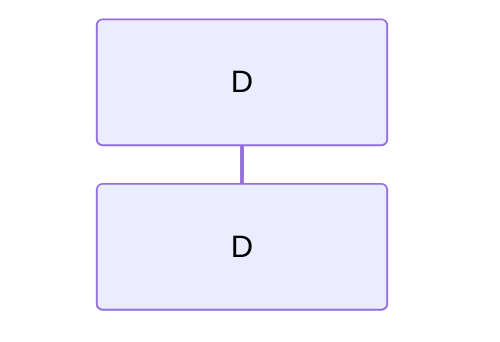

# PR #9 Forensics Report
Generated: 2026-05-23 22:46:37

## Summary

| Metric | Count |
|--------|-------|
| Total Findings | 7 |
| VALID Issues | 7 |
| HALLUCINATIONS | 0 |
| INFRA-NOISE | 0 |
| P0 (Critical) | 5 |
| P1 (High) | 2 |
| P2 (Medium) | 0 |

## VALID Issues (Priority Order)

### [P0] CRITICAL - codacy-production
**Source:** review  
**Timestamp:** 2026-05-24T05:29:53Z  
**URL:** https://github.com/mdasdispatch-hash/universal-or-strategy/pull/9

**Excerpt:**
```
### Pull Request Overview

The review identifies critical synchronization flaws in the circuit breaker rollback logic that could lead to double-cleanup of system resources. While the PR aims to prevent state desynchronization, the current implementation fails to update the caller's state for several key variables (`syncPending`, `reservedDelta`, `poolSlotIndex`) and conditionally skips resetting the `registeredForCleanup` flag. These gaps directly contradict the PR's stated intent and acceptance
```

### [P0] CONCURRENCY - gemini-code-assist
**Source:** review  
**Timestamp:** 2026-05-24T05:28:33Z  
**URL:** https://github.com/mdasdispatch-hash/universal-or-strategy/pull/9

**Excerpt:**
```
## Code Review

This pull request addresses incomplete circuit breaker rollback logic by ensuring the `registeredForCleanup` flag is reset when the circuit breaker trips, thereby preventing double-cleanup in exception handlers. The changes include updates to method signatures in `src/V12_002.SIMA.Dispatch.cs` to pass the flag by reference and the addition of 12 comprehensive unit tests. Feedback focuses on extending this pattern to the `syncPending` and `reservedDelta` parameters to ensure atomi
```

### [P0] CRITICAL - amazon-q-developer
**Source:** review  
**Timestamp:** 2026-05-24T05:26:17Z  
**URL:** https://github.com/mdasdispatch-hash/universal-or-strategy/pull/9

**Excerpt:**
```
## Pull Request Review Summary

**PR Title:** Fix: Complete Circuit Breaker Rollback Logic (EPIC-7-QUALITY-002)

**Overall Assessment:**  **APPROVED** - No blocking issues found

### What This PR Does
Fixes an incomplete circuit breaker rollback that was missing the `registeredForCleanup` flag reset. The PR adds a `ref bool registeredForCleanup` parameter to the rollback methods to ensure the flag is properly reset during cleanup, preventing potential double-cleanup in exception handlers.

##
```

### [P0] CRITICAL - sourcery-ai
**Source:** comment  
**Timestamp:** 2026-05-24T05:25:47Z  
**URL:** https://github.com/mdasdispatch-hash/universal-or-strategy/pull/9#issuecomment-4527494236

**Excerpt:**
```
<!-- Generated by sourcery-ai[bot]: start review_guide -->

## Reviewer's Guide

Implements a complete rollback for the circuit breaker path by threading the registeredForCleanup flag into the circuit-breaker increment/rollback helpers, resetting it during rollback to prevent double-cleanup, and adds focused unit tests plus a completion-summary doc for the EPIC ticket.

#### Sequence diagram for circuit breaker rollback and registeredForCleanup reset



### [P0] CRITICAL - coderabbitai
**Source:** comment  
**Timestamp:** 2026-05-24T05:25:52Z  
**URL:** https://github.com/mdasdispatch-hash/universal-or-strategy/pull/9#issuecomment-4527494368

**Excerpt:**
```
<!-- This is an auto-generated comment: summarize by coderabbit.ai -->
<!-- walkthrough_start -->

## Walkthrough

Refactored dispatch circuit-breaker rollback to coordinate cleanup state via ref parameters. `TryIncrementDispatchCountWithCircuitBreaker` and `RollbackCircuitBreakerState` now manage cleanup-flag state to prevent duplicate cleanup operations when circuit-breaker rejection triggers. Added comprehensive test suite validating cleanup, threshold, concurrency, and state rollback scenari
```

### [P1] REVIEW - sourcery-ai
**Source:** review  
**Timestamp:** 2026-05-24T05:27:11Z  
**URL:** https://github.com/mdasdispatch-hash/universal-or-strategy/pull/9

**Excerpt:**
```
Hey - I've found 3 issues, and left some high level feedback:

- RollbackCircuitBreakerState now takes a long list of loosely related primitive parameters (including the new ref flag); consider introducing a small state struct or context object to group these values and make the call sites and method contract easier to reason about.
- registeredForCleanup is only reset when fleetEntryName != null; if the invariant is that a null name implies no registration, it would help to either enforce that 
```

### [P1] REVIEW - coderabbitai
**Source:** review  
**Timestamp:** 2026-05-24T05:29:53Z  
**URL:** https://github.com/mdasdispatch-hash/universal-or-strategy/pull/9

**Excerpt:**
```
**Actionable comments posted: 1**

> [!CAUTION]
> Some comments are outside the diff and canÔÇÖt be posted inline due to platform limitations.
> 
> 
> 
> <details>
> <summary>ÔÜá´©Å Outside diff range comments (1)</summary><blockquote>
> 
> <details>
> <summary>src/V12_002.SIMA.Dispatch.cs (1)</summary><blockquote>
> 
> `1116-1129`: _ÔÜá´©Å Potential issue_ | _­ƒƒí Minor_ | _ÔÜí Quick win_
> 
> **Clear `registeredForCleanup` unconditionally after rollback.**
> 
> `registeredForCleanup` is only r
```

