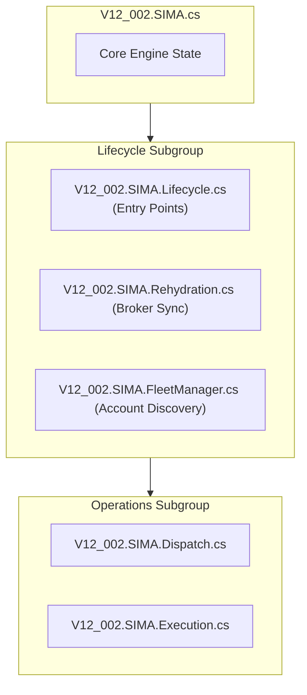

# V12 Refactor Audit: SIMA Engine (Pass 1)

## Status: Blueprinting Phase | Threshold: Local-50 / Global-100

**Last Updated**: 2026-05-05

> [!IMPORTANT]
> This document is part of the **Architectural Blueprinting Session**.
> It is isolated from the `Build-984` mission to prevent context contamination.

---

## 🔍 Target File: `V12_002.SIMA.Lifecycle.cs`

**Current Complexity**: 262
**Action**: Split into 4 specialized modules.

### God Method Breakdown

| Method | Complexity | Extraction Target |
| :--- | :---: | :--- |
| `HydrateWorkingOrdersFromBroker` | 96 | `SIMA.Rehydration.cs` |
| `HydrateFSMsFromWorkingOrders` | 76 | `SIMA.Rehydration.cs` |
| `EnumerateApexAccounts` | 52 | `SIMA.FleetManager.cs` |
| `ProcessShutdownSIMA` | 38 | `SIMA.Lifecycle.cs` (Host) |

---

## 🔍 Target File: `V12_002.SIMA.Fleet.cs`

**Current Complexity**: 102
**Action**: Modularization.

### Hotspot Analysis

* **Issue**: This file mixes UI-driven fleet toggles with low-level status tracking.
* **Extraction**: Move IPC-driven fleet commands to `SIMA.FleetCommands.cs`.

---

## 🗺️ Target "Pass 1" Blueprint (SIMA Group)

---

## 🛠️ Extraction Strategy (Surgical Verbatim)

1. **Tool**: Use `scripts/v12_main_split.py`.
2. **Method**:
    * Identify line ranges for each God Method.
    * Extract into new `.cs` files using the `partial class V12_002` declaration.
    * Ensure all required namespaces (System.Collections.Concurrent, etc.) are duplicated in the header.
3. **Verification**: Compile only. No logic changes permitted in Pass 1.

---
*Generated for the V12 Universal OR Strategy Refactoring Blueprint.*
