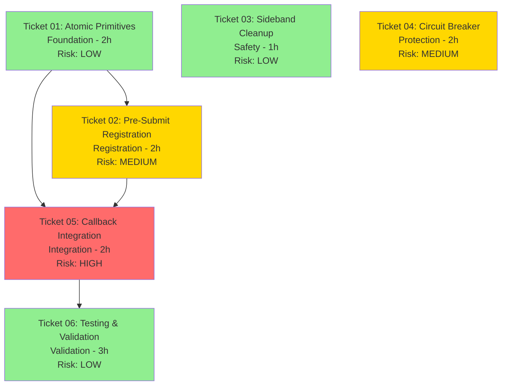

# SIMA Hardening: Execution Guide

**Epic**: SIMA Subgraph Hardening  
**Total Tickets**: 6  
**Estimated Duration**: 3 weeks  
**Last Updated**: 2026-05-16

---

## Overview

This guide provides the execution sequence for the SIMA hardening epic. Each ticket is designed for isolated execution in a Bob CLI session using the `ticket` command.

---

## Ticket Dependency Diagram



**Legend**:
- 🟢 GREEN (LOW risk): Isolated changes, minimal blast radius
- 🟡 YELLOW (MEDIUM risk): Lifecycle changes, moderate coupling
- 🔴 RED (HIGH risk): Hot path modifications, high coupling

---

## Execution Sequence

### Phase 1: Foundation (Week 1, Days 1-2)

#### Ticket 01: Atomic Primitives
**Command**: `bob ticket docs/brain/sima-hardening/ticket-01-atomic-primitives.md`

**Objective**: Create `FsmPackedState` struct and `ZeroAllocOrderIdMap` class.

**Critical Success Factors**:
- All 4 implementation steps completed
- Zero compilation errors
- `deploy-sync.ps1` passes
- Lock audit clean

**Validation**:
```powershell
# After Bob completes the ticket
powershell -File .\deploy-sync.ps1
python scripts/complexity_audit.py
grep -r "lock(" src/
```

**Director Approval Required**: YES (foundation changes)

---

#### Ticket 02: Pre-Submit Registration
**Command**: `bob ticket docs/brain/sima-hardening/ticket-02-presubmit-registration.md`

**Objective**: Implement pre-submit OrderId registration with `Pending` flag.

**Critical Success Factors**:
- `Pending=true` set before `acct.Submit()`
- OrderId mappings registered before broker dispatch
- `TryTransition` method added to FSM

**Validation**:
```powershell
powershell -File .\deploy-sync.ps1
grep -r "Pending=true" src/V12_002.SIMA.Fleet.cs  # Should find 1 match
```

**Director Approval Required**: YES (lifecycle change)

---

#### Ticket 03: Sideband Cleanup
**Command**: `bob ticket docs/brain/sima-hardening/ticket-03-sideband-cleanup.md`

**Objective**: Fix use-after-free by clearing sideband before pool release.

**Critical Success Factors**:
- Sideband clear happens BEFORE pool release
- `Thread.MemoryBarrier()` present between operations
- Finally block ordering correct

**Validation**:
```powershell
powershell -File .\deploy-sync.ps1
# Manual review: Check ProcessFleetSlot finally block ordering
```

**Director Approval Required**: NO (isolated safety fix, low risk)

---

### Phase 2: Protection & Integration (Week 2, Days 3-5)

#### Ticket 04: Circuit Breaker
**Command**: `bob ticket docs/brain/sima-hardening/ticket-04-circuit-breaker.md`

**Objective**: Implement global submit circuit breaker.

**Critical Success Factors**:
- `SubmitCircuitBreaker` class created with lock-free FSM
- Circuit breaker integrated in `SubmitAndRegisterFleetOrders`
- Success/failure recording after submit attempts

**Validation**:
```powershell
powershell -File .\deploy-sync.ps1
grep -r "AllowSubmit()" src/  # Should find integration point
```

**Director Approval Required**: YES (adds failure handling)

---

#### Ticket 05: Callback Integration
**Command**: `bob ticket docs/brain/sima-hardening/ticket-05-callback-integration.md`

**Objective**: Wire all primitives together in callback routing.

**Critical Success Factors**:
- All `_orderIdToFsmKey` call sites migrated to `_orderIdToFsmMap`
- Generation verification present in callback paths
- Old dictionary removed (or kept if validation fails)

**Validation**:
```powershell
powershell -File .\deploy-sync.ps1
grep -r "_orderIdToFsmKey" src/  # Should return ZERO matches after completion
grep -r "Generation ==" src/  # Should find generation checks
```

**Director Approval Required**: YES (hot path modification, HIGH risk)

**CRITICAL**: This ticket has the highest risk. Execute during low-traffic hours. Have rollback plan ready.

---

### Phase 3: Validation (Week 3, Days 6-7)

#### Ticket 06: Testing & Validation
**Command**: `bob ticket docs/brain/sima-hardening/ticket-06-testing-validation.md`

**Objective**: Create comprehensive test coverage.

**Critical Success Factors**:
- FsCheck property tests pass 100 iterations
- Photon stress test completes 1M ops with zero corruption
- Circuit breaker tests verify all state transitions

**Validation**:
```powershell
powershell -File .\scripts\test_stress.ps1
# All tests should pass
```

**Director Approval Required**: NO (test-only, no production code changes)

---

## Bob Session Protocol

### Starting a Ticket

```bash
# Open new Bob session
bob

# Execute ticket
ticket docs/brain/sima-hardening/ticket-XX-[name].md
```

### Bob Will:
1. Read the ticket file completely
2. Perform forensic analysis using jCodemunch MCP
3. Write an extraction plan
4. **STOP and wait for Director approval**

### Director Must:
- Review the plan
- Type `APPROVED` to proceed
- OR provide feedback for plan revision

### Bob Will Then:
5. Execute surgical changes
6. Run post-edit DNA audit
7. Report completion status

### Director Must:
- Press F5 in NinjaTrader IDE to compile
- Verify BUILD_TAG banner
- Confirm ticket completion before proceeding to next ticket

---

## Rollback Plan

### If Ticket Fails Compilation

```powershell
# Revert changes
git checkout HEAD -- src/

# Re-sync hard links
powershell -File .\deploy-sync.ps1

# Retry ticket with revised plan
```

### If Ticket Passes Compilation But Fails Runtime

```powershell
# Create emergency branch
git checkout -b emergency-rollback-ticket-XX

# Revert specific ticket changes
git revert <commit-hash>

# Re-sync and test
powershell -File .\deploy-sync.ps1
```

### If Multiple Tickets Need Rollback

```powershell
# Revert to last known good state
git reset --hard <last-good-commit>
powershell -File .\deploy-sync.ps1
```

---

## Epic Success Criteria

### Functional Metrics
- ✅ Zero orphaned orders under 1M ops/sec stress test
- ✅ Zero ABA failures across 10M slot reuse cycles
- ✅ Circuit breaker halts submissions within 100ms of broker disconnect
- ✅ All 80 bugs in registry resolved or mitigated

### Performance Metrics
- ✅ Dispatch latency < 5ms (p99) under 12-account fleet
- ✅ Zero GC allocations in hot path (verified via ETW trace)
- ✅ Ring saturation handled gracefully (fallback to legacy queue)

### DNA Compliance
- ✅ Zero `lock(stateLock)` statements added
- ✅ Zero heap allocations in `PumpFleetDispatch` → `ProcessFleetSlot` path
- ✅ ASCII-only string literals (verified via `check_ascii.py`)

### Test Coverage
- ✅ FsCheck property tests: 100% pass rate
- ✅ Photon stress test: 1M ops, zero corruption
- ✅ Circuit breaker tests: All state transitions verified

---

## Monitoring & Telemetry

### Post-Deployment Checks

```powershell
# 1. Complexity audit (should show CYC reduction)
python scripts/complexity_audit.py

# 2. Lock audit (should return ZERO matches)
grep -r "lock(" src/

# 3. ASCII audit (should return ZERO matches)
grep -Prn "[^\x00-\x7F]" src/

# 4. Stress test (should pass all scenarios)
powershell -File .\scripts\test_stress.ps1
```

### Runtime Telemetry

Monitor these metrics in production:
- `_photonCrcFailures` counter (should remain 0)
- `_pendingFleetDispatchCount` (should never go negative)
- Circuit breaker state (log transitions to Open/HalfOpen)
- Generation counter growth rate (should be linear)

---

## Emergency Contacts

**Epic Owner**: Bob CLI (v12-engineer)  
**Architect**: Claude Opus 4.7 (escalation only)  
**Adjudicator**: Arena AI (P4 vetting gate)  
**Director**: Human operator (final approval authority)

---

## Notes

- Each ticket is designed for 1-2 hours of implementation work
- Tickets 01-03 can be executed in parallel by different agents (if needed)
- Ticket 05 is the critical path - highest risk, requires careful validation
- Ticket 06 should be executed after all implementation tickets pass F5 compile

**REMEMBER**: This is PLANNING only. Do NOT touch src/ files until Director approves each ticket's extraction plan in a Bob session.