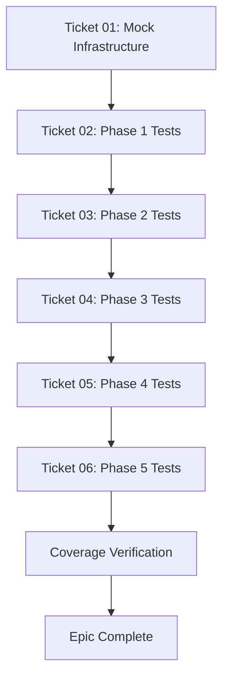

# Symmetry FSM Testing Epic

**BUILD_TAG**: 1111.007-mphase-mp0  
**Status**: Planning Complete - Ready for Execution  
**Target**: `tests/SymmetryFsmIntegrationTests.cs`  
**Owner**: Bob CLI (`v12-engineer`)

---

## Epic Overview

Comprehensive TDD test coverage for the Symmetry FSM (Follower Bracket Finite State Machine) in `src/V12_002.Symmetry.BracketFSM.cs`. The FSM manages the lifecycle of follower brackets from strategic intent to terminal states using V12 DNA-compliant patterns (lock-free, ASCII-only, Actor pattern).

---

## Documents

### Planning Documents
1. **[implementation_plan.md](implementation_plan.md)** - Complete architecture, test design, and execution strategy
2. **[ticket-01-mock-infrastructure.md](ticket-01-mock-infrastructure.md)** - Foundation (BLOCKING)
3. **[ticket-02-phase1-core-state-machine.md](ticket-02-phase1-core-state-machine.md)** - Core FSM (P0)
4. **[ticket-03-phase2-event-processing.md](ticket-03-phase2-event-processing.md)** - 3-Tier Resolution (P1)
5. **[ticket-04-phase3-contract-tracking.md](ticket-04-phase3-contract-tracking.md)** - Contract Logic (P1)
6. **[ticket-05-phase4-edge-cases.md](ticket-05-phase4-edge-cases.md)** - Edge Cases (P2)
7. **[ticket-06-phase5-integration.md](ticket-06-phase5-integration.md)** - Integration (P2)

---

## Execution Sequence



**Critical Path**: Ticket 01 MUST complete before any other ticket can start.

---

## Test Coverage Matrix

| Phase | Tests | Priority | Complexity | Time Est. |
|-------|-------|----------|------------|-----------|
| Foundation | Infrastructure | P0 | S | 2-4h |
| Phase 1 | T01-T04 | P0 | M | 4-6h |
| Phase 2 | T05-T09 | P1 | M | 4-6h |
| Phase 3 | T10-T13 | P1 | M | 4-6h |
| Phase 4 | T14-T17 | P2 | L | 6-8h |
| Phase 5 | T18-T20 | P2 | M | 4-6h |
| **Total** | **20 tests** | - | - | **24-36h** |

---

## Success Criteria

### Functional
- [ ] All 20 test scenarios pass
- [ ] >90% branch coverage on FSM logic
- [ ] Zero flaky tests (100% deterministic)
- [ ] Zero lock usage (verified via grep)

### Non-Functional
- [ ] Test execution time <5 seconds total
- [ ] Each test completes in <100ms
- [ ] Zero memory leaks
- [ ] Zero race conditions

### V12 DNA Compliance
- [ ] Zero `lock()` statements
- [ ] All state updates use `Interlocked` or `Volatile`
- [ ] ASCII-only string literals
- [ ] MockTime pattern (no `Thread.Sleep()`)
- [ ] ConcurrentQueue for mailbox
- [ ] ConcurrentDictionary for FSM storage

---

## Key Patterns

### MockTime Pattern
```csharp
var time = new MockTime(1000000L);
time.AdvanceSeconds(5.0); // Deterministic time control
```

### Event Builder Pattern
```csharp
var evt = CreateAcceptedEvent("ORD001", "Entry_Fleet_Apex_1");
mockFsm.EnqueueEvent(evt);
mockFsm.DrainMailbox();
```

### Assertion Helper Pattern
```csharp
AssertFsmState(fsm, FollowerBracketState.Active, "Entry filled");
AssertRemainingContracts(fsm, 2);
```

---

## Test Scenarios Summary

### Phase 1: Core State Machine (P0)
- T01: Happy Path (None → Filled)
- T02: Rejection Path
- T03: Cancel Path
- T04: Partial Fill Path

### Phase 2: Event Processing (P1)
- T05: Tier 1 - OrderId Hit
- T06: Tier 2 - SignalName Hit + Backfill
- T07: Tier 3 - Scan Hit + Backfill
- T08: Duplicate Events (Idempotency)
- T09: Out-of-Order Events

### Phase 3: Contract Tracking (P1)
- T10: Stop Fill Decrement
- T11: T1 Target Detection
- T12: Multi-Target Scaling
- T13: Zero Contracts Terminal

### Phase 4: Edge Cases (P2)
- T14: Null Order Reference
- T15: Mailbox Overflow
- T16: Concurrent Modifications
- T17: Invalid Transitions

### Phase 5: Integration (P2)
- T18: REAPER Integration
- T19: SIMA Integration
- T20: Orders Integration

---

## Handoff Instructions

### For Bob CLI (`v12-engineer`)
1. Start with Ticket 01 (Mock Infrastructure)
2. Verify compilation before proceeding
3. Execute Tickets 02-06 sequentially
4. Run coverage report after each phase
5. Use `/restore` if checkpointing needed

### For Codex CLI (`codex-rescue`)
- Available for Ticket 05 (Edge Cases) if Bob delegates
- Specializes in thread safety and lock-free verification
- Can assist with concurrent modification tests

---

## References

### Source Files
- `src/V12_002.Symmetry.BracketFSM.cs` - Production FSM implementation
- `tests/CircuitBreakerBehaviorTests.cs` - MockTime pattern reference
- `tests/ReaperWatchdogBehaviorTests.cs` - Test structure reference

### Documentation
- `docs/brain/forensics_report.md` - Forensic analysis
- `AGENTS.md` - V12 DNA compliance rules
- `docs/architecture.md` - System architecture

---

## Status Tracking

- [x] Planning Complete
- [x] Implementation Plan Generated
- [x] Ticket Breakdown Complete
- [ ] Ticket 01 - Mock Infrastructure
- [ ] Ticket 02 - Phase 1 Tests
- [ ] Ticket 03 - Phase 2 Tests
- [ ] Ticket 04 - Phase 3 Tests
- [ ] Ticket 05 - Phase 4 Tests
- [ ] Ticket 06 - Phase 5 Tests
- [ ] Coverage Verification
- [ ] Epic Sign-off

---

**Last Updated**: 2026-05-17  
**Next Action**: Hand off to Bob CLI for Ticket 01 execution