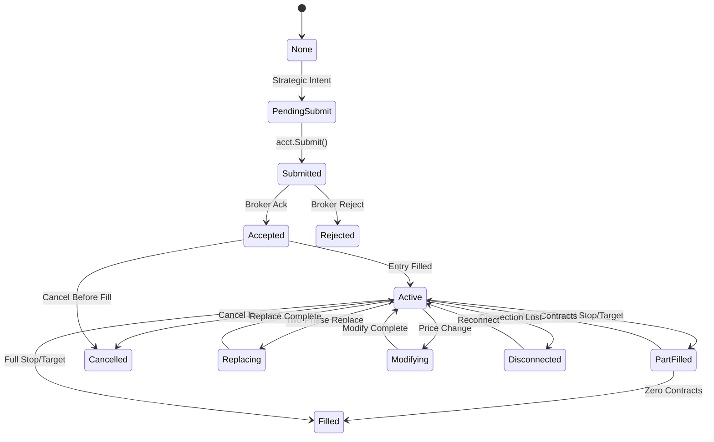
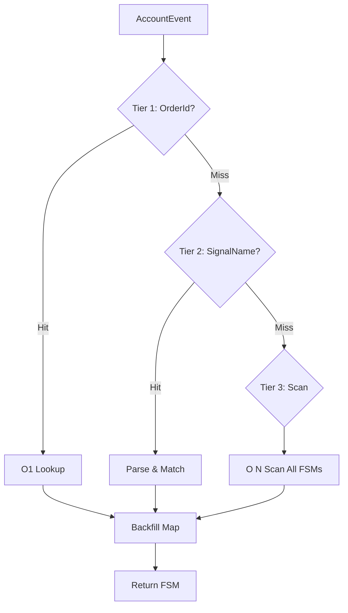
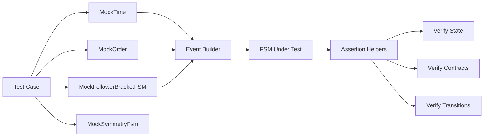
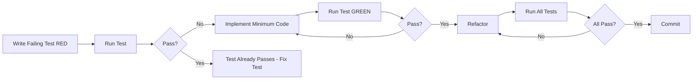

# Symmetry FSM Testing Epic - Implementation Plan
**BUILD_TAG**: 1111.007-mphase-mp0  
**Status**: Stage 1 (Architecture Planning)  
**Target**: `tests/SymmetryFsmIntegrationTests.cs`  
**Epic Owner**: Bob CLI (`v12-engineer`)

---

## 1. Executive Summary

This plan establishes comprehensive TDD test coverage for the Symmetry FSM (Follower Bracket Finite State Machine) in `src/V12_002.Symmetry.BracketFSM.cs`. The FSM is V12 DNA compliant (lock-free, ASCII-only, Actor pattern) and manages the lifecycle of follower brackets from strategic intent to terminal states.

**Key Metrics**:
- Target: >90% branch coverage
- 20 test scenarios across 5 phases
- Zero `Thread.Sleep()` calls (MockTime pattern)
- Zero lock usage (100% lock-free verification)

---

## 2. Architecture Overview

### 2.1 FSM State Machine



### 2.2 3-Tier FSM Resolution

The FSM uses a 3-tier resolution strategy for event routing:



### 2.3 Test Architecture



---

## 3. Mock Infrastructure Design

### 3.1 MockTime (Deterministic Time)

```csharp
private class MockTime
{
    private long _ticks;
    
    public MockTime(long initialTicks) => _ticks = initialTicks;
    public long GetTicks() => _ticks;
    public void Advance(long deltaTicks) => _ticks += deltaTicks;
    public void AdvanceSeconds(double seconds) => 
        _ticks += (long)(seconds * TimeSpan.TicksPerSecond);
}
```

**Pattern**: Mirrors `CircuitBreakerBehaviorTests.MockTime` and `ReaperWatchdogBehaviorTests.MockTime`.

### 3.2 MockOrder (Broker Order Simulation)

```csharp
private class MockOrder
{
    public string OrderId { get; set; }
    public string SignalName { get; set; }
    public OrderAction OrderAction { get; set; }
    public int Quantity { get; set; }
    public OrderState State { get; set; }
    public double FillPrice { get; set; }
    public int FilledQuantity { get; set; }
    
    public MockOrder(string orderId, string signalName, 
                     OrderAction action, int qty)
    {
        OrderId = orderId;
        SignalName = signalName;
        OrderAction = action;
        Quantity = qty;
        State = OrderState.Unknown;
    }
}
```

### 3.3 MockFollowerBracketFSM (FSM Container)

```csharp
private class MockFollowerBracketFSM
{
    public string AccountName { get; set; }
    public string EntryName { get; set; }
    public string OcoGroupId { get; set; }
    private long _packedState;  // Atomic state + pending + generation
    public int RemainingContracts { get; set; }
    public string ReplacingCancelOrderId { get; set; }
    public DateTime LastUpdateUtc { get; set; }
    
    public MockOrder EntryOrder { get; set; }
    public MockOrder StopOrder { get; set; }
    public MockOrder[] Targets { get; set; } = new MockOrder[5];
    
    // State property with atomic access
    public FollowerBracketState State { get; set; }
    public long Generation { get; private set; }
    
    public bool TryTransition(FollowerBracketState newState, bool setPending)
    {
        // Atomic CAS-based transition logic
    }
}
```

### 3.4 MockSymmetryFsm (Test Harness)

```csharp
private class MockSymmetryFsm
{
    private readonly MockTime _time;
    private readonly ConcurrentDictionary<string, MockFollowerBracketFSM> _brackets;
    private readonly ConcurrentQueue<AccountEvent> _mailbox;
    private readonly OrderIdToFsmMap _orderIdMap;
    private int _drainingFlag = 0;
    private const int MAX_PER_DRAIN = 100;
    
    public MockSymmetryFsm(MockTime time)
    {
        _time = time;
        _brackets = new ConcurrentDictionary<string, MockFollowerBracketFSM>();
        _mailbox = new ConcurrentQueue<AccountEvent>();
        _orderIdMap = new OrderIdToFsmMap();
    }
    
    // Core FSM methods with complete implementations
    public void EnqueueEvent(AccountEvent evt) => _mailbox.Enqueue(evt);
    
    // DrainMailbox: Single-threaded consumer with CAS flag protection
    public void DrainMailbox() { /* See Ticket 01 Step 9 for complete implementation */ }
    
    // ResolveFsmFromEvent: 3-tier resolution (OrderId -> SignalName -> Scan) with backfill
    public MockFollowerBracketFSM ResolveFsm(AccountEvent evt) { /* See Ticket 01 Step 9 for complete implementation */ }
    
    // ProcessBracketEvent: State machine logic with TryTransition calls
    public void ProcessBracketEvent(AccountEvent evt) { /* See Ticket 01 Step 9 for complete implementation */ }
    
    public int GetFsmExpectedPosition(string accountName) { /* Aggregate */ }
}
```

**Note**: Complete pseudocode for `DrainMailbox()`, `ProcessBracketEvent()`, and `ResolveFsmFromEvent()` is provided in Ticket 01, Step 9. These implementations include:
- Single-threaded consumer enforcement via `_drainingFlag`
- Full 3-tier FSM resolution with backfill logic
- State machine event processing with proper transitions

---

## 4. Test Harness Design

### 4.1 Event Builders

```csharp
// Helper methods for creating AccountEvent instances
private AccountEvent CreateAcceptedEvent(string orderId, string signalName)
{
    return new AccountEvent
    {
        AccountAlias = "Sim101",
        OrderId = orderId,
        NewState = OrderState.Accepted,
        SignalName = signalName,
        TimestampTicks = _time.GetTicks()
    };
}

private AccountEvent CreateFilledEvent(string orderId, string signalName, 
                                       int qty, double price)
{
    return new AccountEvent
    {
        AccountAlias = "Sim101",
        OrderId = orderId,
        NewState = OrderState.Filled,
        FilledQty = qty,
        FillPrice = price,
        SignalName = signalName,
        TimestampTicks = _time.GetTicks()
    };
}

// Additional builders: CreateRejectedEvent, CreateCancelledEvent, etc.
```

### 4.2 Assertion Helpers

```csharp
private void AssertFsmState(MockFollowerBracketFSM fsm, 
                           FollowerBracketState expectedState,
                           string message = null)
{
    Assert.Equal(expectedState, fsm.State);
    if (message != null)
        _output.WriteLine($"[PASS] {message}: State={fsm.State}");
}

private void AssertRemainingContracts(MockFollowerBracketFSM fsm, 
                                      int expected)
{
    Assert.Equal(expected, fsm.RemainingContracts);
}

private void AssertOrderIdMapped(string orderId, string expectedEntryName)
{
    var fsm = _mockFsm.ResolveFsm_ByOrderId(orderId);
    Assert.NotNull(fsm);
    Assert.Equal(expectedEntryName, fsm.EntryName);
}
```

---

## 5. Red-Green-Refactor Workflow

### 5.1 TDD Pipeline



### 5.2 Workflow Steps

1. **RED**: Write test that fails (FSM behavior not implemented)
2. **GREEN**: Implement minimum code to pass test
3. **REFACTOR**: Clean up implementation while keeping tests green
4. **VERIFY**: Run full test suite to ensure no regressions
5. **COMMIT**: Checkpoint with passing tests

---

## 6. Test Phases & Coverage Matrix

### Phase 1: Core State Machine (P0)
| Test ID | Scenario | Entry State | Event | Exit State | Coverage |
|---------|----------|-------------|-------|------------|----------|
| T01 | Happy Path | None | Submit→Accept→Fill | Filled | Primary flow |
| T02 | Rejection | Submitted | Reject | Rejected | Error handling |
| T03 | Cancel | Active | Cancel | Cancelled | Cancellation |
| T04 | Partial Fill | Active | PartFill→Fill | Filled | Multi-step |

### Phase 2: Event Processing (P1)
| Test ID | Scenario | Resolution Tier | Backfill | Coverage |
|---------|----------|-----------------|----------|----------|
| T05 | OrderId Hit | Tier 1 (O1) | N/A | Primary path |
| T06 | SignalName Hit | Tier 2 | Yes | Secondary path |
| T07 | Scan Hit | Tier 3 (ON) | Yes | Fallback path |
| T08 | Duplicate Events | Tier 1 | N/A | Idempotency |
| T09 | Out-of-Order | Tier 1 | N/A | Race conditions |

### Phase 3: Contract Tracking (P1)
| Test ID | Scenario | Initial | Event | Final | Coverage |
|---------|----------|---------|-------|-------|----------|
| T10 | Stop Fill | 2 | Fill 2 | 0 | Full exit |
| T11 | T1 Detection | 5 | Fill 1 | 4 | Target 1 |
| T12 | Multi-Target | 5 | T1+T2+T3 | 2 | Scaling |
| T13 | Zero Contracts | 1 | Fill 1 | 0 | Terminal |

### Phase 4: Edge Cases (P2)
| Test ID | Scenario | Condition | Expected | Coverage |
|---------|----------|-----------|----------|----------|
| T14 | Null Order | Restart | Fallback | Hydration |
| T15 | Mailbox Overflow | >100 events | Drain | Backpressure |
| T16 | Concurrent Mods | Thread race | CAS retry | Thread safety |
| T17 | Invalid Transition | Bad state | Reject | Validation |

### Phase 5: Integration (P2)
| Test ID | Scenario | Integration Point | Coverage |
|---------|----------|-------------------|----------|
| T18 | REAPER | GetFsmExpectedPosition | Position calc |
| T19 | SIMA | FSM create/remove | Lifecycle |
| T20 | Orders | Two-phase replace | Replacing state |

---

## 7. Implementation Sequence

### Ticket 01: Mock Infrastructure Setup (S)
- Create `MockTime`, `MockOrder`, `MockFollowerBracketFSM`
- Implement `MockSymmetryFsm` test harness
- Build event builders and assertion helpers
- **Verification**: Compile without errors, no tests yet

### Ticket 02: Phase 1 Tests - Core State Machine (M)
- Implement T01-T04 (Happy Path, Rejection, Cancel, Partial Fill)
- **Verification**: 4 tests pass, >60% state coverage

### Ticket 03: Phase 2 Tests - Event Processing (M)
- Implement T05-T09 (3-tier resolution, idempotency, ordering)
- **Verification**: 5 tests pass, >75% resolution coverage

### Ticket 04: Phase 3 Tests - Contract Tracking (M)
- Implement T10-T13 (Stop fill, target detection, scaling)
- **Verification**: 4 tests pass, >80% contract logic coverage

### Ticket 05: Phase 4 Tests - Edge Cases (L)
- Implement T14-T17 (Null order, overflow, concurrency, validation)
- **Verification**: 4 tests pass, >85% edge case coverage

### Ticket 06: Phase 5 Tests - Integration (M)
- Implement T18-T20 (REAPER, SIMA, Orders integration)
- **Verification**: 3 tests pass, >90% total coverage

---

## 8. V12 DNA Compliance Checklist

### Lock-Free Verification
- [ ] Zero `lock()` statements in test code
- [ ] All FSM state updates use `Interlocked` or `Volatile`
- [ ] ConcurrentQueue for mailbox pattern
- [ ] ConcurrentDictionary for FSM storage

### ASCII-Only Compliance
- [ ] No Unicode characters in string literals
- [ ] No emoji in comments or diagnostics
- [ ] No curly quotes in assertions

### Actor Pattern Compliance
- [ ] Events enqueued to mailbox (ConcurrentQueue)
- [ ] Single-threaded consumer (DrainMailbox)
- [ ] No direct state mutation from producers

### MockTime Pattern
- [ ] Zero `Thread.Sleep()` calls
- [ ] All time-based logic uses MockTime.GetTicks()
- [ ] Deterministic test execution

---

## 9. Success Criteria

### Functional Requirements
1. All 20 test scenarios pass
2. >90% branch coverage on FSM logic
3. Zero flaky tests (100% deterministic)
4. Zero lock usage (verified via grep)

### Non-Functional Requirements
1. Test execution time <5 seconds total
2. Each test completes in <100ms
3. Zero memory leaks (verified via profiler)
4. Zero race conditions (verified via stress testing)

### Documentation Requirements
1. Each test has clear docstring explaining scenario
2. Assertion failures include diagnostic context
3. Test output includes state transition logs
4. Coverage report generated and reviewed

---

## 10. Risk Mitigation

### P0 Issues Resolution (2026-05-17)
**Status**: RESOLVED
**Adjudicator Review**: All P0 issues from Adjudicator review have been addressed in Ticket 01:
- **P0 Issue 1**: Complete lock-free CAS implementation added to `TryTransition()` with `IsValidTransition()` helper
- **P0 Issue 2**: Complete pseudocode added for `DrainMailbox()`, `ProcessBracketEvent()`, and `ResolveFsmFromEvent()` with single-threaded consumer enforcement via `_drainingFlag`

Mock infrastructure now includes:
- Full atomic CAS-based state transitions with validation
- Single-threaded mailbox consumer with `Interlocked` flag protection
- Complete 3-tier FSM resolution with backfill logic
- Helper methods for signal name parsing and order matching

### Risk 1: Mock Divergence from Production
**Mitigation**:
- Copy exact FSM logic from `V12_002.Symmetry.BracketFSM.cs`
- Use same atomic primitives (Interlocked, Volatile)
- Verify mock behavior matches production via integration tests
- Complete CAS implementation ensures lock-free compliance

### Risk 2: Test Brittleness
**Mitigation**:
- Use assertion helpers to abstract state checks
- Avoid hardcoded timestamps (use MockTime)
- Test behavior, not implementation details

### Risk 3: Incomplete Coverage
**Mitigation**:
- Generate coverage report after each phase
- Identify untested branches and add scenarios
- Use mutation testing to verify test quality

---

## 11. Handoff to Engineer

**Target Agent**: Bob CLI (`v12-engineer`) or Codex CLI (`codex-rescue`)  
**Mode**: Code (P5 Surgical)  
**Prerequisites**: 
- Forensic report reviewed
- Implementation plan approved
- Ticket breakdown generated

**Execution Order**:
1. Ticket 01 (Mock Infrastructure) - **MUST COMPLETE FIRST**
2. Tickets 02-06 (Test Phases) - Sequential execution
3. Coverage verification after each ticket
4. Final integration test run

**Checkpointing**: Enabled via `.bob/settings.json` - restore via `/restore` if needed.

---

## 12. Appendix: Test Pattern Examples

### Example 1: Happy Path Test (T01)

```csharp
[Fact]
public void T01_HappyPath_None_To_Filled()
{
    // Arrange
    var time = new MockTime(1000000L);
    var fsm = new MockFollowerBracketFSM
    {
        AccountName = "Sim101",
        EntryName = "Fleet_Apex_1",
        State = FollowerBracketState.None,
        RemainingContracts = 2
    };
    
    // Act: Submit -> Accepted -> Filled
    fsm.State = FollowerBracketState.PendingSubmit;
    fsm.State = FollowerBracketState.Submitted;
    
    var acceptEvent = CreateAcceptedEvent("ORD001", "Entry_Fleet_Apex_1");
    ProcessBracketEvent(acceptEvent, fsm);
    
    var fillEvent = CreateFilledEvent("ORD001", "Entry_Fleet_Apex_1", 2, 4500.0);
    ProcessBracketEvent(fillEvent, fsm);
    
    // Assert
    AssertFsmState(fsm, FollowerBracketState.Active, "Entry filled");
    AssertRemainingContracts(fsm, 2);
}
```

### Example 2: 3-Tier Resolution Test (T05-T07)

```csharp
[Fact]
public void T05_Tier1_OrderId_Hit()
{
    // Arrange: OrderId already mapped
    var evt = CreateAcceptedEvent("ORD001", "Entry_Fleet_Apex_1");
    _orderIdMap.TryAdd("ORD001", "Fleet_Apex_1", 1);
    
    // Act
    var fsm = _mockFsm.ResolveFsm(evt);
    
    // Assert
    Assert.NotNull(fsm);
    Assert.Equal("Fleet_Apex_1", fsm.EntryName);
}

[Fact]
public void T06_Tier2_SignalName_Hit_With_Backfill()
{
    // Arrange: OrderId not mapped, but SignalName parseable
    var evt = CreateAcceptedEvent("ORD002", "Entry_Fleet_Apex_1");
    
    // Act
    var fsm = _mockFsm.ResolveFsm(evt);
    
    // Assert
    Assert.NotNull(fsm);
    Assert.Equal("Fleet_Apex_1", fsm.EntryName);
    
    // Verify backfill
    AssertOrderIdMapped("ORD002", "Fleet_Apex_1");
}
```

---

**END OF IMPLEMENTATION PLAN**

**Next Steps**: 
1. Review and approve this plan
2. Generate individual ticket files (Ticket 01-06)
3. Hand off to Bob CLI for execution
4. Monitor progress via checkpointing