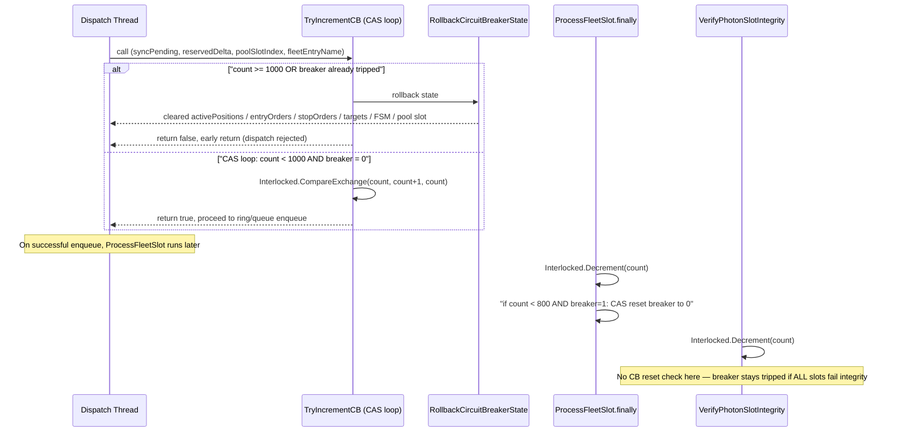

# Greptile Review Findings - PR #1

**Review Date**: 2026-05-22  
**Confidence Score**: 3/5  
**Status**: NOT SAFE TO MERGE

## Summary

Greptile identified a critical circuit breaker deadlock issue where the breaker can be permanently locked if `VerifyPhotonSlotIntegrity` drains the queue via integrity failures.

## Key Findings

### 1. Circuit Breaker Deadlock (CRITICAL - P0)

**Location**: `src/V12_002.SIMA.Fleet.cs` - `VerifyPhotonSlotIntegrity` (~line 377)

**Issue**: 
- `VerifyPhotonSlotIntegrity` decrements `_pendingFleetDispatchCount` after shadow-integrity rejection
- Does NOT check whether count has dropped below the 800-item reset threshold
- If the ring is drained entirely by integrity failures while breaker is tripped:
  - Count reaches 0
  - `ProcessFleetSlot` is never called
  - `_reaperCircuitBreakerTripped` stays at 1 forever
  - **Result**: Permanently blocks all new dispatches without strategy restart

**Severity**: BLOCKING - Can cause permanent system lockup

**Status**: UNRESOLVED from prior review thread

### 2. Incomplete Circuit Breaker Rollback (P1)

**Location**: `src/V12_002.SIMA.Dispatch.cs`, lines 696-821

**Issue**:
- When breaker trips, rollback only undoes `syncPending` and `reservedDelta`
- Entries already written to these structures are NOT removed:
  - `activePositions`
  - `entryOrders`
  - `stopOrders`
  - Target dicts
  - `_followerBrackets` (PendingSubmit FSM at line 742)
- REAPER and subsequent dispatch cycles observe these accounts as having active FSM entries for orders that were never enqueued
- **Result**: Blocks fresh dispatches to those accounts

**Severity**: HIGH - Causes dispatch blocking

**Status**: ADDRESSED in current PR (RollbackCircuitBreakerState helper added)

### 3. Positive Findings

**What Works**:
- ✅ CAS-loop atomicity fix is correct
- ✅ Full-rollback helper (`RollbackCircuitBreakerState`) is correct
- ✅ `volatile` field declaration is now consistent
- ✅ Circuit breaker reset in `ProcessFleetSlot.finally` is correct

## Greptile's Recommendation

**NOT SAFE TO MERGE** due to the permanent breaker lockup risk in `VerifyPhotonSlotIntegrity`.

## Required Actions

1. **IMMEDIATE (P0)**: Add CB reset check to `VerifyPhotonSlotIntegrity` after its `Interlocked.Decrement`
2. **VERIFY**: Ensure all decrement paths evaluate the reset condition (count < 800 && breaker == 1)
3. **TEST**: Add stress test for integrity-failure-only queue drain scenario

## Files Reviewed

| File | Status | Notes |
|------|--------|-------|
| `src/V12_002.cs` | ✅ PASS | Adds `volatile int _reaperCircuitBreakerTripped` and `const int REAPER_MAX_PENDING_DISPATCHES = 1000` |
| `src/V12_002.SIMA.Dispatch.cs` | ⚠️ PARTIAL | CAS loop correct, rollback helper correct, but formatting-only changes throughout |
| `src/V12_002.SIMA.Fleet.cs` | ❌ FAIL | CB reset in `ProcessFleetSlot.finally` correct, but `VerifyPhotonSlotIntegrity` lacks matching reset check |

## Sequence Diagram

## Next Steps

1. Create ticket for P0 fix: Add CB reset to `VerifyPhotonSlotIntegrity`
2. Add stress test for integrity-failure scenario
3. Re-run Greptile review after fix
4. Verify all decrement paths have reset logic